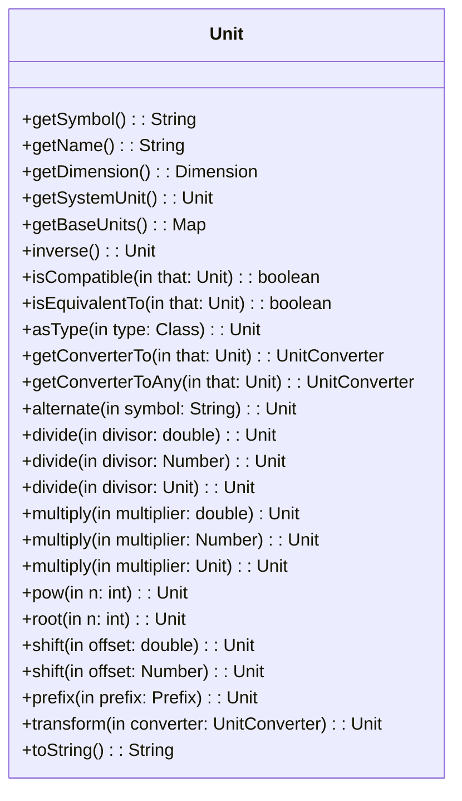
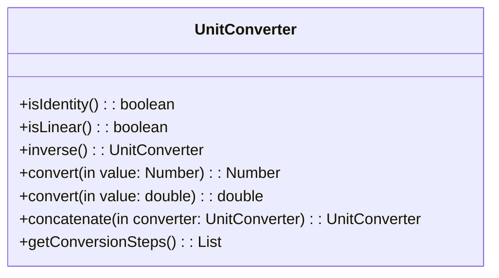
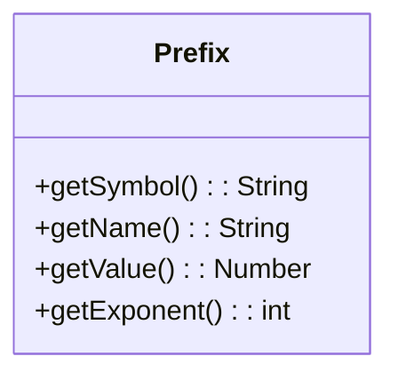
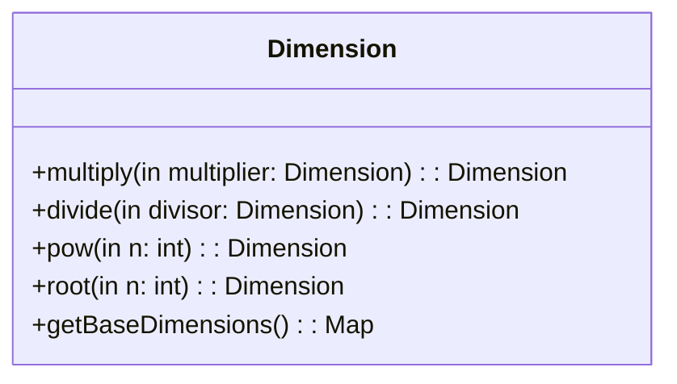
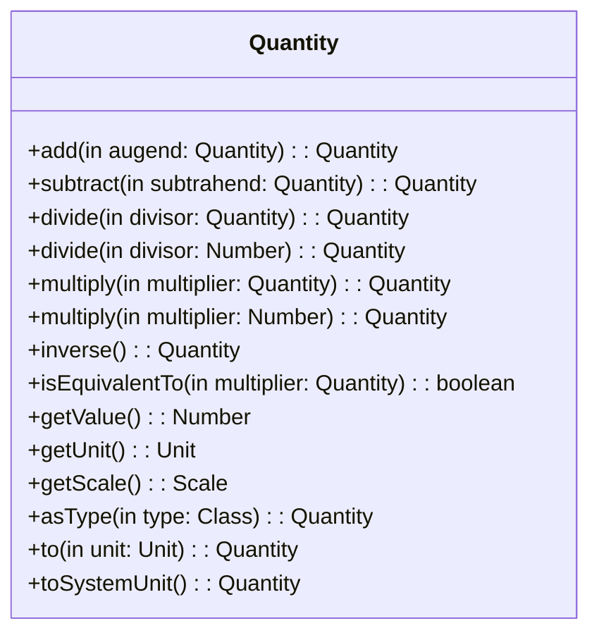
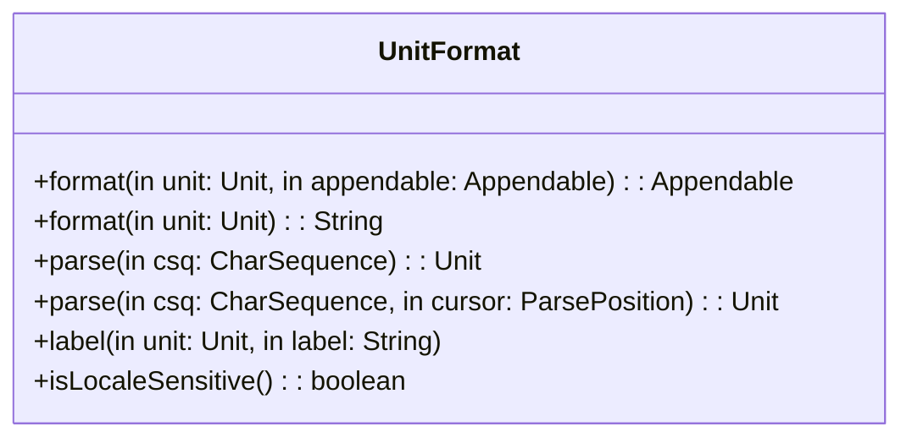
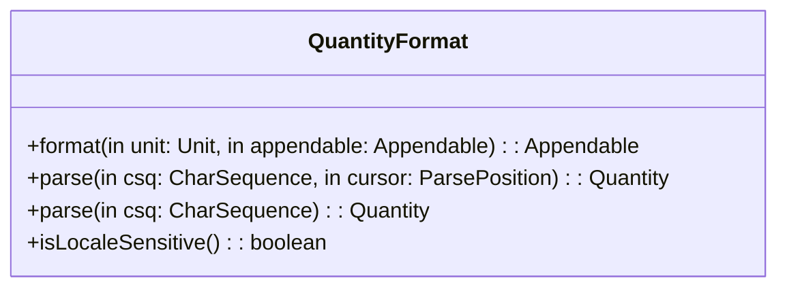
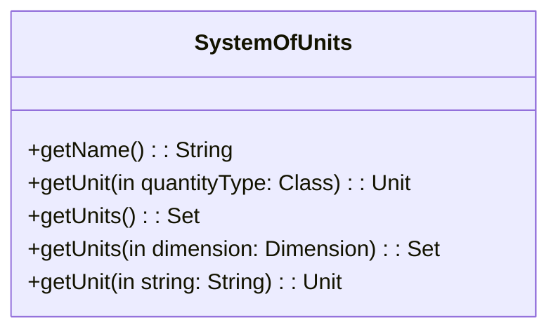

## 译者序

本文来自 [JSR 385: Units of Measurement API 2.0](https://jcp.org/en/jsr/detail?id=385) 。翻译了其中核心的部分，舍弃了第 6 节（可选项与依赖）、第 7 节（示例）、第 8 节（相关工作）和第 9 节（FAQ）。

译者水平有限，不免存在遗漏或错误之处。如有疑问，敬请查阅原文。

以下是译文。

---

# 目的

Java 开发人员在面对科学、工程、医学、金融或制造业等领域时，需要一个能够健壮地表达量(quantity, 下同) 、正确地处理量的框架。目前，开发人员不得不使用有缺陷的计量模型或自建解决方案，但两种方案都可能导致严重的程序错误。将计量标准建模为简单数字而不考虑其单位的做法会导致代码非常脆弱，因为如果必须从上下文线索推测单位，那么数值将非常容易被误解。比如，你无法清晰的认识到一个人的体重数值是以斤还是公斤为单位。

标准解决方案需要既安全又高效，可以为开发人员节约面向特例领域问题的宝贵时间。JSR 385 致力于建立安全、有效的物理量(physical quantity)建模方法。本标准包含如下内容：

-   支持单位运算的接口方法或抽象类方法，包括：
    -   单位的兼容性检查
    -   以不同单位来表达同一计量值
    -   单位间的算术运算
-   提供标准单位类型（基础单位与衍生单位）的实现类和单位换算能力
-   提供量的解析与格式化
-   预置标准单位

# 1 需求与设计目标

## 1.1 必要条件

核心 API 必须满足：

-   不涉及对 Java 虚拟机的修改
-   不以任何形式损坏（错误解析、丢失精度等）数据，不能因此影响业务逻辑
-   框架支持的算术操作应尽可能地与 Java 虚拟机种现有的算数运算保持一致
-   提供与框架外代码的互操作性
-   支持用户自定义的量纲(dimensions)、单位、量和单位制(systems of units)
-   支持严格的符号解析
    -   国际单位制词头
    -   其他单位的词头（比如特定于地区与文化的）
-   支持运行时处理和打印单位、量和量纲

比如：一个形如 $kg^{1}\cdot m^{1}\cdot s^{-2}$ 的单位，需要被正确解析出量纲($kg$, $m$, $s$) 和量纲指数($1,1,-2$)，以及这个单位的名字（如果有定义的话，这里是牛顿 $N$）

## 1.2 期望

对于一个成功的 API，以下特性被认为是非常重要的：

-   需要为目前正在使用 java.lang.Number 及其扩展类的人员提供足够低的学习曲线
-   支持同时使用多个单位制，比如程序需要同时面向国际单位制、厘米-克-秒单位制(CGS, centimetre-gram-second system)、英制单位(Imperial units)
-   当有足够的信息可用于编译时检查时，编译时检查量纲错误。

## 1.3 源代码与二进制兼容性

API 基于 Java 8 源代码和编译器兼容性。 该 JAR 与 Java 8 兼容，但它同时包含与 Java 9 兼容的模块信息。 虽然 Java SE 的支持路线图显示 Java 7 在 2022 年之前仍受支持（持续支持客户的支持时间更长），但 Java SE 7 或 Java ME 8 Embedded 的用户应继续使用 [[JSR-363](https://jcp.org/en/jsr/detail?id=363)]，直到其环境或新应用程序能够使用 JSR 385。

尽管专用于许多小型设备（比如 Raspberry Pi Zero）的 Java SE Embedded 在 Java 8 之后不再存在。 但是使用 Java 9 中的 JLink 可以进一步减少特定应用程序所需的 JVM 和模块的大小，这使得在版本 8 之后放弃专用 Java SE Embedded 和 Java ME Embedded 的决定是可以被理解的。

对于参考实现 (RI)，最小支持的 Java 版本是 Java SE 8。

# 2 定义

物理量的计量是通过它与已知的同类量（我们将其视为标准）的比较。比如米作为国际单位制中表示长度的标准单位，“1 米”是被人为定义的标准长度。物体长“5 米”是相对于“1 米”评估得出的。如果货币单位得到准确定义，也可以对货币量采取类似的方法。

上述定义建立在零基线性标度(zero-based linear scale)的预设前提下。 然而，为了方便起见，可以使用不同标度来表示计量值。

-   非零基：例如，以摄氏度为单位的计量值可以被视为以开尔文为单位的计量值偏移 273.15 度（$K = ℃ + 273.15$）。
-   非线性：以分贝为单位的计量值可以被认为是以对数标度表示的功率级差计量值（$L_{dB}=10 \log_{10}(\frac{P_1}{P_0})$）。

术语”计量“也以更宽松的方式使用，如用数字来表示等级。

-   例如，用于表示矿物硬度的莫氏硬度，是利用矿物的相对刻划硬度来划分矿物硬度的标准。 它可以描述石英比方解石硬，但无法量化描述硬多少。 这只是一个严格有序的标度。 根据这种标度，硬度可比较，但不可进行算数运算。

计量也可以是精确量。

-   例如，我们可以通过计数来确定一个纸箱中正好有 12 个鸡蛋。

## 2.1 符号**与缩写术语**

| API     | 应用程序接口                 |
| ------- | ---------------------------- |
| BIPM    | 国际计量局                   |
| CGS     | 厘米-克-秒单位制             |
| CLDC    | 有限连接设备配置             |
| ISO     | 国际标准化组织               |
| Java SE | Java 标准版本                |
| Java ME | Java 微缩版本                |
| JSR     | Java 规范                    |
| NIST    | （美国）国家标准与技术研究所 |
| RI      | 参考实现                     |
| SI      | 国际单位制                   |
| SPI     | 第三方可扩展接口             |
| TCK     | 技术兼容套件                 |
| UCUM    | 计量单位统一代码             |
| UOM     | 计量单位                     |
| UML     | 统一建模语言                 |

## 2.2 格式化

除了普通的纯文本之外：

-   *斜体*用于强调术语和关键词；
-   **粗体**主要用于重要的段落、注释或评论；
-   衬线体用于代码片段、类或接口名称，以及代码示例；
-   [链接](https://www.notion.so/JSR-385-Units-of-Measurements-e118c6bef8004408bdc3ca9cc81f0dc5?pvs=21)指向文档内部或外部 URL 的交叉引用。

## 2.3 本规范使用的术语

本规范中定义的 Java 类不局限物理量，也可应用于货币量、故事点数（敏捷软件开发）、服装尺寸或用户定义的标度（包括序数标度）。 因此，除非特别指出为“物理量”或“物理单位”，否则术语“量”和“单位”应理解为一般含义。

### 量纲

量的某个基本维度，比如长度(L)，质量(M)，时间(T)，或者其组合(ML/T²，力的量纲)

量纲没有大小的概念，我们可以谈论长度(L)，但并不意味着我们正在谈论任何特定的长度。 如果两个或多个物理量具有相同的量纲，则称它们是可通约的。 可通约的物理量可以进行有意义的比较。

### 量

事物任何可量化的性质或属性。比如，温度、体积、压力、分子质量和内能都是可以用来描述密闭气体状态的定量性质。

量不一定需要单位，比如可以通过掂量鞋子来感知它的质量；算数运算也可以不需要单位，可以通过将两只鞋子放在天平盘中来称量总重量（左鞋+右鞋）。单位是为了在纸上、计算机程序上表达可计量的量而存在的。

在本应用程序接口中，量仅限于可计量的量（可表示为数值+单位的量）。

### 单位

作为标准被采用的量，可以用它来说明相同量纲的其他量的大小。

单位是根据一些众所周知的量作为参考而创建的。 不管单位是如何创建的，都可以用具有相同维度的其他单位的量来表示。例如，英尺单位对应于 0.3048 米的（长度）量。

### 基本单位

在单位制中作为基础构建出其他单位的单位。国际单位制定义了 7 个基本单位（时间单位“秒”、长度单位“米”、质量单位“千克”、电流单位“安培”、热力学温度单位“开尔文”、物质的量单位“摩尔”和发光强度单位“坎德拉”），其他国际单位制单位都是从这 7 个基本单位导出的。

### 导出单位

由基本单位的幂次的乘积构建。比如，平方米(㎡)就是从米(m)导出的单位。

为了方便，有些导出单位有它特定的名称和符号。比如国际单位制的功率单位($m^{2} \cdot kg \cdot s^{-3}$)被命名为瓦特，符号 W 。类似的导出单位有赫兹、牛顿、伏特。

在国际单位制中，基本单位和导出单位构成了一系列相互换算关系明确的一贯单位。

### 单位制

以一套预定的基本单位和导出单位组成的标准计量系统。比如国际单位制（公制）、美制、英制。

不同的单位制可能使用相同的单位。比如美制单位制包含了很多英制中已定义的单位（如英尺）。

### 词头

词头符号与紧接的单个单位符号构成一个新的（十进制倍数或分数）单位符号。它可以取正数或负数
幂，也可以与其他单位符号组合，构成组合单位符号。比如在国际单位制中主要使用到了千(kilo-)和厘(centi-)，再比如信息技术领域常见的二进制词头。

### 单位转换器

可换算单位之间的数值转换。

### 单位格式化

将单位(Unit)实例对象格式化成字符串，或从字符串解析出单位实例对象。

### 量格式化

将量(Quantity)实例对象格式化成字符串，或从字符串解析出量实例对象。

## 2.4 _Metre or Meter_

前者是英式拼写，后者是美式拼写。国际计量局手册、ISO 31 和维基百科使用 "metre"，而 NIST 使用 "meter"（例如 NIST SP 1038）。在本规范中，除非另有明确要求，我们在文本中保留了国际计量局的 "metre" 拼法。所有国际单位制常量名称（如 Units.METRE）都使用国际计量局拼写。

这两种拼写有时同时使用，但含义略有不同： "metre" 是一种计量单位，"meter" 是一种计量设备。

## 2.5 等价性

在 Java 中，尽管数值相同，但严格的等价性使得 `Integer.valueOf(1)`、`BigInteger.ONE` 或 `BigDecimal.ONE` 之间存在差异。这就是我们在这里专门描述等价性的原因。例如，1 千米是国际单位制的长度单位，相当于 1000 米。1 千米也相当于 0.6214 英里。

## 2.6 示例

计量单色光发射波长的经验结果可以用国际单位制表示为：

$$
\lambda = 698.2\ nm
$$

其中：

-   λ 是物理量（波长）的符号
-   nm 是物理单位（纳米）的符号
-   n 是分数倍数的符号（nano-, $10^{-9}$）
-   m 是基本单位或导出单位的符号
-   698.2 是波长的数值，单位是纳米

在量纲分析中，长度量纲通常用字母 L 表示。量纲一般并不明确出现，但它可以从物理量 λ 或单位 m 中推断出来。

# 3 用例

## 3.1 电商

### 在线商店

一个必须覆盖的基本场景是传统网店的购物车场景。

-   购物车中的商品可以是一件或多件
-   有些网店还支持非整数的重量统计，如 1.5 kg 的商品
-   此外，有些网店还支持根据客户的设置或所在地，采用不同的单位制

总结上述情况，需要满足以下需求：

1. 用户会修改需要购买的商品数量，而统计总重量需要涉及算术运算。
2. 来自不同国家的用户使用不同单位制。比如大多数采用国际单位制的国家记录重量为 1.5 kg，而其他国家（例如美国）表示为 3.31 磅。

## 3.2 物联网

物联网领域有大量用例用到量与单位。

联网的加油泵可以处理所售可燃物（汽油、酒精或液化石油气）的体积信息、价格信息和当前油箱容积。使用正确的数值与单位可以避免价格计算错误，可以更容易计算因热传递引起的体积膨胀，也可以在国际化显示屏上呈现数值信息。


## 3.3 医疗与公共卫生

世界各地的医疗与公共卫生组织越来越意识到在通讯中广泛使用计量单位统一代码(UCUM)的重要性。特别是对于全球运营的大型机构，如医疗保健标准组织 HL7、世界卫生组织（WHO）或疾病预防控制中心（CDC）等，它们需要确保持续可靠地交换医疗保健和患者信息。

### 自我健康管理

个人健康设备（"智能药盒"（根据电子病历了解病人需要的剂量）、联网体重秤、血压、心跳或糖分传感器）也需要量与单位的支撑。比如联网体重秤可以通过称量个人体重很轻松地计算体重指数(BMI, Body Mass Index)。


## 3.4 DevOps & Cloud

DevOps、配置管理或云到处都依赖于计量。 如果不测量可用容量、带宽和其他重要的服务统计数据或用户已消耗的量，基于云的解决方案将是不可想象的，或者至少是低效、容易出错和有损耗的。

### 监控

云监控解决方案通常与性能相关，是一个经典用例，其中计量值及其单位发挥着重要作用。

# 4 API

## 4.1 包与基础类型

本规范由以下包组成：

-   javax.measure
    -   javax.measure.format[可选]
    -   javax.measure.quantity [可选]
    -   javax.measure.spi [可选]

该 API 的主要类型，即 `Dimension`、`Quantity` 和 `Unit`，在 javax.measure 顶级包中定义。

javax.measure.quantity 包定义了量的类型（例如质量、长度），而 javax.measure 包定义了单位（例如克、米）。 通过使用 Java 泛型，量和单位可以协同工作。

注意：本 API 章节中提供的一些示例包含大写标识符，例如 METRE。 这些标识符代表参考实现中可用的 Units 类的静态成员。 其他实现可以提供等效成员。 这些成员通常在讨论中被省略，因为它们都可以通过调用 Unit 成员方法来实现。

## 4.2 接口类 Unit

用户需要熟悉的最基本的接口可能是 `javax.measure.Unit`。单位类型表示一个被广泛采用作为计量标准的已知量。例如“公里”和“瓦特”都是单位。

量与单位是相互关联的，但又是不同的。 “5 公里”是一个量，但不是一个单位。虽然 `Unit` 可以被定义为 `Quantity` 的子类型，但本规范为了防止用户滥用 `Unit` 作为 `Quantity` 的通用实现，放弃使用这种实现。

量与单位均可以参数化形式表示为量的类型

除了每个对象都有的 `equals()` 和 `hashCode()` 方法之外，`Unit` 还提供 `isEquivalentTo()` 方法支持等价性判断。与 `isCompatible()` 不同，等价性检查要求两个单位严格类型兼容，因为比较克和毫米毫无意义。虽然兼容性检查可能适用于不同类型的量。



单位的量纲（`javax.measure.Dimension`）可以在运行时通过 `Unit` 接口方法获取。在编译时，必须从其量的类型推断出量纲。

比如：”厘米“是一个单位，”2.54 厘米“是一个长度类型的量，这个量也可以被用来定义一个新的单位——英寸。请注意“1 英寸（量）“和“英寸（单位）”是不同的。在本 API 中，它们由两种不同的类型表示。

通过测量得出的所有数值都直接或间接地与一个单位相关联。最简单的量是数值与单位的组合。这种量可以通过实现 QuantityFactory 接口直接创建。

许多数值与同一单位的关联可汇集成容器对象，如向量(`Vector`)、表格中的列等。此类结构概述了一种存储同类测量值的方法。

比如：

```java
public class Vector<Q extends Quantity<Q>> {
	double[] values;
	Unit<Q> unit; // Single unit for all vector components. ...
}
```

将单一单位与一大组数值关联起来，不仅能更有效地利用存储空间，还能提高性能，因为将数值转换为另一种单位的公式只需为整个向量(`Vector`)确定一次。单个单位还可以与矩阵或集合等更复杂的对象相关联。

由于相同的单位实例通常会被很多量的对象引用，因此不可变性至关重要，因为克隆每个单位实例（防御性复制）的成本太高。单位实例是不可变的，也是线程安全的。它们可以安全地被用作最终静态常量。

### 单位操作

可以通过对现有单位对象进行算术运算来动态创建新的单位。所有操作都定义为单位接口的成员方法。

**_操作数_**

大多数二元操作都需要 `(Unit, Unit)` 或 `(Unit, n)` 操作数，其中 n 代表实数（有时也限制为整数）。第一个操作数总是调用 Java 方法时的 `Unit` 实例。

示例：假设 "m" 和 "s" 是两个 `Unit` 实例。一些有效的操作包括 "m/s"、"m·s"、"m²"或 "m·1000"，其中用 "/"、"·" 和幂表示的操作符对应在名为 "m" 的 `Unit` 实例上调用 Java 方法 `divide(double)`、`multiply(double)` 和 `pow(int)`。

**_结果_**

所有运算（包括一元运算和二元运算）都会返回一个新的或现有的 `Unit` 实例。可以通过比较返回单位的量纲和第一个 `Unit` 操作数的量纲对操作进行分类：

-   与操作数的量纲相同
    这些运算通过将现有单位按一定系数缩放或将现有单位按一定偏移量平移来定义新单位。用结果单位表示的量可以转换为原始单位。例如，单位“英寸”可以定义为 2.54 厘米，或者等价地定义为按因子 2.54 缩放的单位“厘米”。
    以下示例将单位英寸定义为 2.54 厘米。这个单位有三种不同的定义方法，在一定的四舍五入误差范围内都是等价的。请注意，CENTI(x) 是 x.divide(100) 的便捷方法，并添加了前缀符号管理。CENTI 和 METRE 成员定义在参考实现中定义的 `Units` 类中。
    ```java
    Unit<Length> INCH = CENTI(METRE).multiply(2.54)；
    Unit<Length> INCH = METRE.multiply(0.01).multiply(2.54)；
    Unit<Length> INCH = METRE.multiply(254).divide(100); // Recommended.
    ```
    推荐使用最后一种定义（只使用整数值），因为它不会引入浮点的精度问题（使用 double 原始类型的 2.54 的内部表示实际上类似于 2.540000000000000036......）。
-   与操作数的量纲不同
    这些运算用于从现有单位（通常是从基本单位）推导出新单位。这种单位表示的量通常不能转换成原始单位。
    例如，单位“瓦特”可以定义为单位“焦耳”除以单位“秒”。焦耳的量纲是能量，而秒的量纲是时间。结果是功率量纲的单位。
    ```java
    Unit<Power> WATT = JOULE.divide(SECOND).asType(Power.class)；
    ```

下表总结了单位接口提供的算术运算。

| 与操作数的量纲相同 | 与操作数的量纲不同 |
| ------------------ | ------------------ |

| 二元操作：
divide(double)
divide(Number)
multiply(double)
multiply(Number)
shift(double)
shift(Number)
alternate(String)
prefix(Prefix) | 二元操作：
pow(int)
root(int)
multiply(Unit)
divide(Unit)
transform(UnitConverter) |
| | 一元操作：
inverse() |

### 单位参数化

在进行任何操作之前，都需要检查运行时单位的兼容性。例如，任何尝试将以千克为单位的量转换为以米为单位的操作都需要抛出 `MeasurementException` 异常。尽管在大多数情况下这种错误转换甚至无法编译通过。但严格的运行时检查是必须的，因为在某些情况下，单位在编译时可能是未知的，并且可能通过强制转换来骗过编译时检查。请注意，系统运行时检查对性能的影响并不总是很大。

除了运行时检查之外，在 Java 语言中还可以使用参数化类型来实现一些有限的编译时检查。 例如，对于任何长度单位，`Unit` 接口应参数化为 `Unit<Length>`，以限制它们可以接受的单位。
获取参数化单位有两种方法：

-   来自预定义常量之一的赋值，例如在 Units 类中定义的常量。
-   返回与操作数类型相同的单元的任何操作的返回值，或者，就 Java 语言而言，返回类型恰好为 `Unit<Q>` 的所有 Unit 方法。 这包括乘或除以无量纲因子。

以下代码都是类型安全的：

```java
Unit<Length> m = METRE;
Unit<Length> cm = CENTI(m);
Unit<Length> inch = cm.multiply(2.54);
```

但是，下列这种强制类型转换是非类型安全的。对于此类代码，Java 编译器会发出未检查的类型转换(unchecked cast)警告。

```java
Unit<Length> m = (Unit<Length>) AbstractUnit.parse("m"); // Unsafe!
Unit<Area> m2 = (Unit<Area>) m.pow(2); // Unsafe!
Unit<Pressure> Pa = (Unit<Pressure>) NEWTON.divide(m2); // Unsafe!
```

_请注意，`AbstractUnit` 是参考实现中 `Unit` 的一种实现类，这里只是举例说明。_

从 Java 8 开始，上述代码无法在编译时进行检查。不过，上述代码可以以稍微安全的方式重写如下：

```java
Unit<Length> m = AbstractUnit.parse("m").asType(Length.class);
Unit<Area> m2 = m.pow(2).asType(Area.class);
Unit<Pressure> Pa = NEWTON.divide(m2).asType(Pressure.class);
```

`asType(Class)` 方法可应用于单位或量的实例，在运行时检查单位是否匹配正确的量纲。如果单位的量纲不匹配，就会产生 ClassCastException 异常。与只在首次请求单位转换时才会抛出异常的 unchecked cast 相比，这种检查可以更早地检测到量纲不匹配的情况。

### 单位转换

转换包括两个步骤：

1. 为给定的源单位和目标单位准备一个 UnitConverter 对象
2. 使用该对象转换任意数值。下面的示例将 4 米和 6 米分别转换为 400 厘米和 600 厘米：

    ```java
    Unit<Length> sourceUnit = METRE;
    Unit<Length> targetUnit = CENTI(METRE);
    UnitConverter converter = sourceUnit.getConverterTo(targetUnit);
    double length1 = 4.0;
    double length2 = 6.0;
    double result1 = converter.convert(length1);
    double result2 = converter.convert(length2);
    ```

本例说明了使用 `UnitConverter` 接口类，而不是简单地在 Unit 接口类中加入 `convert(double, Unit)` 方法的优势。与 `UnitConverter.convert(double)` 相比，`Unit.getConverterTo(Unit)` 在检查单位兼容性和计算转换因子方面代价更高昂。UnitConverter 接口类通过提前计算转换因子，使得它能重复利用并进行大量单位的类型转换。当然，对于不同类型的单位标度（线性标度、对数标度等），可能存在不同的实现方式。



**_创建单位类型转换实例_**

不存在直接创建 UnitConverter 实例的工厂类。不同类型的转换器都是通过各种 Unit.getConverterTo(Unit) 方法间接创建的。例如，下面两行可能会创建相同的 UnitConverter，但推荐使用第二种方式。

```java
UnitConverter scale1 = new MyCustomConverter(...);
UnitConverter scale2 = KILOMETRE.getConverterTo(METRE);
```

### 词头

单位词头是在计量单位前添加一个标注或助记符，用于表示单位的倍数或分数。



词头接口类包含值与指数两个属性（ $值^{指数}$）。公制单位的前缀（如厘 centi-、千 kilo- 或毫 milli-）代表十的幂次。在信息技术中，二的幂次这种二进制前缀非常常见。

为了支持常见场景，公制前缀（MetricPrefix）和二进制前缀（BinaryPrefix）都是 API 的一部分。

示例：

```java
Unit<Length> cm = CENTI(METRE);
// Is the same as
Unit<Length> cm = METRE.prefix(CENTI);
```

### 单位的量纲

量纲接口类表示单位的量纲。单位实例的实际量纲可通过 `Unit.getDimension()` 方法获得。不过，虽然量纲是单位的一个非常重要的属性，但它本身很少被使用或实例化。



如果两个单位 u1 和 u2 具有相同的基本维度，则它们是兼容的。

## 4.3 接口类 Quantity

所有量的父接口类都是 javax.measure.Quantity



该接口表示某物的定量属性。质量、时间、距离、热量和角距都是常见的定量属性。此 API 仅支持可测量的量——所有 Quantity 实例在概念上都是 (Number, Unit<Q>) 元组。

Quantity 接口类也像 Unit 接口类一样通过 isEquivalentTo() 方法做等价性判断。

getValue() 和 getUnit() 方法分别返回量的数值以及表示数值的单位。

Quantity 接口类还包含一个转换器方法 to(Unit<Q>)，将值转换为所需的目标单位。

getScale() 方法返回量的标度。

### 量的标度

绝对标度是指计量值从一个最小点开始，只向一个方向增长。

而相对标度不同于绝对标度，它从特定的某个点开始，可以向两个方向增长。长度、面积和体积的测量通常是采用绝对标度，但也有例外，比如海拔高度。

### 量的操作

通过对现有量的对象进行算数运算，可以动态创建新的量的对象。JSR 385 提供的对量的操作与单位操作大致相似。

下表总结了量接口类的算数运算。

| 与结果同一量纲 | 与结果不同量纲 |
| -------------- | -------------- |

| 二元操作
add(Quantity)
subtract(Quantity)
multiply(Number)
divide(Number) | 二元操作
multiply(Quantity)
divide(Quantity)
to(Unit) |
| | 一元操作
inverse() |

以下示例展示了如何进行编译时类型安全的操作：

```java
ServiceProvider provider = ServiceProvider.current();
QuantityFactory<Length> factory = provider.getQuantityFactory(Length.class);
Quantity<Length> m = factory.create(10, METRE);
Quantity<Length> cm = factory.create(5, CENTI(METRE));
Quantity<Length> inch = cm.multiply(2.54);
```

对于不同量纲的操作，其结果是一种无法由 Java 类型系统静态确定的类型。下面的赋值不是类型安全的赋值，需要显式施用以避免编译错误。Java 编译器会对此类代码发出 "unchecked cast" 警告。

```java
QuantityFactory<Mass> massFactory = provider.getQuantityFactory(Mass.class);
Quantity<Mass> mass = massFactory.create(1035, KILOGRAM);
Quantity<Volume> volume = massFactory.create(1000, LITRE);
Quantity<Density> density = (Quantity<Density>) mass.divide(volume); // Unsafe!
```

_注：密度 Density 不是本 API 的一部分，此处仅作为示例使用。另请参阅[支持的量](https://www.notion.so/JSR-385-Units-of-Measurements-e118c6bef8004408bdc3ca9cc81f0dc5?pvs=21)_

由于结果的量纲和量的类型都可能是新的或未知的，使用通用通配符<?>可以避免编译器警告：

```java
Quantity<?> density = mass.divide(volume);
```

从 Java 8 开始，无法在编译时对此类代码执行检查。不过，可以通过下列方式进行防御性编程：

```java
Quantity<Density> density = mass.divide(volume).asType(Density.class);
```

asType(Class) 方法可应用于 Quantity 实例，就像对 Unit 一样在运行时对 Quantity 实例进行检查。

### 将量作为参数类型

扩展 Quantity 接口类，利用参数化类型可以实现编译期对参数化参数的类型检查。

```java
Sensor<Temperature> sensor = ... // Generic sensor.
QuantityFactory<Mass> massFactory = provider.getQuantityFactory(Mass.class);
Quantity<Mass> mass = massFactory.create(180, POUND);
Vector3D<Speed> aircraftSpeed = new Vector3D(12.0, 34.0, -45.5, METRE_PER_SECOND);
```

### 支持的量

量预定义了一组有代表性的子类型。下表列出了 javax.measure.quantity 中定义的所有量的类型，以及参考实现的 Units 类中声明的 Unit 常量的名称。

应用程序或第三方库可以使用用户定义的量来扩展此表。不过，对于本 API 未包含的任何量，不同库中定义的量之间的互操作性都会降低。例如，如果名为 "A" 和 "B" 的两个独立库在各自的软件包中定义了名为盐度的量，那么就不可能在需要使用库 B 的盐度量实例的地方使用库 A 的盐度量实例。它们的相关单位<盐度>实例也不能互换，但如果单位只使用标准量纲实例，它们还是兼容的。此时，库 A 的量可以转换为库 B 的量，反之亦然。

| Quantity type          | 量的类型     | Unit constant            | Symbol | SI 基本单位 |
| ---------------------- | ------------ | ------------------------ | ------ | ----------- |
| Acceleration           | 加速度       | METRES_PER_SQUARE_SECOND | m/s²   |             |
| AmountOfSubstance      | 物质的量     | MOLE                     | mol    | Y           |
| Angle                  | 角度         | RADIAN                   | rad    |             |
| Area                   | 面积         | SQUARE_METRE             | m2     |             |
| CatalyticActivity      | 催化活性     | KATAL                    | kat    |             |
| Dimensionless          | 无量纲量     | ONE                      | 1      |             |
| ElectricCapacitance    | 电容         | FARAD                    | F      |             |
| ElectricCharge         | 电荷         | COULOMB                  | C      |             |
| ElectricConductance    | 电导         | SIEMENS                  | S      |             |
| ElectricCurrent        | 电流         | AMPERE                   | A      | Y           |
| ElectricInductance     | 电感         | HENRY                    | H      |             |
| ElectricPermittivity   | 电容率       | FARAD_PER_METRE          | F/m    |             |
| ElectricPotential      | 电压         | VOLT                     | V      |             |
| ElectricResistance     | 电阻         | OHM                      | Ω      |             |
| Energy                 | 能量         | JOULE                    | J      |             |
| Force                  | 力           | NEWTON                   | N      |             |
| Frequency              | 频率         | HERTZ                    | Hz     |             |
| Illuminance            | 照度         | LUX                      | lx     |             |
| Length                 | 长度         | LENGTH                   | m      | Y           |
| LuminousFlux           | 光通量       | LUMEN                    | lm     |             |
| LuminousIntensity      | 发光强度     | CANDELA                  | cd     | Y           |
| MagneticFieldStrength  | 磁场强度     | AMPERE_PER_METRE         | A/m    |             |
| MagneticFlux           | 磁通量       | WEBER                    | Wb     |             |
| MagneticFluxDensity    | 磁感应强度   | TESLA                    | T      |             |
| Mass                   | 质量         | KILOGRAM                 | kg     | Y           |
| Power                  | 功率         | WATT                     | W      |             |
| Pressure               | 压力         | PASCAL                   | Pa     |             |
| RadiationDoseAbsorbed  | 辐射吸收剂量 | GRAY                     | Gy     |             |
| RadiationDoseEffective | 有效辐射剂量 | SIEVERT                  | Sv     |             |
| Radioactivity          | 放射性强度   | BECQUEREL                | Bq     |             |
| SolidAngle             | 立体角       | STERADIAN                | sr     |             |
| Speed                  | 速度         | METRES_PER_SECOND        | m/s    |             |
| Temperature            | 温度         | KELVIN                   | K      | Y           |
| Time                   | 时间         | SECOND                   | s      | Y           |
| Volume                 | 体积         | CUBIC_METRE              | m³     |             |

本表提供国际单位制中的基础单位与常见的导出单位。

### 单位格式化

UnitFormat 接口类允许将给定的单位格式化为 `Appendable` 对象，或解析指定的字符序列以生成一个单位实例。它还提供了一个简化的 format() 方法以返回字符串。如果没有要解析的单位，则会返回一个无量纲单位实例。



此外，还有两个方法：label() 和 isLocalSensitive()，这两个方法都可以在不同的环境下协助格式化和解析。

-   label() 将一个系统级标签附加到指定的单位上。特别是对于没有符号或名称的单位（如单位的乘积），它提供了一种为单位分配显示标签的标准方法。如果需要以不同方式显示单位，还可以覆盖现有标签。
-   isLocaleSensitive() 可以显示该格式是否取决于本地语言。在不支持 Locale 的环境（如 Java ME）中，该函数通常返回 false。在参考实现中，该类对本地不敏感，而其他实现（如 LocalUnitFormat）则对本地敏感。如果实现 isLocaleSensitive()，它通常会为给定的 Locale 或等价物提供至少一个实例。在这种情况下，label() 只会影响该特定实例。

### 量的格式化

该接口类允许将给定的量格式化为 Appendable，或解析指定的字符序列以生成量的实例。



# 5 SPI

## 5.1 Quantity Factory

QuantityFactory 提供了创建新的 Quantity 实例的工厂方法，可以指定数值与单位。

## 5.2 单位制

单位制是指被选作为指定测量标准的一组单位。一个系统包含一组定义明确的单位，称为基本单位，按照惯例，这些单位被视为在量纲上独立于其他基本单位。该系统还包含一组更大的导出单位，它们是基本单位的组合。广泛使用的单位制是公制，即国际单位制。



我们鼓励（但不要求）SystemOfUnits 的实现类将其所有基本单位和导出单位作为静态常量公开。例如，参考实现中的 Units 类提供了 METRE（基本单位）或 WATT（导出单位）等静态常量。

## 5.3 服务提供者 Service Provider

ServiceProvider 是 JSR 385 中唯一的类（异常或枚举除外）。它是一个抽象基类。

-   ServiceProvider.current() 提供当前加载的服务提供者实例，该实例具有最高优先级。
-   ServiceProvider.available() 返回在当前类加载器中发现的所有 ServiceProvider 实例的列表。默认发现机制依赖于 java.util.ServiceLoader 。通过调用 ServiceProvider.setCurrent() 可以加载第三方模块不同的发现机制，如 OSGi、依赖注入框架或其他服务加载技术（如 Java ME LIBlets 和 Java 9）。ServiceProvider 实例按照优先级进行排序。

## 5.4 服务

以下服务可通过 ServiceProvider 提供：

-   FormatService 用于检索有二方或三方库定义的不同 UnitFormat 或 QuantityFormat 实现。
-   SystemOfUnitsService 可访问由二方或三方库定义的不同单位制 SystemOfUnits 和词头 Prefix 的实现。由于像 MetricPrefix（参考实现的一部分）这样的词头实现类通常与特定的单位制绑定，因此我们认为在 SystemOfUnitsService 中将两者的访问结合起来是一个不错的选择。

## 5.5 获取 Unit 实例

Unit 实例的获取方式有很多种。

### 从单位制中获取单位(s)

单位可以从 SystemOfUnitsService 提供的不同 SystemOfUnits 中获取。另一种简单但可移植性较差的方法是直接使用预定义常量（请参阅[支持的量](https://www.notion.so/JSR-385-Units-of-Measurements-e118c6bef8004408bdc3ca9cc81f0dc5?pvs=21)）。由于编译器知道这些常量，因此这种方法还提供了编译时检查，这一点在[单位参数化](https://www.notion.so/JSR-385-Units-of-Measurements-e118c6bef8004408bdc3ca9cc81f0dc5?pvs=21)中已经讨论过。如果知道单位的字符串表示，也可以从 SystemOfUnits 实例中查找。通过对现有单位进行算术运算或解析单位符号来创建新单位实例也是不错的选择。

### 从符号解析中获取单位

单位可以通过字符串表示动态创建，通常是单位符号，但也允许使用其他类型的字符串表示。单位和字符串表示之间的双向转换（解析和格式化）由 UnitFormat 实现。UnitFormat 接口类面临三种场景：

1. 维护任意数量的单位实例与其字符串表示之间的关联。这通常包括所有基本单位以及具有特殊名称和符号的导出单位。例如，UnitFormat 实例应将国际单位制符号 W 映射到 WATT 单位实例。
2. 将词头符号映射到相应的标度缩放方法。例如，UnitFormat 实例应将国际单位制符号 kW 映射到 KILO(WATT) 单位实例。
3. 将运算符符号映射到相应的运算方法。例如，UnitFormat 实例应将国际单位制符号 m/s 映射为表达式 METRE.divide(SECOND)。

用户可以直接从 UnitFormat 实例中获取单位对象。可以使用不同的格式来识别国际单位制手册、美国习惯单位制（美制）或统一度量衡单位编码(UCUM)中列举的单位。美制或 UCUM 等单位制的第三方扩展可以提供自己的 UnitFormat 实例和服务，也可以使用参考实现或其他 JSR 385 实现提供的实例和服务。

```java
FormatService formatService = ServiceProvider.current().getFormatService();
UnitFormat format = formatService.getUnitFormat();
UnitFormat asciiFormat = formatService.getUnitFormat(“Simple”, "ASCII");
UnitFormat ucumFormat = formatService.getUnitFormat(“UCUM”, "CS");
Unit<Length> metre = format.parse("m").asType(Length.class);
Unit<Length> foot = ucumFormat.parse("[ft_i]").asType(Length.class);
Unit<Energy> kilojoule = ucumFormat.parse("kJ").asType(Energy.class);
Unit<Force> newton = format.parse("m·kg/s2").asType(Force.class);
Unit<Volume>m3 =format.parse("m³").asType(Volume.class);
Unit<Volume> asciiM3 = asciiFormat.parse("m^3").asType(Volume.class);
```

asType(Class) 方法检查声明为 Unit<?> 的 parse(...) 方法的返回值是否属于适当的量的类型（例如 Unit<Length>）。量的类型在[单位参数化](https://www.notion.so/JSR-385-Units-of-Measurements-e118c6bef8004408bdc3ca9cc81f0dc5?pvs=21)中已经作了详细说明。

## 5.6 获取 Quantity 实例

### 从 QuantityFactory 获取 Quantity 实例

QuantityFactory 接口的实现类提供了创建 Quantity 实例的方法

```java
ServiceProvider provider = ServiceProvider.current();
QuantityFactory<Time> timeFactory = provider.getQuantityFactory(Time.class);
QuantityFactory<Length> lengthFactory = provider.getQuantityFactory(Length.class); Quantity<Time> time = timeFactory.create(12, MILLI(SECOND));
Quantity<Length> length = lengthFactory.create(34.5, MILE);
```

### 从运算中获取 Quantity 实例

Quantity 实例也可以通过算术运算获得

```java
Quantity<Time> timeToDestination(Quantity<Length> distance, Quantity<Speed> speed) {
	return distance.divide(speed).asType(Time.class);
}
```

### 从符号解析中获得 Quantity 实例

Quantity 可以根据字符串表示动态创建——通常是数值和单位符号，但也允许使用其他方式的字符串表示。Quantity 和字符串表示之间的双向转换（解析和格式化）由 QuantityFormat 的实现执行。该接口类面临三种场景：

1. 维护任意数量的 Quantity 实例与其字符串表示之间的关联。例如，使用国际单位制符号的 QuantityFormat 实例应将字符串 "1 W" 映射为表示 1 瓦特的量的实例。
2. 将词头符号映射到相应的词头实现。
3. 将运算符符号映射到相应的运算方法。例如，使用国际单位制符号的 QuantityFormat
   实例应将 "2 m/s "字符串映射到类似 speedQuantityFactory.create(2, METRE.divide(SECOND)) 这样的表达式。

用户可以直接从 QuantityFormat 实例中获取 Quantity 对象。

```java
FormatService formatService = ServiceProvider.current().getFormatService();
QuantityFormat format = formatService.getQuantityFormat();
QuantityFormat ndFormat = formatService.getQuantityFormat(“NumberDelimiter”);
Quantity<?> tenMin = format.parse("10 min");
Quantity<Mass> fiveKgTyped = format.parse("5 kg").asType(Mass.class);
Quantity<?> oneMetre = ndFormat.parse("1 m");
```
