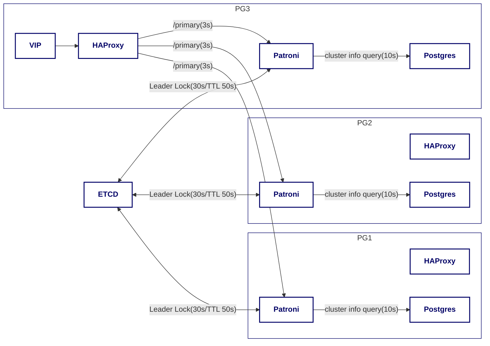

## 1 背景简介

我们的生产环境依赖一套由 Patroni 管理的 PostgreSQL 高可用集群。该集群通过 HAProxy + Keepalived 对外提供服务，并使用 ETCD 存储集群状态。在故障发生前，这套系统一直稳定运行，支撑着核心业务。

但最近的系统可用性被一系列周期性的“主库无响应”事件打破。监控系统开始频繁告警，业务团队也反馈服务出现短暂中断。具体表现为，主数据库节点上的 SQL 查询（包括来自 Patroni 和 HAProxy 的健康检查）会长时间无响应，最终超时。

每次故障发生，Patroni 忠实地履行了预定的主从切换程序，从老的主节点无响应到新的主节点就位，这个过程大约需要一到一分半钟。在此期间，少量正在进行的业务请求会失败，对用户体验和业务连续性造成了困扰。

本文将完整复盘这次棘手的 PostgreSQL 周期性“假死”故障的排查过程。您将看到我们如何从最初的迷茫，通过层层分析日志、系统指标和内部锁机制，最终定位到由 `pg_stat_statements` 扩展引发的性能瓶颈。希望我们的排查思路、使用的工具以及最终的解决方案能为您在处理类似数据库疑难杂症时提供一些有价值的参考。

## 2 故障现象与初步诊断

### 2.1 详细故障现象

故障核心表现为数据库主节点周期性无响应，包括 Patroni 和 HAProxy 的健康检查查询，继而由 Patroni 触发主从切换，业务短暂中断一分到一分半钟后，新主节点就绪来恢复服务运转。

在过去一段时间内，这种现象多次发生，具体时间点如下：

- 2025-01-02 13:23:37 (主节点 PG1 无响应)
- 2025-01-04 11:06:07 (主节点 PG2 无响应)
- 2025-01-05 12:25:07 (主节点 PG3 无响应)
- 2025-01-07 03:46:37 (主节点 PG2 无响应)
- 2025-01-08 13:12:07 (主节点 PG3 无响应)
- 2025-01-09 18:19:39 (主节点 PG1 无响应)
- 2025-01-11 00:34:00 (主节点 PG1 无响应)

### 2.2 系统部署架构

在进一步开展故障排查之前，我们首先明确了系统的部署架构。以下是我们的 PostgreSQL 高可用集群架构图：


- 图上假定当前 VIP 漂移到 PG3 节点，该节点的 HAProxy 作为主从流量分发器。仅绘制一个 HAProxy 作为示意，事实上三节点均部署有 HAProxy 。
- HAProxy 定期（每3秒）通过访问 Patroni 的 `/primary` 接口检查主节点状态，超时时间15秒，失败3次则认为节点不可用。
- Patroni 主节点定期（每10秒）检查 Postgres 状态，并尝试维持在 ETCD 中的 Leader 角色（TTL 50秒）。

### 2.3 监控与日志分析

#### 2.3.1 数据库日志分析

通过分析数据库日志，我们发现存在大量的 `canceling statement due to statement timeout` 错误，这些错误通常是由于数据库执行的 SQL 语句超过了设定的超时时间而被取消。

以下日志片段分别记录了两种关键的超时场景：
- Patroni heartbeat 心跳连接进程 (PID=113729)：该进程由本节点的 Patroni 服务发起，用于定期（每 10 秒一次）执行 SQL 查询以监控数据库状态。
- Patroni REST API 连接进程 (PID=113734)：该进程源于 HAProxy 对 Patroni REST API 的调用（通常来自所有三个 HAProxy 节点），最终由 Patroni 触发 SQL 查询。此健康检查每 3 秒进行一次，由于涉及 3 个节点调用，因此总计近似每 3 秒产生三次此类查询。

```sql
-- 数据库进程(PID=113729): 最后一次执行成功的 SQL 语句
2025-01-11 00:30:55 CST [113729-12939] [local] postgres@postgres LOG:  statement: SELECT CASE WHEN pg_catalog.pg_is_in_recovery() THEN 0 ELSE ('x' || pg_catalog.substr(pg_catalog.pg_walfile_name(pg_catalog.pg_current_wal_lsn()), 1, 8))::bit(32)::int END, CASE WHEN pg_catalog.pg_is_in_recovery() THEN 0 ELSE pg_catalog.pg_wal_lsn_diff(pg_catalog.pg_current_wal_flush_lsn(), '0/0')::bigint END, pg_catalog.pg_wal_lsn_diff(pg_catalog.pg_last_wal_replay_lsn(), '0/0')::bigint, pg_catalog.pg_wal_lsn_diff(COALESCE(pg_catalog.pg_last_wal_receive_lsn(), '0/0'), '0/0')::bigint, pg_catalog.pg_is_in_recovery() AND pg_catalog.pg_is_wal_replay_paused(), 0, CASE WHEN latest_end_lsn IS NULL THEN NULL ELSE received_tli END, slot_name, conninfo, status, pg_catalog.current_setting('restore_command'), (SELECT pg_catalog.json_agg(s.*) FROM (SELECT slot_name, slot_type as type, datoid::bigint, plugin, catalog_xmin, pg_catalog.pg_wal_lsn_diff(confirmed_flush_lsn, '0/0')::bigint AS confirmed_flush_lsn, pg_catalog.pg_wal_lsn_diff(restart_lsn, '0/0')::bigint AS restart_lsn, xmin FROM pg_catalog.pg_get_replication_slots()) AS s), 'on', '', NULL FROM pg_catalog.pg_stat_get_wal_receiver()
-- 数据库进程(PID=113729): 受阻塞的 SQL 语句
2025-01-11 00:31:05 CST [113729-12940] [local] postgres@postgres LOG:  statement: SELECT CASE WHEN pg_catalog.pg_is_in_recovery() THEN 0 ELSE ('x' || pg_catalog.substr(pg_catalog.pg_walfile_name(pg_catalog.pg_current_wal_lsn()), 1, 8))::bit(32)::int END, CASE WHEN pg_catalog.pg_is_in_recovery() THEN 0 ELSE pg_catalog.pg_wal_lsn_diff(pg_catalog.pg_current_wal_flush_lsn(), '0/0')::bigint END, pg_catalog.pg_wal_lsn_diff(pg_catalog.pg_last_wal_replay_lsn(), '0/0')::bigint, pg_catalog.pg_wal_lsn_diff(COALESCE(pg_catalog.pg_last_wal_receive_lsn(), '0/0'), '0/0')::bigint, pg_catalog.pg_is_in_recovery() AND pg_catalog.pg_is_wal_replay_paused(), 0, CASE WHEN latest_end_lsn IS NULL THEN NULL ELSE received_tli END, slot_name, conninfo, status, pg_catalog.current_setting('restore_command'), (SELECT pg_catalog.json_agg(s.*) FROM (SELECT slot_name, slot_type as type, datoid::bigint, plugin, catalog_xmin, pg_catalog.pg_wal_lsn_diff(confirmed_flush_lsn, '0/0')::bigint AS confirmed_flush_lsn, pg_catalog.pg_wal_lsn_diff(restart_lsn, '0/0')::bigint AS restart_lsn, xmin FROM pg_catalog.pg_get_replication_slots()) AS s), 'on', '', NULL FROM pg_catalog.pg_stat_get_wal_receiver()
-- 数据库进程(PID=113729): 错误，执行超时
2025-01-11 00:32:37 CST [113729-12941] [local] postgres@postgres ERROR:  canceling statement due to statement timeout
-- 数据库进程(PID=113729): 配合上一行日志，打印出执行超时的 SQL 语句
2025-01-11 00:32:37 CST [113729-12942] [local] postgres@postgres STATEMENT:  SELECT CASE WHEN pg_catalog.pg_is_in_recovery() THEN 0 ELSE ('x' || pg_catalog.substr(pg_catalog.pg_walfile_name(pg_catalog.pg_current_wal_lsn()), 1, 8))::bit(32)::int END, CASE WHEN pg_catalog.pg_is_in_recovery() THEN 0 ELSE pg_catalog.pg_wal_lsn_diff(pg_catalog.pg_current_wal_flush_lsn(), '0/0')::bigint END, pg_catalog.pg_wal_lsn_diff(pg_catalog.pg_last_wal_replay_lsn(), '0/0')::bigint, pg_catalog.pg_wal_lsn_diff(COALESCE(pg_catalog.pg_last_wal_receive_lsn(), '0/0'), '0/0')::bigint, pg_catalog.pg_is_in_recovery() AND pg_catalog.pg_is_wal_replay_paused(), 0, CASE WHEN latest_end_lsn IS NULL THEN NULL ELSE received_tli END, slot_name, conninfo, status, pg_catalog.current_setting('restore_command'), (SELECT pg_catalog.json_agg(s.*) FROM (SELECT slot_name, slot_type as type, datoid::bigint, plugin, catalog_xmin, pg_catalog.pg_wal_lsn_diff(confirmed_flush_lsn, '0/0')::bigint AS confirmed_flush_lsn, pg_catalog.pg_wal_lsn_diff(restart_lsn, '0/0')::bigint AS restart_lsn, xmin FROM pg_catalog.pg_get_replication_slots()) AS s), 'on', '', NULL FROM pg_catalog.pg_stat_get_wal_receiver()
```

```sql
-- 数据库进程(PID=113734): 最后一次执行成功的 SQL 语句
2025-01-11 00:31:02 CST [113734-107905] [local] postgres@postgres LOG:  statement: SELECT pg_catalog.pg_postmaster_start_time(), CASE WHEN pg_catalog.pg_is_in_recovery() THEN 0 ELSE ('x' || pg_catalog.substr(pg_catalog.pg_walfile_name(pg_catalog.pg_current_wal_lsn()), 1, 8))::bit(32)::int END, CASE WHEN pg_catalog.pg_is_in_recovery() THEN 0 ELSE pg_catalog.pg_wal_lsn_diff(pg_catalog.pg_current_wal_flush_lsn(), '0/0')::bigint END, pg_catalog.pg_wal_lsn_diff(pg_catalog.pg_last_wal_replay_lsn(), '0/0')::bigint, pg_catalog.pg_wal_lsn_diff(COALESCE(pg_catalog.pg_last_wal_receive_lsn(), '0/0'), '0/0')::bigint, pg_catalog.pg_is_in_recovery() AND pg_catalog.pg_is_wal_replay_paused(), pg_catalog.pg_last_xact_replay_timestamp(), (pg_catalog.pg_stat_get_wal_receiver()).status, pg_catalog.current_setting('restore_command'), pg_catalog.array_to_json(pg_catalog.array_agg(pg_catalog.row_to_json(ri))) FROM (SELECT (SELECT rolname FROM pg_catalog.pg_authid WHERE oid = usesysid) AS usename, application_name, client_addr, w.state, sync_state, sync_priority FROM pg_catalog.pg_stat_get_wal_senders() w, pg_catalog.pg_stat_get_activity(pid)) AS ri
-- 数据库进程(PID=113734): 受阻塞的 SQL 语句
2025-01-11 00:31:05 CST [113734-107906] [local] postgres@postgres LOG:  statement: SELECT pg_catalog.pg_postmaster_start_time(), CASE WHEN pg_catalog.pg_is_in_recovery() THEN 0 ELSE ('x' || pg_catalog.substr(pg_catalog.pg_walfile_name(pg_catalog.pg_current_wal_lsn()), 1, 8))::bit(32)::int END, CASE WHEN pg_catalog.pg_is_in_recovery() THEN 0 ELSE pg_catalog.pg_wal_lsn_diff(pg_catalog.pg_current_wal_flush_lsn(), '0/0')::bigint END, pg_catalog.pg_wal_lsn_diff(pg_catalog.pg_last_wal_replay_lsn(), '0/0')::bigint, pg_catalog.pg_wal_lsn_diff(COALESCE(pg_catalog.pg_last_wal_receive_lsn(), '0/0'), '0/0')::bigint, pg_catalog.pg_is_in_recovery() AND pg_catalog.pg_is_wal_replay_paused(), pg_catalog.pg_last_xact_replay_timestamp(), (pg_catalog.pg_stat_get_wal_receiver()).status, pg_catalog.current_setting('restore_command'), pg_catalog.array_to_json(pg_catalog.array_agg(pg_catalog.row_to_json(ri))) FROM (SELECT (SELECT rolname FROM pg_catalog.pg_authid WHERE oid = usesysid) AS usename, application_name, client_addr, w.state, sync_state, sync_priority FROM pg_catalog.pg_stat_get_wal_senders() w, pg_catalog.pg_stat_get_activity(pid)) AS ri
-- 数据库进程(PID=113734): 错误，执行超时
2025-01-11 00:32:37 CST [113734-107907] [local] postgres@postgres ERROR:  canceling statement due to statement timeout
-- 数据库进程(PID=113734): 配合上一行日志，打印出执行超时的 SQL 语句
2025-01-11 00:32:37 CST [113734-107908] [local] postgres@postgres STATEMENT:  SELECT pg_catalog.pg_postmaster_start_time(), CASE WHEN pg_catalog.pg_is_in_recovery() THEN 0 ELSE ('x' || pg_catalog.substr(pg_catalog.pg_walfile_name(pg_catalog.pg_current_wal_lsn()), 1, 8))::bit(32)::int END, CASE WHEN pg_catalog.pg_is_in_recovery() THEN 0 ELSE pg_catalog.pg_wal_lsn_diff(pg_catalog.pg_current_wal_flush_lsn(), '0/0')::bigint END, pg_catalog.pg_wal_lsn_diff(pg_catalog.pg_last_wal_replay_lsn(), '0/0')::bigint, pg_catalog.pg_wal_lsn_diff(COALESCE(pg_catalog.pg_last_wal_receive_lsn(), '0/0'), '0/0')::bigint, pg_catalog.pg_is_in_recovery() AND pg_catalog.pg_is_wal_replay_paused(), pg_catalog.pg_last_xact_replay_timestamp(), (pg_catalog.pg_stat_get_wal_receiver()).status, pg_catalog.current_setting('restore_command'), pg_catalog.array_to_json(pg_catalog.array_agg(pg_catalog.row_to_json(ri))) FROM (SELECT (SELECT rolname FROM pg_catalog.pg_authid WHERE oid = usesysid) AS usename, application_name, client_addr, w.state, sync_state, sync_priority FROM pg_catalog.pg_stat_get_wal_senders() w, pg_catalog.pg_stat_get_activity(pid)) AS ri
```

当数据库主节点从阻塞状态恢复后，Patroni 判断 PG 不可用，发送了重启指令。

```sql
2025-01-11 00:32:37 CST [102590-9]  LOG:  received immediate shutdown request
2025-01-11 00:34:07 CST [971804-8]  LOG:  received fast shutdown request
```

#### 2.3.2 Patroni 日志分析

- 00:30:55，PG1 最后一次声明自己为主节点（例行心跳）
- 自 00:31:48 起，PG3 升格为主节点。
- 自 00:32:37 起，PG1 从阻塞恢复，尝试声明自己为主节点（例行心跳），发现失败。

时序事件很清晰地表明其对 PostgreSQL 执行的 SQL 查询（如 `cluster_info_query`）超时，因此无法更新 ETCD 中的 Leader Lock，最终导致降级和新主选举。

```sql
Jan 11 00:30:05 localhost patroni[4171439]: 2025-01-11 00:30:05,182 INFO: no action. I am (pgnode01), the leader with the lock
Jan 11 00:30:15 localhost patroni[4171439]: 2025-01-11 00:30:15,183 INFO: no action. I am (pgnode01), the leader with the lock
Jan 11 00:30:25 localhost patroni[4171439]: 2025-01-11 00:30:25,183 INFO: no action. I am (pgnode01), the leader with the lock
Jan 11 00:30:35 localhost patroni[4171439]: 2025-01-11 00:30:35,183 INFO: no action. I am (pgnode01), the leader with the lock
Jan 11 00:30:45 localhost patroni[4171439]: 2025-01-11 00:30:45,183 INFO: no action. I am (pgnode01), the leader with the lock
Jan 11 00:30:55 localhost patroni[4171439]: 2025-01-11 00:30:55,182 INFO: no action. I am (pgnode01), the leader with the lock
Jan 11 00:32:37 localhost patroni[4171439]: 2025-01-11 00:31:05,048 INFO: Lock owner: pgnode01; I am pgnode01
Jan 11 00:32:37 localhost patroni[4171439]: 2025-01-11 00:32:37,568 ERROR: Exception when called state_handler.last_operation()
Jan 11 00:32:37 localhost patroni[4171439]: Traceback (most recent call last):
Jan 11 00:32:37 localhost patroni[4171439]:  File "/usr/local/lib/python3.9/site-packages/patroni/ha.py", line 385, in update_lock
Jan 11 00:32:37 localhost patroni[4171439]:    last_lsn = self._last_wal_lsn = self.state_handler.last_operation()
Jan 11 00:32:37 localhost patroni[4171439]:  File "/usr/local/lib/python3.9/site-packages/patroni/postgresql/__init__.py", line 1267, in last_operation
Jan 11 00:32:37 localhost patroni[4171439]:    return self._wal_position(self.is_primary(), self._cluster_info_state_get('wal_position') or 0,
Jan 11 00:32:37 localhost patroni[4171439]:  File "/usr/local/lib/python3.9/site-packages/patroni/postgresql/__init__.py", line 575, in is_primary
Jan 11 00:32:37 localhost patroni[4171439]:    return bool(self._cluster_info_state_get('timeline'))
Jan 11 00:32:37 localhost patroni[4171439]:  File "/usr/local/lib/python3.9/site-packages/patroni/postgresql/__init__.py", line 476, in _cluster_info_state_get
Jan 11 00:32:37 localhost patroni[4171439]:    result = self._is_leader_retry(self._query, self.cluster_info_query)[0]
Jan 11 00:32:37 localhost patroni[4171439]:  File "/usr/local/lib/python3.9/site-packages/patroni/utils.py", line 763, in __call__
Jan 11 00:32:37 localhost patroni[4171439]:    return func(*args, **kwargs)
Jan 11 00:32:37 localhost patroni[4171439]:  File "/usr/local/lib/python3.9/site-packages/patroni/postgresql/__init__.py", line 385, in _query
Jan 11 00:32:37 localhost patroni[4171439]:    return self._connection.query(sql, *params)
Jan 11 00:32:37 localhost patroni[4171439]:  File "/usr/local/lib/python3.9/site-packages/patroni/postgresql/connection.py", line 84, in query
Jan 11 00:32:37 localhost patroni[4171439]:    raise exc
Jan 11 00:32:37 localhost patroni[4171439]:  File "/usr/local/lib/python3.9/site-packages/patroni/postgresql/connection.py", line 74, in query
Jan 11 00:32:37 localhost patroni[4171439]:    cursor.execute(sql.encode('utf-8'), params or None)
Jan 11 00:32:37 localhost patroni[4171439]: psycopg2.errors.QueryCanceled: canceling statement due to statement timeout
Jan 11 00:32:37 localhost patroni[4171439]: 2025-01-11 00:32:37,568 ERROR: get_postgresql_status
Jan 11 00:32:37 localhost patroni[4171439]: Traceback (most recent call last):
Jan 11 00:32:37 localhost patroni[4171439]:  File "/usr/local/lib/python3.9/site-packages/patroni/api.py", line 1320, in get_postgresql_status
Jan 11 00:32:37 localhost patroni[4171439]:    row = self.query(stmt.format(postgresql.wal_name, postgresql.lsn_name,
Jan 11 00:32:37 localhost patroni[4171439]:  File "/usr/local/lib/python3.9/site-packages/patroni/api.py", line 1252, in query
Jan 11 00:32:37 localhost patroni[4171439]:    return self.server.query(sql, *params)
Jan 11 00:32:37 localhost patroni[4171439]:  File "/usr/local/lib/python3.9/site-packages/patroni/api.py", line 1454, in query
Jan 11 00:32:37 localhost patroni[4171439]:    return connection.query(sql, *params)
Jan 11 00:32:37 localhost patroni[4171439]:  File "/usr/local/lib/python3.9/site-packages/patroni/postgresql/connection.py", line 84, in query
Jan 11 00:32:37 localhost patroni[4171439]:    raise exc
Jan 11 00:32:37 localhost patroni[4171439]:  File "/usr/local/lib/python3.9/site-packages/patroni/postgresql/connection.py", line 74, in query
Jan 11 00:32:37 localhost patroni[4171439]:    cursor.execute(sql.encode('utf-8'), params or None)
Jan 11 00:32:37 localhost patroni[4171439]: psycopg2.errors.QueryCanceled: canceling statement due to statement timeout
// something omitted ...
Jan 11 00:32:37 localhost patroni[4171439]: 2025-01-11 00:32:37,811 ERROR: failed to update leader lock
Jan 11 00:32:37 localhost patroni[4171439]: 2025-01-11 00:32:37,813 INFO: Demoting self (immediate-nolock)
Jan 11 00:32:52 localhost patroni[4171439]: 2025-01-11 00:32:52,985 INFO: demoted self because failed to update leader lock in DCS
Jan 11 00:32:52 localhost patroni[4171439]: 2025-01-11 00:32:52,987 WARNING: Loop time exceeded, rescheduling immediately.
Jan 11 00:32:52 localhost patroni[4171439]: 2025-01-11 00:32:52,988 INFO: Lock owner: pgnode03; I am pgnode01
Jan 11 00:32:52 localhost patroni[4171439]: 2025-01-11 00:32:52,988 INFO: starting after demotion in progress
Jan 11 00:32:52 localhost patroni[4171439]: 2025-01-11 00:32:52,988 INFO: Lock owner: pgnode03; I am pgnode01
Jan 11 00:32:52 localhost patroni[4171439]: 2025-01-11 00:32:52,988 INFO: starting after demotion in progress
Jan 11 00:32:52 localhost patroni[4171439]: 2025-01-11 00:32:52,990 INFO: closed patroni connections to postgres
Jan 11 00:32:53 localhost patroni[4171439]: 2025-01-11 00:32:53,079 INFO: establishing a new patroni heartbeat connection to postgres
Jan 11 00:32:53 localhost patroni[4171439]: 2025-01-11 00:32:53,118 INFO: establishing a new patroni heartbeat connection to postgres
Jan 11 00:32:53 localhost patroni[4171439]: 2025-01-11 00:32:53,151 INFO: establishing a new patroni heartbeat connection to postgres
Jan 11 00:32:54 localhost patroni[4171439]: 2025-01-11 00:32:54,112 INFO: postmaster pid=971804
Patroni 3
```

#### 2.3.3 HAProxy 日志分析

HAProxy 配置有 http-check，正常是 3 秒触发一次。失败 3 次认为服务不可用。每次 HTTP check 请求的超时时间是 15 秒。

从 `2025-01-11 00:31:05` 发起第一次检测请求，每 15 秒超时一次，以及 fastinter 间隔 1 秒。
到 `2025-01-11 00:31:52` ，确认 MASTER/pgnode01 不可用。

```sql
Jan 11 00:31:52 pgnode01 haproxy[266304]: [WARNING]  (266304) : Server master/pgnode01 is DOWN, reason: Layer7 timeout, check duration: 15002ms. 0 active and 0 backup servers left. 0 sessions active, 0 requeued, 0 remaining in queue.
```

#### 2.3.4 系统监控

观察主节点 PG1 00:32:37 前（收到停机指令前）的监控指标（CPU 使用率、系统负载、网络速率等），未见明显异常。

但可以观察到进程内存增长，磁盘 IO 打高。


更细粒度地获取 PG 服务器的内存指标


分析信息如下：

| 参数项 | 00:31:00 读数 | 00:32:37 读数 | 读数差 |
| --- | --- | --- | --- |
| pgpgin | 2693021082 | 2697326022 | 4304940 = 4.1 M Pages |
| memory_cache | 56787918848 | 46933356544 | 9854562304 = 9.178 GB |
| memory_free | 1425088512 | 5657796608 | 4232708096 = 3.94 GB |

监控数据显示，在故障时段，系统的页面缓存（memory_cache）显著下降约 9.18 GB，而空闲内存（memory_free）上升约 3.94 GB。同时，pgpgin 指标显示有大量页面从磁盘读入。这些现象暗示了系统可能在进行密集的磁盘读取操作，导致缓存被替换。

### 2.4 初步排查路径与假设

根据日志、监控指标，以及对故障的时序分析，HAProxy、Patroni 等组件均忠实地执行了预期的功能，没有出现异常。核心的故障成因很大可能性出现在 PostgreSQL 内部。

根据上述信息，初步猜测 PostgreSQL 内部存在以下问题：

- 数据库进程内存增长与大量页的换入，可能存在一个大量载入数据的 SQL
- 锁的存在，导致其他 SQL 执行被阻塞

然而，这一现象与一些常规预期（读操作不应长时间阻塞其他读操作）有所出入。

- 读 SQL 持有共享锁，不应阻塞其他读 SQL
- Patroni 对 Postgres 的连接设置了 `statement_timeout = 2000` （即 2 秒超时）

虽然认定 PostgreSQL 内部存在问题，但我们仍需进一步收集信息，进行更深入的分析。

## 3 深入分析与定位

为了更深入地定位故障的根本原因，我们临时在集群外挂了 `strace` 工具，对 PostgreSQL 进程进行了系统调用追踪。并在下一次主节点崩溃时捕获到了关键的系统调用日志。

### 3.1 系统调用追踪

我们在 PostgreSQL 进程上执行了以下命令：

```bash
strace -T -p <postgres_pid>
```

通过采集故障期间 PostgreSQL 进程的系统调用日志，发现 `futex` 调用存在长时间等待（如下日志中记录为 83 秒），这是导致 PostgreSQL 进程阻塞的关键。在 PostgreSQL 中，`futex` 主要用于实现轻量锁 (LWLock)，表明轻量锁 LWLock 争用是导致相关 PostgreSQL 进程阻塞的关键。

```plain
futex(0x7efbe8960538, FUTEX_WAIT_BITSET|FUTEX_CLOCK_REALTIME, 0, NULL, FUTEX_BITSET_MATCH_ANY) = ? ERESTARTSYS (To be restarted if SA_RESTART is set) <1.451096>
futex(0x7efbe8960538, FUTEX_WAIT_BITSET|FUTEX_CLOCK_REALTIME, 0, NULL, FUTEX_BITSET_MATCH_ANY) = ? ERESTARTSYS (To be restarted if SA_RESTART is set) <0.548451>
futex(0x7efbe8960538, FUTEX_WAIT_BITSET|FUTEX_CLOCK_REALTIME, 0, NULL, FUTEX_BITSET_MATCH_ANY) = ? ERESTARTSYS (To be restarted if SA_RESTART is set) <7.453295>
futex(0x7efbe8960538, FUTEX_WAIT_BITSET|FUTEX_CLOCK_REALTIME, 0, NULL, FUTEX_BITSET_MATCH_ANY) = 0 <83.968462>
futex(0x7efbe895aa38, FUTEX_WAKE, 1) = 1 <0.000012>
```

### 3.2 LWLock 追踪

为了进一步分析 LWLock 的争用情况，我们使用了 `pg_lw_lock_tracer` 工具。该工具能够实时追踪 PostgreSQL 中所有的 LWLock，包括共享锁和排他锁。通过分析 LWLock 的争用情况，我们发现了一个明显的争用热点：`pg_stat_statements` LWLock，进程 `1546168` 长时间（约 85.8 秒）等待 。

```plain
1456519339511420 [Pid 1546168] Acquired lock pg_stat_statements (mode LW_SHARED) / LWLockAcquire()
1456519339514243 [Pid 1546168] Unlock pg_stat_statements
1456519340867759 [Pid 1546168] Acquired lock pg_stat_statements (mode LW_SHARED) / LWLockAcquire()
1456519340870396 [Pid 1546168] Unlock pg_stat_statements
1456521211182426 [Pid 1546168] Wait for pg_stat_statements
1456607090196214 [Pid 1546168] Wait for pg_stat_statements lock took 85879013788 ns
1456607090230984 [Pid 1546168] Acquired lock pg_stat_statements (mode LW_SHARED) / LWLockAcquire()
1456607090254843 [Pid 1546168] Unlock pg_stat_statements
```

## 4 根因技术解读

综合以上排查，根本原因指向 PostgreSQL 的 `pg_stat_statements` 扩展及其相关的维护操作。

| | |
| --- | --- |
|  |  |

<center><small>图：pg_stat_statements 相关源码</small></center>

系统配置了 `pg_stat_statements` 扩展，并启用了持久化：

```ini
pg_stat_statements.max: 10000
pg_stat_statements.save: true
```

通过阅读源码与配置，我们明确了故障发生的机制：

1. 当 `pg_stat_statements.save` 为 `true` 时，统计信息会保存在数据目录下的 `pgss_query_texts.stat`。
2. `pg_stat_statements` 垃圾回收(GC)机制：当记录的语句数量达到 `pg_stat_statements.max` 时，会触发 GC 清理旧统计。
3. 排他锁获取：GC 或写入新语句文本到持久化文件时，`pg_stat_statements` 扩展需要获取内部的 `pg_stat_statements` LWLock，并且通常是以排他模式 (LW_EXCLUSIVE) 获取。
4. 磁盘 I/O 密集操作：如果持久化文件非常大（案例中观察到 4.1 GB，约 7000 条 SQL），GC 过程需要将此大文件读入内存处理再写回，产生大量磁盘 I/O（对应观察到的 `pgpgin` 飙高和 `memory_cache` 下降）。
5. 长时间持锁：由于磁盘 I/O 缓慢或文件过大，持有 `pg_stat_statements` 排他锁的时间会非常长（如记录的 85 秒）。
6. 查询全面阻塞：在此期间，任何尝试执行 SQL 并需要记录到 `pg_stat_statements` 的会话（几乎所有会话），都需要获取该锁的共享模式 (LW_SHARED)。由于排他锁被 GC 进程持有，这些会话全部陷入等待，导致全面的查询阻塞和超时。Patroni 和 HAProxy 的健康检查 SQL 也因此受阻，触发故障切换。

## 5 解决方案与建议

针对上述根因，提出以下解决措施和建议：

1. 优化磁盘 I/O 性能: 提升存储系统的 I/O 能力，可以显著缩短 `pg_stat_statements` GC 操作的持锁时间。
2. 调整 `pg_stat_statements.max`: 适当降低 `pg_stat_statements.max` 的值。这将减小 `pgss_query_texts.stat` 文件的大小，从而减轻 GC 的压力和持锁时间。需要权衡统计信息的详细程度和系统性能。
3. 禁用 `pg_stat_statements` 插件: 如果 `pg_stat_statements` 提供的详细 SQL 统计并非业务强依赖，或者有其他监控替代方案，可以考虑禁用此插件，从根本上消除此问题。
4. 监控与定期重置 (缓解措施): 监控 `pg_stat_statements` 相关文件的大小，并在必要时（如维护窗口）手动调用 `pg_stat_statements_reset()` 来清空统计信息，减小文件体积。但这是一种治标不治本的方法。

最终，我们分析了插件的应用场景，在确定应用面较小，且优化 I/O 成本过高后，确定禁用 `pg_stat_statements` 插件，以彻底解决 PostgreSQL 中的查询阻塞问题。