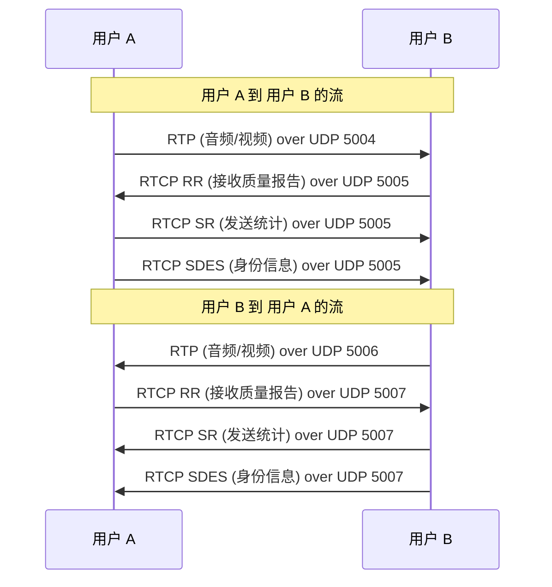

在网络世界里，“会话协议”通常不是指某一个单独的协议，而是指为了完成一次完整的通信会话（比如打一通网络电话）而协同工作的一组协议。我们可以用大家熟悉的打电话过程来做个类比：

- **会话初始协议 (Session Initiation Protocol, SIP)**：就像是电话系统里的“拨号”和“接听”机制。它负责发起、管理和结束通话，确保你的设备能连上网络并找到你想呼叫的人。
- **会话描述协议 (Session Description Protocol, SDP)**：如同通话前商量好“我们是用中文还是英文交流？”。它用来协商沟通的具体方式，比如是用语音还是视频，以及使用哪种编码格式。
- **实时传输协议 (Real-time Transport Protocol, RTP)**：则负责在通话过程中实际传输你的声音和图像数据。
- **实时传输控制协议（Real-time Transport Control Protocol, RTCP）**：用来监控数据传输的质量和进行一些会话管理。
 
如果你对这些协议还不熟悉，接下来的内容会用打电话的例子带你一步步了解它们是如何协同工作的。
 
## 1 会话初始协议

**会话初始协议 (SIP)** 是一种应用层控制协议，它的核心任务是在一个或多个参与者之间**创建、修改和终止会话**。这里的“会话”可以是互联网电话、视频会议、即时消息，甚至是网络游戏等多种形式。简单来说，SIP 就是那个负责“牵线搭桥”和“维持通话”的协议。
 

让我们通过一个经典的 Alice 呼叫 Bob 的例子，来看看 SIP 是如何工作的（你可以对照一下自己平时打电话的步骤）：

1. Alice 向 Bob 发起通话 (F1 ~ F5)
2. Bob 的 SIP 电话响铃 (F6 ~ F8)
3. Bob 接听通话 (F9 ~ F11)
4. Alice 确认通话 (F12)
5. 通话过程 (Media Session)
6. Bob 挂断通话 (F13 ~ F14)

```plain
                     atlanta.com  . . . biloxi.com
                 .      proxy              proxy     .
               .                                       .
       Alice's  . . . . . . . . . . . . . . . . . . . .  Bob's
      softphone                                        SIP Phone
         |                |                |                |
         |    INVITE F1   |                |                |
         |--------------->|    INVITE F2   |                |
         |  100 Trying F3 |--------------->|    INVITE F4   |
         |<---------------|  100 Trying F5 |--------------->|
         |                |<-------------- | 180 Ringing F6 |
         |                | 180 Ringing F7 |<---------------|
         | 180 Ringing F8 |<---------------|     200 OK F9  |
         |<---------------|    200 OK F10  |<---------------|
         |    200 OK F11  |<---------------|                |
         |<---------------|                |                |
         |                       ACK F12                    |
         |------------------------------------------------->|
         |                   Media Session                  |
         |<================================================>|
         |                       BYE F13                    |
         |<-------------------------------------------------|
         |                     200 OK F14                   |
         |------------------------------------------------->|
         |                                                  |
```
<small>图 1. 一次典型的 SIP 通话流程 (来源：RFC3261)</small>
 
### 1.1 创建会话 (INVITE)
 
图 1 中 F1 的 INVITE 消息

```plain
INVITE sip:bob@biloxi.com SIP/2.0
Via: SIP/2.0/UDP pc33.atlanta.com;branch=z9hG4bK776asdhds
Max-Forwards: 70
To: Bob <sip:bob@biloxi.com>
From: Alice <sip:alice@atlanta.com>;tag=1928301774
Call-ID: a84b4c76e66710@pc33.atlanta.com
CSeq: 314159 INVITE
Contact: <sip:alice@pc33.atlanta.com>
Content-Type: application/sdp
Content-Length: 142
```

这个 `INVITE` 消息就像是 Alice 按下了呼叫按钮后发出的信号，其中包含了一些关键信息：

| 参数 | 描述 |
| --- | --- |
| Via | 发起人希望从该地址(pc33.atlanta.com)接收此请求的响应。以及标识当前事务的分支参数。 |
| Max-Forwards | 表示此请求的最大递归次数，即跳数。 |
| To | 指定请求的目标对象。 |
| From | 表示请求的发起人。 |
| Call-ID | 全局唯一标识符，由随机字符串和主机名/IP地址组合 |
| CSeq | 指定此请求的序列号。 |
| Contact | 表示联系 Alice 的直接路由 |
| Content-Type | 表示此请求的内容类型。 |
| Content-Length | 表示此请求的内容长度。 |
 

这里的 `Call-ID`、`From` 头中的 `tag` 参数、以及后续响应中 `To` 头里的 `tag` 参数，共同构成了一个唯一的标识，用于区分这次特定的通话，这在 SIP 中称为一个 **Dialog（对话）**。
 
### 1.2 修改会话 (re-INVITE)
 
有时候在通话过程中，我们可能想做些改变，比如从纯语音通话切换到视频通话。这时就需要用到 `re-INVITE`。
 
`re-INVITE` 本质上还是一个 `INVITE` 请求，但它发生在已建立的对话（Dialog）中。它的主要目的是**重新协商会话参数**。与初始 `INVITE` 的一个关键区别是，`re-INVITE` 中的 `To` 字段会包含一个 `tag` 参数，表明这是针对现有对话的请求。

```plain
INVITE sip:bob@biloxi.com SIP/2.0
Via: SIP/2.0/UDP pc33.atlanta.com;branch=z9hG4bK776asdhds
Max-Forwards: 70
To: Bob <sip:bob@biloxi.com>;tag=a6c85cf
From: Alice <sip:alice@atlanta.com>;tag=1928301774
Call-ID: a84b4c76e66710@pc33.atlanta.com
CSeq: 314159 INVITE
Contact: <sip:alice@pc33.atlanta.com>
Content-Type: application/sdp
Content-Length: 142
```
 
### 1.3 终止会话 (BYE)
 
当通话结束，比如 Bob 挂断电话时，会发送一个 `BYE` 请求，如图 1 中的 F13 所示。这个消息非常简单，主要目的是通知对方通话结束。

```plain
BYE sip:alice@pc33.atlanta.com SIP/2.0
Via: SIP/2.0/UDP 192.0.2.4;branch=z9hG4bKnashds10
Max-Forwards: 70
From: Bob <sip:bob@biloxi.com>;tag=a6c85cf
To: Alice <sip:alice@atlanta.com>;tag=1928301774
Call-ID: a84b4c76e66710
CSeq: 231 BYE
Content-Length: 0
```


### 1.4 注册 (REGISTER)

在你能够接听电话之前，你的 SIP 设备（比如网络电话或手机 App）需要先告诉网络“我在这里，我的地址是这个，有电话打给我请转到这里来”。这个过程就是**注册**。设备会向一个叫做**注册服务器 (Registrar)** 的地方发送 `REGISTER` 请求。
 
```plain
    biloxi.com         Bob's
    registrar       softphone
        |                |
        |   REGISTER F1  |
        |<---------------|
        |    200 OK F2   |
        |--------------->|
```

<small>图 2. SIP 注册过程</small>

```plain
REGISTER sip:registrar.biloxi.com SIP/2.0
Via: SIP/2.0/UDP bobspc.biloxi.com:5060;branch=z9hG4bKnashds7
Max-Forwards: 70
To: Bob <sip:bob@biloxi.com>
From: Bob <sip:bob@biloxi.com>;tag=456248
Call-ID: 843817637684230@998sdasdh09
CSeq: 1826 REGISTER
Contact: <sip:bob@192.0.2.4>
Expires: 7200
Content-Length: 0
```

### 1.5 SIP 响应
 
对于每一个 SIP 请求，都会有一个或多个 SIP 响应。响应消息会包含一个**状态码**（如 `200`）和一个**原因短语**（如 `OK`），告知请求的处理结果。

SIP 的状态码设计很大程度上借鉴了 HTTP/1.1，所以你会看到很多熟悉的数字，比如 `200 OK` 表示成功，`404 Not Found` 表示未找到用户。SIP 还增加了一些特有的状态码，特别是 1XX（临时响应，如 `180 Ringing` 表示对方正在响铃）和 6XX（全局性失败）。

| 响应代码 | 功能说明 |
| --- | --- |
| 1XX | Provisional, 临时的响应 |
| 2XX | Successful, 成功的响应 |
| 3XX | Redirection, 重定向 |
| 4XX | Request Failure, 请求故障 |
| 5XX | Server Failure, 服务器故障 |
| 6XX | Global Failures, 全局故障 |


```plain
SIP/2.0 200 OK
Via: SIP/2.0/UDP server10.biloxi.com
    ;branch=z9hG4bKnashds8;received=192.0.2.3
Via: SIP/2.0/UDP bigbox3.site3.atlanta.com
    ;branch=z9hG4bK77ef4c2312983.1;received=192.0.2.2
Via: SIP/2.0/UDP pc33.atlanta.com
    ;branch=z9hG4bK776asdhds ;received=192.0.2.1
To: Bob <sip:bob@biloxi.com>;tag=a6c85cf
From: Alice <sip:alice@atlanta.com>;tag=1928301774
Call-ID: a84b4c76e66710@pc33.atlanta.com
CSeq: 314159 INVITE
Contact: <sip:bob@192.0.2.4>
Content-Type: application/sdp
Content-Length: 131
```

## 2 会话描述协议
 
当 SIP 负责建立连接后，双方就需要具体商量“我们这次通话要怎么进行？” 这就需要**会话描述协议 (Session Description Protocol, SDP)** 登场了。SDP 的任务不是传输媒体，而是**描述媒体会话的参数**。它定义了一种标准的格式，用来传递诸如媒体类型（音频、视频）、编码格式、传输地址（IP 和端口）、会话时间等元数据。

通常，SDP 的信息会作为 SIP 消息（如 `INVITE` 或 `200 OK`）的**消息体**来传输。下面是一个简单的 SDP 示例：

```plain
v=0
o=john 2890844526 2890842807 IN IP4 10.47.16.5
s=SDP Seminar
i=A Seminar on the session description protocol
u=http://www.example.com/seminars/sdp.pdf
e=j.doe@example.com (Jane Doe)
c=IN IP4 224.2.17.12/32
t=2873397496 2873404696
a=recvonly
m=audio 49170 RTP/AVP 0
m=video 51372 RTP/AVP 99
a=rtpmap:99 h263-1998/90000
```

一个典型的 SDP 描述通常包含以下几类信息（每行以一个字母开头，表示不同字段）：
 
1. 基本信息
    - v= 版本信息
    - o= 发起者信息 `<username> <sess-id> <sess-version> <nettype> <addrtype> <unicast-address>`
2. 会话描述信息
    - s= 会话名称
    - i= 会话信息
    - u= 相关资源 URI （如会议文档链接）
    - e= 联系人邮件地址
    - a= 会话属性 `<key>:<value>` 
3. 连接信息
    - c= 媒体流地址
4. 时间范围
    - t= 会话有效起止时间
5. 多媒体信息
    - m= `<media><port><proto><fmt>` 
 
## 3 实时传输协议 (RTP)

现在通过 SIP 建立了连接，通过 SDP 也商量好了通话细节（用什么编码、发到哪个地址端口），接下来就轮到**实时传输协议 (Real-time Transport Protocol, RTP)** 来干活了——**实际传输音频和视频数据**。
 
> **为什么需要 RTP？直接用 TCP 或 UDP 不行吗？**
> 
> - **TCP** 虽然可靠，但它的重传机制会带来不可接受的**延迟**。试想一下，通话时为了等一个丢失的几十毫秒语音包重传回来，导致后面所有语音都卡住，这体验太糟糕了。实时通信宁可牺牲一点点数据的完整性（比如短暂的杂音），也要保证流畅性。
> - **UDP** 速度快、延迟低，非常适合实时传输。但它太“基础”了，本身**无法解决**实时媒体流的关键问题：
>    - 数据包乱序：网络传输可能导致UDP数据包不按发送顺序到达接收端，UDP本身不负责排序。
>    - 数据包丢失：UDP不保证数据包一定送达，也不提供任何机制让接收方直接知道哪些包丢失了。
>    - 播放定时：UDP数据包到达的时间间隔可能因网络拥塞而变化（即抖动 Jitter），UDP 本身不提供信息来帮助接收端在正确的时间点平滑地播放媒体。
>     - 媒体类型识别：UDP数据包的载荷就是原始数据，它不包含任何信息来告诉接收端里面装的是哪种音频或视频编码格式。

```plain
0                   1                   2                   3
0 1 2 3 4 5 6 7 8 9 0 1 2 3 4 5 6 7 8 9 0 1 2 3 4 5 6 7 8 9 0 1
+-+-+-+-+-+-+-+-+-+-+-+-+-+-+-+-+-+-+-+-+-+-+-+-+-+-+-+-+-+-+-+-+
|V=2|P|X|  CC   |M|     PT      |       sequence number         |
+-+-+-+-+-+-+-+-+-+-+-+-+-+-+-+-+-+-+-+-+-+-+-+-+-+-+-+-+-+-+-+-+
|                           timestamp                           |
+-+-+-+-+-+-+-+-+-+-+-+-+-+-+-+-+-+-+-+-+-+-+-+-+-+-+-+-+-+-+-+-+
|           synchronization source (SSRC) identifier            |
+=+=+=+=+=+=+=+=+=+=+=+=+=+=+=+=+=+=+=+=+=+=+=+=+=+=+=+=+=+=+=+=+
|            contributing source (CSRC) identifiers             |
|                             ....                              |
+-+-+-+-+-+-+-+-+-+-+-+-+-+-+-+-+-+-+-+-+-+-+-+-+-+-+-+-+-+-+-+-+
```

<small>图 3. RTP 头部结构（来源：RFC 3550）</small>

RTP 通常运行在 UDP 之上。为了解决 UDP 的不足，RTP 在每个 UDP 数据包的载荷（Payload）前增加了一个 RTP 头部（如上图所示），包含了处理实时数据所需的关键信息：

RTP 为了解决包乱序、丢失、定时等问题，定义了如上图所示的 RTP 头部，它包含如下信息：

- 载荷类型 (PT, Payload Type)：告诉接收端这个包里装的是什么类型的媒体数据（比如是 G.711 语音还是 H.264 视频），对应哪种编码格式。这样接收端才知道用哪个解码器来处理。
- 序列号 (Sequence Number)：每个 RTP 包递增的序号。接收端用它来检测数据包丢失，并将乱序到达的数据包重新排序。
- 时间戳 (Timestamp)：反映包内数据的采样时刻。这是实现精确播放定时、消除网络抖动（通过抖动缓冲器 Jitter Buffer）以及音视频同步的关键。注意，这个时间戳是基于媒体时钟的，不是绝对时间。
- 同步源标识符 (SSRC)：一个随机生成的、在会话中唯一的数字 ID。它用来标识这个媒体流是谁发出的。比如，在一个多人会议里，每个人的发言都会有不同的 SSRC；如果你同时发送音频和视频，通常音频和视频也会有各自独立的 SSRC。

## 4 实时传输控制协议 (RTCP)

光有 RTP 负责运送数据还不够。我们还需要一个“配套服务”来做两件重要的事情：
1. 监控传输质量：数据传输得怎么样？丢包多不多？网络抖动大不大？延迟高不高？
2. 会话管理：比如同步不同媒体流（音视频同步）、识别会议参与者等。

这个“配套服务”就是实时传输控制协议 (Real-time Transport Control Protocol, RTCP)。

RTCP 与 RTP 协同工作，通常使用相邻的 UDP 端口（如果 RTP 用偶数端口 N，RTCP 通常用奇数端口 N+1）。RTCP 不传输媒体数据，而是周期性地在参与者之间传输控制信息，主要包括：

- 发送端报告 (SR - Sender Report)：由发送媒体流的参与者发送，包含发送数据包数量、字节数统计，以及NTP时间戳和对应的RTP时间戳，用于音视频同步和延迟计算。
- 接收端报告 (RR - Receiver Report)：由只接收媒体流的参与者发送（或发送者报告其接收情况），包含关于它从其他源接收到的RTP流的质量统计信息，如：丢包率、累计丢包数、接收到的最高序列号、包间到达抖动等。这是进行服务质量(QoS)监控的核心。发送端可以根据这些反馈调整发送策略。
源描述 (SDES - Source Description Items)：包含与SSRC关联的描述性信息，如CNAME（规范名称，全局唯一标识）、NAME（用户名）、EMAIL等，用于识别参与者。
- BYE：用于指示某个参与者离开会话。
- APP：应用程序自定义的控制信息。


图4. RTCP 传输示意图

# 5 总结

- SIP 负责建立、修改和终止会话（“打电话”、“挂电话”）。
- SDP 负责描述会话内容（“我们用什么语言说话，用什么视频格式”）。
- RTP 负责在 UDP 之上传输实际的音视频数据，并提供序列号和时间戳来处理丢包、乱序和定时问题。
- RTCP 负责监控 RTP 传输质量（“你那边听得清楚吗？有没有卡顿？”）并提供会话控制信息。

这几个协议（或协议族）共同协作，才使得我们能够在 IP 网络上进行流畅、可管理的实时多媒体通信。


