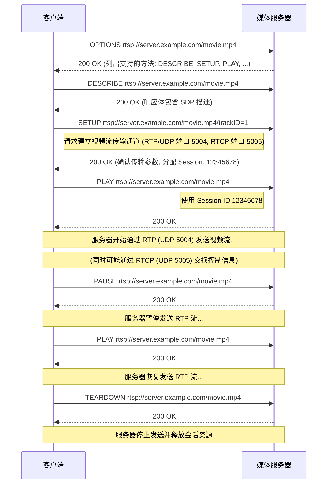

在上一篇 [《会话协议全解析：SIP, SDP, RTP, RTCP》](https://www.ffutop.com/posts/2025-04-07-session-protocols/) 中，我们探讨了如何使用 SIP 来“拨号”和“接听”，用 SDP 来“商定交流方式”，以及用 RTP/RTCP 来实际“传输和监控”语音视频数据，这些共同构成了实时通信（如网络电话、视频会议）的基础。

但如果我们面对的场景不是双向或多向的实时互动，而是想控制一个已经存在的媒体流呢？比如：
*   点播服务器上存储的电影片段。
*   观看网络摄像头 (IPC) 传输的实时监控画面。
*   控制录像机 (NVR) 回放过去的录像。

这时，单纯的 SIP/SDP/RTP 组合就不够了，我们需要专门的“遥控器”协议来对媒体流进行播放、暂停、快进等操作。这就是**实时流协议 (Real-time Streaming Protocol, RTSP)**和在安防领域广泛应用的 **GB/T 28181** 发挥作用的地方。

## 1 实时流协议 (RTSP)

想象一下，你想看一部存放在网络服务器上的电影。你不需要像打电话那样和服务器建立一个复杂的双向会话，你只需要告诉服务器：“嘿，播放这部电影，从第 5 分钟开始”，或者“暂停一下”，或者“快进到结尾”。**实时流协议** 就是设计来完成这种“遥控”任务的。

RTSP 的核心目标是**建立和控制**客户端与媒体服务器之间的**媒体流会话**。它本身并不负责传输实际的媒体数据（如音频或视频帧），而是专注于发送控制指令。

> **RTSP vs. HTTP**
>
> *   **状态**：RTSP 在语法上借鉴了 HTTP/1.1，也是基于文本的请求-响应模式。但关键区别在于 RTSP 是**有状态的 (stateful)**。服务器需要记住每个客户端的当前状态（例如，正在播放哪个视频？播放到哪里了？）。而 HTTP 设计上主要是无状态的。
> *   **关注点**：HTTP 主要用于传输文件内容本身。RTSP 则专注于**控制信令 (Control Signaling)**，它告诉服务器“如何”以及“何时”发送媒体流，媒体流本身通常走另一条通道（通常是 RTP）。

> **RTSP 与 RTP/RTCP/SDP 的协作**
>
> RTSP 并非孤立工作，它需要与我们在上一篇文章中介绍的协议协同：
>
> 1.  **发现与描述 (`DESCRIBE`)**: 客户端通过 RTSP 的 `DESCRIBE` 请求，向服务器询问某个媒体资源（如 `rtsp://server.com/movie.mp4`）的详细信息。服务器通常会回复一个包含 **SDP** 描述的响应，告知客户端该媒体包含哪些流（如一个 H.264 视频流和一个 AAC 音频流），以及它们的编码细节。
> 2.  **建立传输通道 (`SETUP`)**: 客户端分析 SDP 后，针对每个它想接收的媒体流（比如视频流），发送 RTSP 的 `SETUP` 请求。在这个请求中，客户端会告诉服务器：“请把这个视频流通过 **RTP** 发送到我的 IP 地址的 UDP 端口 5004，相关的 **RTCP** 报告请发到 UDP 端口 5005”。服务器确认后，会建立相应的传输通道，并返回一个会话 ID (Session ID).
> 3.  **控制播放 (`PLAY`, `PAUSE`, `TEARDOWN`)**: 客户端发送 `PLAY` 请求（带上 Session ID），服务器就开始通过 **RTP** 向客户端指定的地址和端口发送媒体数据。传输过程中，双方可以通过 **RTCP** 交换控制信息（如丢包统计）。客户端可以随时发送 `PAUSE` 暂停传输，或发送 `TEARDOWN` 彻底结束会话。

### 1.1 RTSP 如何工作？核心方法一览

RTSP 的交互模式是客户端-服务器模型。以下是一些核心的 RTSP 方法（命令），可以想象成遥控器上的按钮：

| 方法 (Method) | 描述 (遥控器按钮)                                            |
| ------------- | ------------------------------------------------------------ |
| `OPTIONS`     | "这个服务器支持哪些操作？" - 查询服务器支持的方法。              |
| `DESCRIBE`    | "我想看的这个‘节目’具体是啥样的？" - 请求媒体内容的 SDP 描述。 |
| `SETUP`       | "准备播放！请把媒体流通过这条‘线路’发给我。" - 指定接收媒体流的传输机制 (RTP/UDP, RTP/TCP) 和端口，建立传输通道并获取 Session ID。 |
| `PLAY`        | "开始播放！" - 请求服务器开始发送媒体数据。可指定播放范围 (Range)。 |
| `PAUSE`       | "暂停！" - 临时停止媒体流传输，但不释放会话资源。                |
| `RECORD`      | "开始录制！" - (较少见) 请求服务器录制客户端上传的媒体。         |
| `TEARDOWN`    | "停止并结束！" - 彻底结束会话，服务器释放相关资源。              |

### 1.2 RTSP 交互流程示例

一个简化的 RTSP 会话流程如下：



### 1.3 RTSP 消息示例

一个 `PLAY` 请求可能看起来像这样：

```plain
PLAY rtsp://media.example.com/movie.mp4 RTSP/1.0
CSeq: 835
Session: 12345678
Range: npt=30.5-
User-Agent: MyAwesomePlayer/1.0
```

-   `CSeq`: 命令序列号，用于匹配请求和响应。
-   `Session`: 由 `SETUP` 响应确定的会话标识符，用于服务器区分不同客户端的不同会话，体现了 RTSP 的状态性。
-   `Range`: 指定播放范围，`npt=30.5-` 表示从正常播放时间的 30.5 秒开始播放到结束。

### 1.4 RTSP 小结

RTSP 是流媒体世界的“遥控器”。它不亲自搬运数据，而是指挥媒体服务器何时、何地、以何种方式传输媒体流。它与 SDP（描述内容）、RTP（传输数据）、RTCP（监控质量）紧密协作，是视频点播 (VOD)、直播、网络监控（简单场景）等应用的核心控制协议。

## 2 基于 SIP 的监控系统互联协议 (GB/T 28181)

现在，让我们转向一个在特定领域——中国视频监控行业——占据主导地位的协议：**GB/T 28181**。它的全称是《公共安全视频监控联网系统信息传输、交换、控制技术要求》，是中国推荐国家标准。

GB/T 28181 的核心目标是解决不同厂商的视频监控设备（如网络摄像机 IPC、网络录像机 NVR/DVR、中心管理平台 VMS 等）之间的互联互通难题，实现跨品牌设备的统一接入、管理和数据共享。

### 2.1 GB/T 28181 与 SIP 的关系

理解 GB/T 28181 的关键在于认识到，它**并非一个全新的独立协议，而是深度基于 SIP 协议进行了大量的行业扩展和定制**。它聪明地复用了 SIP 成熟的会话管理框架，并在此基础上嫁接了视频监控业务所需的特定功能。

可以这样理解 GB/T 28181 的架构：

*   **信令基础是 SIP**: GB/T 28181 使用 SIP 的核心方法和流程来处理设备间的基本信令交互。
    *   **设备注册**: IPC/NVR 使用 SIP `REGISTER` 向平台注册上线，报告自身地址和状态。
    *   **实时预览/录像回放**: 平台使用 SIP `INVITE` 请求设备发送实时视频流或历史录像流。SDP 用于协商媒体参数（编码、传输方式等）。会话结束使用 `BYE`。
    *   **心跳维持**: 通常通过 SIP `MESSAGE` 或 `OPTIONS` 实现。
*   **业务控制靠 XML**: 大量的监控特定指令和信息，是通过在 SIP 消息（主要是 `MESSAGE` 方法，有时也可能是 `INFO`）的消息体中嵌入 **XML (可扩展标记语言)** 格式的数据来实现的。这部分是 GB/T 28181 相对于标准 SIP 的主要扩展。常见的 XML 定义的业务包括：
    *   **设备控制 (PTZ)**: 平台控制摄像机云台转动、镜头变焦、预置位调用等。
    *   **设备目录查询**: 平台向 NVR 查询其下挂载的通道列表。
    *   **报警事件通知**: 设备（如 IPC）检测到移动侦测、遮挡报警等事件，主动通过 SIP `MESSAGE` + XML 向平台发送报警通知。
    *   **录像检索与回放控制**: 平台查询指定时间段的录像文件列表，控制录像回放的开始、暂停、快进/快退、定位等（这些控制也通过 XML 实现，而非 RTSP 的原生方法）。
    *   **设备配置**: 获取或设置设备的参数。
*   **媒体传输仍用 RTP/RTCP**: 与标准 SIP 通话或 RTSP 流媒体一样，GB/T 28181 体系下的实时视频流和录像回放流，其实际媒体数据通常还是通过 **RTP** 协议传输，并使用 **RTCP** 进行传输控制和质量反馈。媒体参数（如编码格式 H.264/H.265、传输协议、端口等）通过 **SDP** 描述，SDP 信息通常包含在 SIP `INVITE` 请求或其 `200 OK` 响应的消息体中。GB/T 28181 标准通常推荐或要求使用特定的 RTP 载荷格式，例如将 H.264/H.265 视频封装在 MPEG2-TS (Transport Stream) 或 PS (Program Stream) 中再进行 RTP 打包。

### 2.2 GB/T 28181、SIP 与 RTSP 的异同分析

现在我们把三者放在一起进行比较：

| 特性         | SIP (Session Initiation Protocol)                  | RTSP (Real-Time Streaming Protocol)                  | GB/T 28181                                                     |
| :----------- | :------------------------------------------------- | :--------------------------------------------------- | :------------------------------------------------------------- |
| **核心目标** | 建立、修改、终止**通用交互式会话**（电话、会议等）   | 控制**媒体流**（点播、直播）的**播放**（开始、暂停、定位） | **安防设备互联互通**（注册、控制、流媒体、报警等综合管理）         |
| **基础协议** | 自身是基础信令协议                                 | 自身是独立的控制协议，语法类似 HTTP                    | **基于 SIP 扩展**，大量使用 XML 定义监控特定信令内容             |
| **协议角色** | 通用会话“电话系统”                                   | 专用流媒体“遥控器”                                   | 定制的安防“带特殊指令的电话系统”                                 |
| **流媒体发起** | `INVITE` 请求建立会话，SDP 协商媒体              | `DESCRIBE`/`SETUP`/`PLAY` 控制媒体流                   | 使用 SIP `INVITE` 请求流媒体（实时/回放），SDP 协商媒体        |
| **流媒体控制** | 无内置播放控制（如暂停、定位）                       | 内建 `PAUSE`, `PLAY` (带 Range) 等方法                 | 播放控制（暂停、快进等）和设备控制（PTZ）通过 **SIP `MESSAGE` + XML** 实现 |
| **状态管理** | 管理会话“Dialog”状态                             | 管理流播放状态和时间轴位置                             | 管理设备注册状态、会话状态，并通过 XML 管理复杂业务状态           |
| **主要应用** | VoIP、视频会议、即时消息                           | VOD、直播、网络摄像头（简单场景）                        | **跨厂商视频监控系统集成 (中国市场)** |
| **复杂性** | 相对标准、通用                                   | 相对简单、专注于流控制                                 | **较高**，涉及 SIP、XML、SDP、RTP 及大量特定监控业务流程         |

**总结来说：**

*   **GB28181 vs. SIP**: GB28181 是 SIP 在安防监控领域的**行业化应用和深度扩展**。它继承了 SIP 的会话管理能力（注册、邀请、结束），并加入了大量监控业务（如 PTZ、报警、录像检索）所需的特定信令，这些信令主要通过 XML 承载在 SIP 消息（特别是 `MESSAGE`）中。可以说，没有 SIP 就没有 GB28181 的基础。
*   **GB28181 vs. RTSP**: 两者都能实现视频流的获取（直播、点播），但实现方式和侧重点截然不同。
    *   RTSP 是一个**纯粹的流媒体控制协议**，简单直接，专注于“遥控”媒体播放（开始、暂停、定位）。
    *   GB28181 是一个**综合性的监控互联协议**，流媒体获取只是其功能的一部分。它使用 SIP 的会话机制 (`INVITE`) 来启动流媒体，并通过 SIP `MESSAGE` + XML 来实现更复杂的控制（不仅是播放控制如快进/快退/定位，还包括设备本身的控制如 PTZ）。在需要统一管理设备注册、状态、报警、配置以及流媒体等多方面需求的复杂监控平台场景下，GB28181 提供了一个（理论上）统一的解决方案框架。而如果只用 RTSP 获取流，通常还需要依赖其他协议（如 ONVIF 的设备管理部分）来实现设备发现、注册、PTZ 控制等功能。

### 2.3 为何需要 GB/T 28181？

在中国安防市场，早期各设备厂商自成体系，私有协议林立，导致系统集成困难、成本高昂，形成了“信息孤岛”。GB/T 28181 标准的推出，正是为了打破这种局面。它通过规定一套基于开放标准 (SIP) 的统一接口规范，**强制要求不同品牌设备之间实现基本的互联互通**（至少在理论和标准层面）。这极大地促进了中国视频监控系统的大规模联网和平台化管理，降低了集成门槛。

尽管 GB/T 28181 在实践中也存在一些挑战（例如，各厂商对标准细节的理解和实现可能存在差异，导致兼容性问题；基于 XML 的信令解析相对复杂等），但它对于推动中国安防行业的标准化、网络化和智能化进程起到了不可或缺的关键作用。

## 3 结语

RTSP 和 GB/T 28181 都是在 SIP/SDP/RTP/RTCP 这套基础通信协议栈之上，为了满足特定应用场景需求而发展出来的控制协议。

*   **RTSP** 更通用，专注于对媒体流进行播放控制，适用于 VOD、直播等场景，可以看作是流媒体的“标准遥控器”。
*   **GB/T 28181** 则是一个特定于中国安防监控行业的“瑞士军刀”，它基于 SIP 构建了一个综合管理框架，不仅能获取流媒体，还能进行设备注册、状态管理、PTZ 控制、报警处理、录像管理等一系列复杂操作，旨在实现跨厂商设备的统一联网。

理解它们的设计目标、核心机制以及与基础协议的关系，有助于我们在实际应用中选择合适的协议，并更好地进行系统设计和问题排查。
