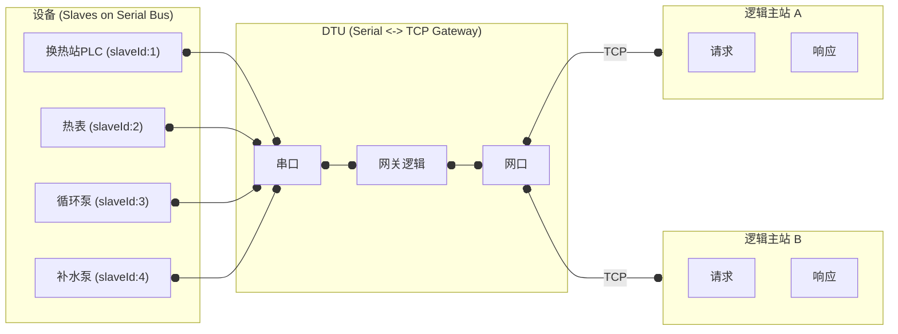
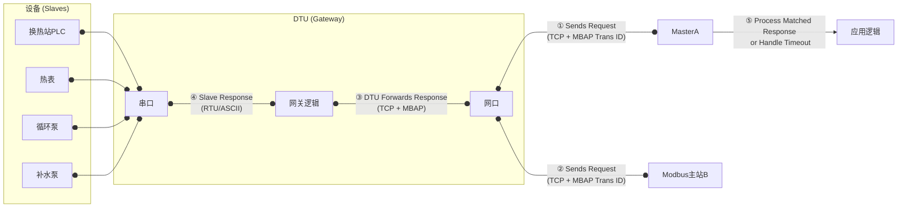
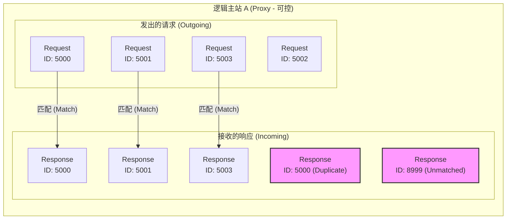
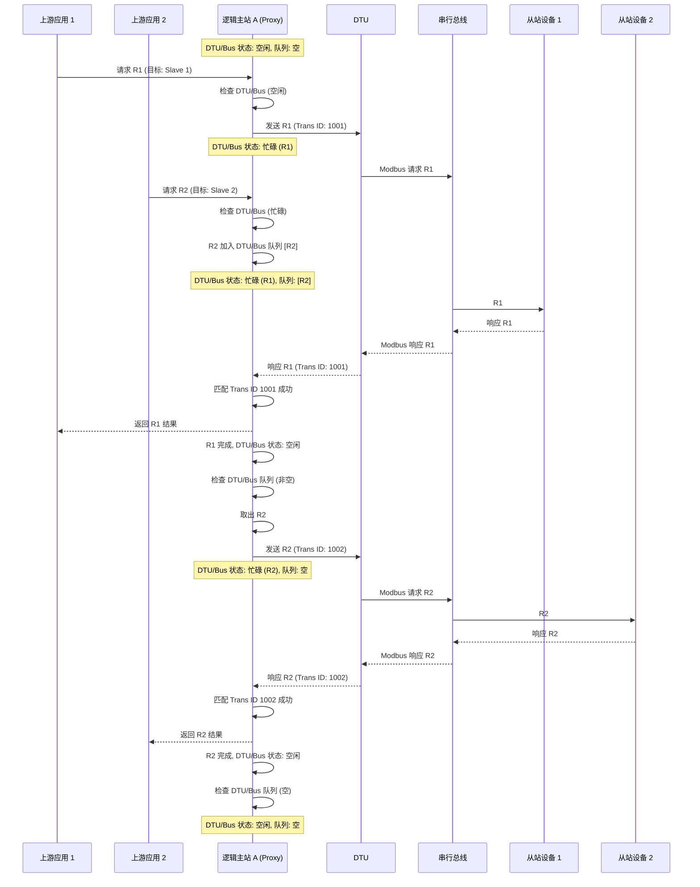

Modbus 协议在串行总线（如 RS-485/RS-232）上运行时，其 RTU 或 ASCII 模式通常遵循单主站架构。一个主站设备按顺序与多个从站设备进行半双工通信。然而，在工业物联网（IIoT）应用中，常需要通过 IP 网络允许多个应用程序或平台（逻辑上的多个主站）并发访问这些串行设备。

一种常见实现方式是使用 DTU（数据传输单元）或串口服务器作为网关，将 IP 网络上的请求（通常封装为 Modbus TCP）转换为串行总线上的 Modbus RTU/ASCII 请求。这种架构引入了并发访问控制的挑战：当多个 TCP 客户端（逻辑主站）同时通过 DTU 与共享串行总线上的设备通信时，必须确保请求和响应的正确对应关系，并管理对单个从站设备的访问冲突。

<small>图 1. 多逻辑主站通过 DTU 访问共享串行总线架构</small>

在此架构下，假设有 N 个从站设备和 M 个逻辑主站（例如，通过主站 A 代理的 M 个上游应用，以及独立的主站 B），并发访问共享串行总线时，可能导致以下问题：

1. 请求冲突与数据损坏：若多个主站的请求几乎同时到达 DTU，且 DTU 未做适当的串行化处理，可能导致在物理串行总线上发送冲突的数据帧。
2. 响应归属不明确：DTU 从串行总线接收到一个响应后，必须确定应将其转发给哪个 TCP 主站。若 DTU 的转发逻辑不完善，可能导致主站 A 收到预期之外的响应。
3. 请求超时与重试复杂化：主站 A 发送请求后超时，其原因可能多样：请求在网络或 DTU 丢失、从站处理延迟、响应在网络或 DTU 丢失，或者主站 A 收到了一个不匹配的响应（源自其他主站的请求）并将其丢弃。这使得超时原因难以判断，并可能引发不必要的重试，加剧总线负载。
4. 重复响应处理：网络传输或 DTU 的机制可能导致同一从站响应被多次转发至 TCP 主站，主站需具备识别和处理重复响应的能力。

为应对这些挑战，尤其是在可以控制至少一个逻辑主站（例如，主站 A 是一个自研代理服务）的场景下，需要实现两层关键机制：一是可靠的请求-响应匹配，二是针对单个 DTU 及其下的串行总线的访问串行化。

## 1 解决方案：基于请求标识符的响应匹配

在任何需要处理并发请求-响应交互的系统中，确保每个响应都能准确地与其对应的原始请求关联至关重要。这类似于 TCP 协议使用序列号来保证数据段的顺序和确认应答的匹配。实现这一目标通常需要在每个发出的请求中嵌入一个唯一的请求标识符 (Request Identifier) 或序列号，并要求相应的响应携带相同的标识符。

对于通过 TCP 网络访问 Modbus 串行设备的场景，Modbus TCP 协议本身在 MBAP Header (Modbus Application Protocol Header) 中提供了一个标准的 16 位字段——事务标识符 (Transaction Identifier)，恰好可以作为这种请求标识符使用。

即使底层的 Modbus RTU/ASCII 协议没有此概念，当请求通过 DTU 在 TCP 网络上传输时，我们可以在我们控制的逻辑主站 A (Proxy) 中利用 Modbus TCP 的事务标识符来实现精确的请求-响应匹配。

逻辑主站 A (Proxy) 的工作流程如下：

<small>图 2. 逻辑主站 A 使用请求标识符匹配流程 (以 Modbus TCP Transaction ID 为例)</small>

1. 生成唯一标识符：当逻辑主站 A (Proxy) 发起请求时，生成一个在其当前活动请求集合中唯一的请求标识符。在 Modbus TCP 场景下，即生成一个唯一的 Transaction ID (例如 5000)。
2. 封装与发送：将 Modbus 请求数据单元 (PDU) 封装在包含此唯一标识符 (Transaction ID 5000) 的协议头 (MBAP Header) 中，形成完整的 Modbus TCP 报文，通过 TCP 连接发送给 DTU。
3. 记录待处理状态：在内部维护一个状态表（如 Map），记录该请求的相关信息，以请求标识符 (Transaction ID 5000) 为键，存储请求详情、发送时间戳、超时设置等。
4. 接收与解析：监听来自 DTU 的 TCP 响应。收到响应报文后，解析出协议头中的请求标识符 (Transaction ID)。
5. 匹配处理：
	- 成功匹配：使用收到的标识符在状态表中查找待处理的请求记录。若找到匹配项（例如，收到 ID 5000 的响应，且状态表中有等待 ID 5000 的记录），则确认响应有效。将响应数据与原始请求关联，从状态表中移除该记录，并将结果传递给上层应用。
	- 标识符不匹配：若收到的标识符在状态表中不存在（例如，收到 ID 8999 的响应，可能源自逻辑主站 B 的请求），或对应的请求已完成/超时（例如，收到 ID 5000 的重复响应 `resp5000dup`），则直接丢弃该响应报文。
	- 超时处理：若在预设时间内未收到对应请求标识符（如 ID 5002）的有效响应，则判定请求超时。清除状态表中的记录，并向上层应用报告超时。

## 2 解决方案：针对单个 DTU 及其下串行总线的请求串行化代理

仅仅实现请求-响应匹配机制（如使用 Transaction ID）还不够。由于 Modbus 串行通信（尤其是 RS-485）通常是半双工的，物理总线上在同一时刻只能有一个设备发送数据。如果逻辑主站 A (Proxy) 代理的 M 个上游应用发出的请求（即使目标是从站不同）并发地通过 DTU 发送到同一个串行总线，就可能导致总线冲突和数据损坏。

因此，逻辑主站 A (Proxy) 还需要实现针对其连接的每个 DTU（及其下的整个串行总线）的请求串行化机制。目标是确保在任何时刻，只有一个由主站 A 发起的请求正在通过特定的 DTU 在对应的串行总线上活动。

工作流程如下：

1. 维护 DTU/总线状态与队列：主站 A 内部为每个其管理的 DTU（或对应的串行总线接口）维护一个状态（例如，“空闲”或“忙碌”）和一个请求队列。
2. 请求入队与检查：当主站 A 收到一个来自上游应用、需要通过特定 DTU 发送的请求时（无论目标从站是哪个）：
    * 检查该 DTU/总线的当前状态。
    * 如果状态为“空闲”，则将该请求标记为“活动”，设置其 Transaction ID，发送给 DTU，并将该 DTU/总线的状态置为“忙碌”。
    * 如果状态为“忙碌”，则将该新请求放入该 DTU/总线的请求队列中。
3. 请求完成与出队：当一个通过该 DTU 发送的活动请求完成（收到匹配的响应或超时）时：
    * 主站 A 将该 DTU/总线的状态重新置为“空闲”。
    * 检查该 DTU/总线的请求队列。
    * 如果队列不为空，取出队首的请求，将其标记为“活动”，设置新的 Transaction ID，发送给 DTU，并将该 DTU/总线的状态再次置为“忙碌”。
    * 如果队列为空，则该 DTU/总线保持“空闲”状态。

<small>图 3. 逻辑主站 A 对单个 DTU/串行总线的请求进行串行化处理示例</small>

通过这种机制，逻辑主站 A 确保了对于其连接的任何一个 DTU 及其下的串行总线，在任意时刻只有一个由它发起的 Modbus 事务正在进行。来自 M 个上游应用的对该总线上 N 个从站的并发请求，都被有效地在代理层进行了排队和串行化处理，从源头上避免了由主站 A 引起的总线冲突。

## 3 机制的有效性与限制

结合请求标识符匹配（解决响应归属）和针对单个 DTU/串行总线的请求串行化代理（解决总线访问冲突）这两种机制，逻辑主站 A (Proxy) 可以提供更健壮和有序的 Modbus 访问：

* 准确关联响应：通过 Transaction ID 匹配，确保响应被正确路由给发起请求的上游应用。
* 处理重复响应：能够识别并丢弃已完成请求的后续重复响应。
* 明确超时判定：基于 Transaction ID 匹配的超时机制，提高了超时判断的准确性。
* 增强鲁棒性：减少因响应错乱或总线冲突（由代理自身引起的部分）导致的逻辑错误。
* 保证串行总线访问顺序：通过内部对 DTU/总线的访问队列，确保由代理发起的请求严格按顺序访问物理串行总线，避免了代理自身造成的总线冲突。
* 简化下游交互：从 DTU 和从站设备的角度看，来自代理的请求流是串行且有序的。

需要注意的限制：

* 无法解决外部冲突：此方案主要解决了逻辑主站 A 内部及其发起的请求在串行总线上的有序性问题。如果存在其他独立的逻辑主站 B 同时通过同一 DTU 或直接连接到同一串行总线，或者 DTU 本身没有良好的多 TCP 连接到串口的仲裁机制，物理串行总线上的冲突仍然可能发生（例如，主站 A 的请求与主站 B 的请求在总线上碰撞）。
* 引入总线级排队延迟：对整个 DTU/总线的请求进行串行化意味着，如果多个上游应用高频请求该总线上的*任何*从站，请求都会在代理处为该总线排队等待，增加了所有访问该总线的请求的端到端响应延迟。总线的整体吞吐量受限于最慢的从站响应和代理的处理能力。
* 代理成为瓶颈：逻辑主站 A 的处理能力、内存（维护 Transaction ID 状态和每个 DTU/总线的队列）可能成为整个系统的瓶颈，尤其是在管理大量 DTU 或高并发请求时。
* 实现复杂性：在代理中同时管理 Transaction ID 状态和每个 DTU/总线的队列状态及状态转换，需要仔细设计和实现，确保线程安全和高效处理。
* 依赖代理控制权：这些方案的前提是能够开发和部署这样一个可控的逻辑主站 A (Proxy)。

## 4 总结

在多个逻辑主站通过 DTU 网关并发访问共享 Modbus 串行总线的场景中，实现可靠通信需要综合运用多种策略。在一个可控的逻辑主站（如代理服务）中：

1. 利用协议本身提供的或自定义的请求标识符（如 Modbus TCP 的 Transaction Identifier）进行严格的请求-响应匹配，解决响应归属、重复和超时判定的准确性问题。
2. 实施针对单个 DTU 及其下整个串行总线的请求串行化机制，通过内部队列管理，确保由该代理发起的访问请求严格按顺序发送到物理串行总线，避免了代理自身引起的总线冲突。

这两种机制相结合，可以显著提升代理主站的通信可靠性和鲁棒性，确保在复杂并发环境下的逻辑正确性和对串行总线的有序访问。然而，这并不能完全消除物理串行总线本身的冲突可能性（尤其当存在多个独立主站或 DTU 仲裁不足时），也不能避免因对整个总线进行排队而引入的延迟。因此，在系统设计时，还需要仔细评估并发需求、总线负载、DTU 能力以及网络拓扑，并可能需要结合限制并发访问源、优化轮询策略、选择更智能的 DTU 或采用其他架构（如每个主站使用独立的 DTU）等手段。
