> **重要声明**：
>
> 本文档内容基于作者在特定时间点的个人理解与认知积累，可能存在主观判断、信息偏差或未能完全覆盖所有相关领域的最新进展。作者的知识结构和经验范围可能对内容的深度、广度及视角产生一定影响。
>
> 本文内容截至 **2025年5月6日**。敬请读者在参考本文信息时，结合其他权威资料进行综合判断，并注意技术的快速发展可能带来的内容时效性问题。

模型上下文协议 (Model Context Protocol, MCP) 的出现，为大语言模型 (LLM) 与具体业务场景的深度融合开辟了新的路径。为了深入探索其在实际业务中的应用潜力，我们对 MCP 进行了一些尝试，并在这篇文章中分享我们的一些探索成果。

## 1 大语言模型接入外部知识的方式

大语言模型的核心能力源于其海量的训练数据，然而这些数据本质上是在特定时间点的静态快照，具有固有的时效性和覆盖局限性。因此，当模型面对其训练数据截止日期之后的新信息、特定组织或个人的私有数据，或是需要实时更新的动态数据流（如最新新闻、股票价格或传感器读数）时，其理解和处理能力会受到显著制约。

为了克服这一挑战，业界涌现出一系列技术手段，旨在增强 LLM 对外部动态数据和私有知识的获取与利用能力。主要包括：

### 1.1 检索增强生成 (Retrieval-Augmented Generation, RAG)

RAG 是一种通过将外部数据与模型的输入结合，以增强模型对这些外部信息的理解和处理能力的技术。其核心思想是，通过为模型提供精准、实时的上下文信息，辅助模型生成更准确、更相关的答案，有效缓解模型知识陈旧或缺乏特定领域知识的问题。

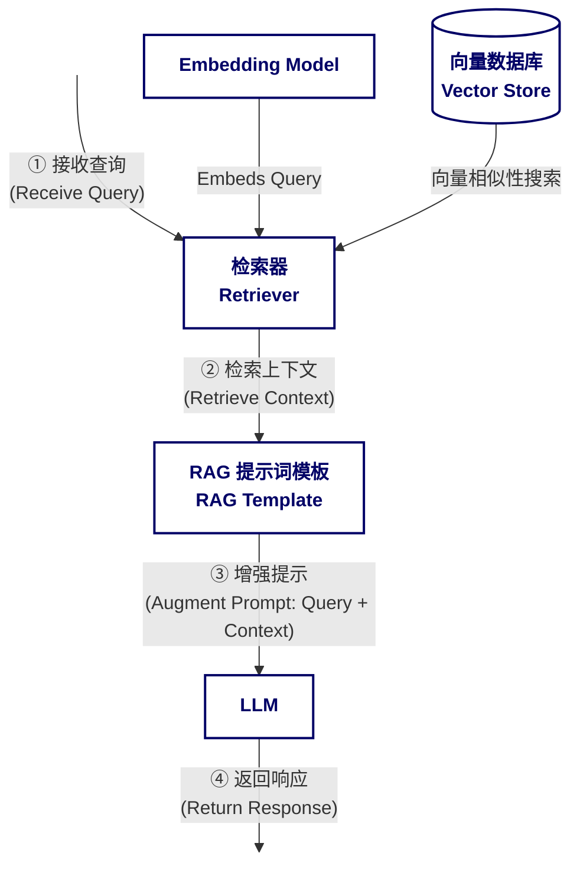
<center><small>图 1: RAG 工作流程图</small></center>

### 1.2 函数调用 (Function Calling)

函数调用能力赋予了大语言模型在对话过程中动态执行预定义外部函数的能力。这一机制使得 LLM 不再仅仅是一个信息处理和生成的黑盒，而是能够根据对话上下文和用户意图，主动调用外部工具来获取实时信息（如查询天气、股价）、执行操作（如发送邮件、创建订单）或与专有业务系统交互。这极大地扩展了 LLM 的应用边界，使其能够更灵活地完成复杂任务。

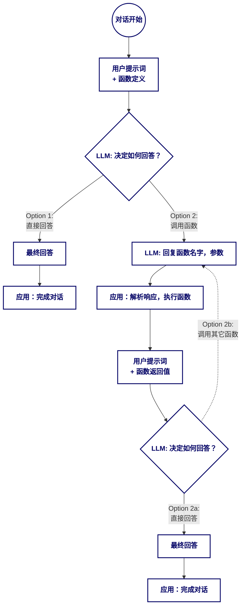
<center><small>图 2: 函数调用工作流程图</small></center>

尽管 RAG 和函数调用等技术显著增强了 LLM 的能力，但在面对日益复杂的应用场景，尤其是需要集成多个、异构的数据源和工具时，如何标准化这种交互，确保不同 LLM 应用与各种外部资源之间的高效、安全、可扩展的互操作性，成为了新的挑战。模型上下文协议 (MCP) 正是为应对这一挑战而提出的。

## 2 模型上下文协议 (Model Context Protocol, MCP)

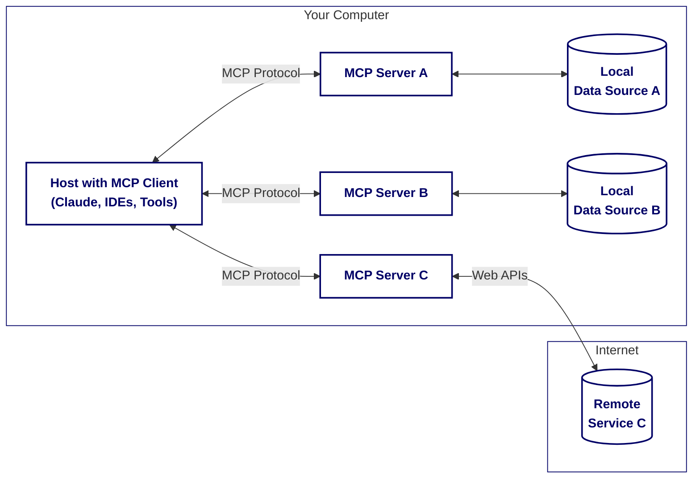
<center><small>图 3: MCP 概念图（简化版）</small></center>

上图为普通用户呈现了一个直观易懂的 MCP 概念。图中，用户电脑 (Your Computer) 上运行着一个 MCP 客户端（MCP Client），通过类似通用 USB 接口的方式连接了多个 MCP 服务器（MCP Servers）。这些服务器各自对接不同的数据源（Data Sources），数据源既可以是本地的，也可以是远程的。

然而，值得注意的是，尽管图中将所有 MCP Server 都描绘在用户电脑的范围内，这可能造成一种印象，即 MCP Server 必须部署在本地。实际上，MCP Server 完全可以部署在云端或任何可访问的网络位置。

下图展示了 MCP 更为典型的部署架构，能够更准确地反映其灵活性：

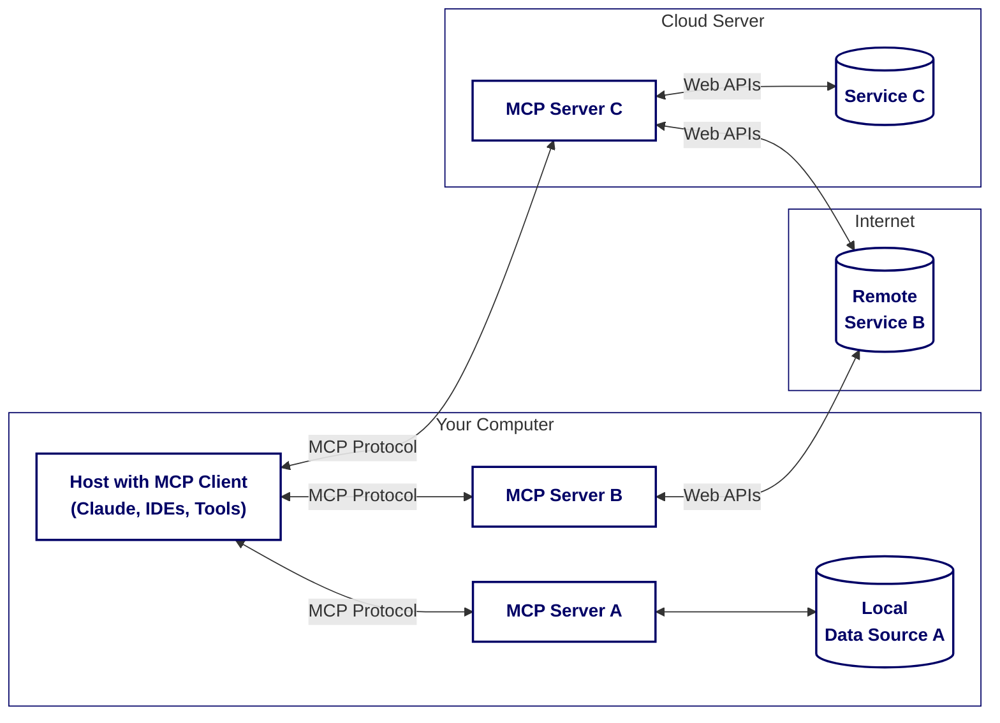
<center><small>图 4: MCP 部署架构图</small></center>

### 2.1 核心架构

MCP 是一种基于客户端/服务器 (Client-Server) 架构的协议，旨在规范 LLM 应用（Host）与其所需外部上下文信息和工具之间的交互。

- **Host**: 指运行 LLM 的应用程序，例如集成开发环境 (IDE)、桌面聊天客户端、浏览器插件、或任何需要与外部资源交互的 AI 应用。
- **MCP Client**: 嵌入在 Host 应用中的组件（如插件、库、服务或脚本），负责与一个或多个 MCP Server 建立连接并进行通信。
- **MCP Server**: 独立的进程或服务，它向 MCP Client 暴露特定的上下文信息 (Resources)、可执行的工具 (Tools) 和预设的提示 (Prompts)。

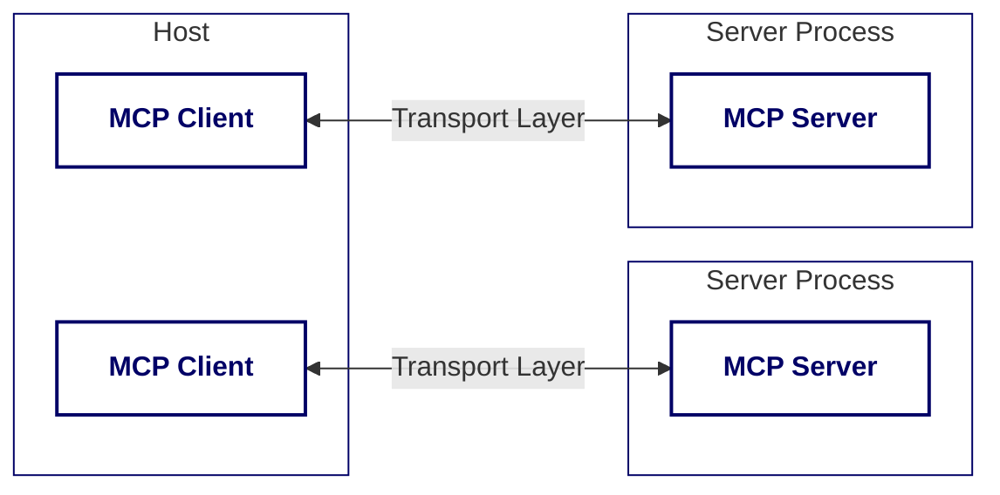
<center><small>图 5: MCP 核心架构图</small></center>

MCP 协议定义了两种传输层机制：

- **Stdio transport**: 使用标准输入输出进行通信，适用于本地进程。
- **HTTP with SSE transport**: 使用 Server-Sent Events 进行服务器到客户端的消息传递，使用 HTTP POST 进行客户端到服务器的消息传递。
- **Streamable HTTP**: \[2025-03-26\] 引入 Streamable HTTP 替代原先的 HTTP + SSE 作为默认传输方式。这一变更在解决原有方案中连接不可恢复、服务端长连接压力大等问题的同时，依然保留了 SSE 带来的流式响应优势。

所有传输层使用 JSON-RPC 2.0 进行消息交换。

### 2.2 核心概念

MCP 的核心功能通过以下几个关键概念实现：

#### Resources

`Resources` 被定义为可以被用户或 LLM 使用的上下文和数据。它们提供数据而不执行重要的计算，也没有副作用，类似于 REST API 中的 `GET` 请求。资源可以包括文件、数据库、API 数据、网络搜索结果、项目文档、日志和数据库记录等。资源由应用程序控制，这意味着客户端应用程序决定如何以及何时使用它们。服务器通过 `resources/list` 端点暴露可用资源列表，其中包括 URI、名称、描述和 MIME 类型。客户端可以使用带有资源 URI 的 `resources/read` 请求来读取资源内容。MCP 支持通过列表更改和内容订阅来实现资源的实时更新。   

```javascript
// Static resource
server.resource(
  "config",
  "config://app",
  async (uri) => ({
    contents: [{
      uri: uri.href,
      text: "App configuration here"
    }]
  })
);

// Dynamic resource with parameters
server.resource(
  "user-profile",
  new ResourceTemplate("users://{userId}/profile", { list: undefined }),
  async (uri, { userId }) => ({
    contents: [{
      uri: uri.href,
      text: `Profile data for user ${userId}`
    }]
  })
);
```

#### Tools

与 `Resources` 不同，`Tools` 允许 LLM 通过 MCP Server 执行具体的操作，这些操作可能会改变系统状态或与外部服务进行交互（例如，修改数据、发送消息、调用 API）。它们类似于 REST API 中的 `POST`, `PUT`, `DELETE` 等方法。MCP Client 可以使用 `tools/list` 端点发现可用的工具，通过 `tools/call` 端点触发服务器执行操作并返回结果。

```javascript
// Simple tool with parameters
server.tool(
  "calculate-bmi",
  {
    weightKg: z.number(),
    heightM: z.number()
  },
  async ({ weightKg, heightM }) => ({
    content: [{
      type: "text",
      text: String(weightKg / (heightM * heightM))
    }]
  })
);

// Async tool with external API call
server.tool(
  "fetch-weather",
  { city: z.string() },
  async ({ city }) => {
    const response = await fetch(`https://api.weather.com/${city}`);
    const data = await response.text();
    return {
      content: [{ type: "text", text: data }]
    };
  }
);
```

#### Prompts

`Prompts` 在 MCP 中定义了与 LLM 进行特定交互的模板或预设指令。它们封装了向 LLM 发出的请求结构，可以包含对特定 `Resources` 的查询指令或调用 `Tools` 的意图描述。这有助于规范和简化 Host 应用与 LLM 之间的通信。MCP Client 可以使用 `prompts/get` 请求检索提示详细信息，使用 `prompts/list` 端点查找可用的提示。

```javascript
server.prompt(
  "review-code",
  { code: z.string() },
  ({ code }) => ({
    messages: [{
      role: "user",
      content: {
        type: "text",
        text: `Please review this code:\n\n${code}`
      }
    }]
  })
);
```

#### Sampling

`Sampling` 机制允许 MCP Server 主动通过 MCP Client 向 LLM 发起请求，以实现更复杂的代理行为或链式思考。例如，Server 在处理一个 Tool 调用时，可能需要 LLM 的进一步决策或信息补全，此时便可通过 Sampling 请求 Client 调用 LLM。

> **注记**: “Sampling” 这一术语在此上下文中可能易产生歧义。更准确地理解，它代表了一种由服务器发起的、通过客户端代理执行的 LLM 调用流程，而非传统意义上的数据采样。

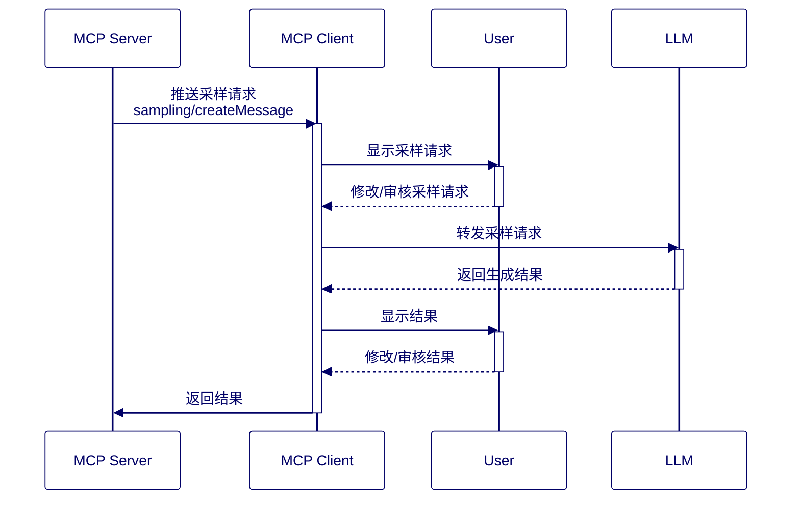

#### Roots

`Roots` 机制允许 MCP Client 在连接建立时或后续通信中，向 MCP Server 声明其当前关注的上下文范围或主要工作目录/资源。例如，一个 IDE 中的 MCP Client 可以将当前打开的项目目录声明为一个 Root。这有助于 MCP Server 更智能地提供相关的 `Resources` 和 `Tools` 提示，或者在进行信息检索时限定搜索范围，从而提高交互的效率和相关性。

一个典型的示例：

```plain
{
  "roots": [
    {
      "uri": "file:///home/user/projects/frontend",
      "name": "前端代码库"
    },
    {
      "uri": "https://api.example.com/v1",
      "name": "API 端点"
    }
  ]
}
```

### 2.3 使用场景

MCP 通过其核心概念——`Resources`、`Tools`、`Prompts`、`Sampling` 及 `Roots`——为 LLM 应用与外部世界的交互勾勒了清晰的蓝图。这些概念的真正价值，在于它们如何共同作用于多样化的实际应用场景。

#### Resources：为 LLM 和用户提供上下文感知

在 MCP 框架中，`Resources` 是指可供用户或 LLM 利用的上下文信息与数据集。

- 用户交互与展现：MCP Server 向 Client 暴露的 `Resources`，首先是面向最终用户的。例如，在集成了 MCP Client 的 IDE 中，用户可以直接浏览和选择由 MCP Server 提供的项目文件、文档片段或数据库表结构等资源，作为后续与 LLM 交互的上下文。许多 IDE 的聊天机器人允许用户通过 `#` 符号引用工作区文件，这便是 `Resources` 应用的一个直观体现。
- 构建 RAG 应用：Host 应用可以将 `Resources` 视为构建检索增强生成 (RAG) 系统的标准接口。通过 MCP 获取的结构化资源信息，可以便捷地融入 RAG 流程，为 LLM 提供动态、精准的知识，从而提升回答的相关性和准确性。

典型应用场景包括：
- AI 聊天助手访问企业知识库，提供精准的客户支持。
- IDE 内的编码助手查阅项目文档、API 规范或代码片段库。
- 金融分析应用实时拉取市场数据、财报等资源进行分析。
- 桌面应用（如 Claude Desktop）访问本地文件系统，实现与用户本地数据的交互。
- 数据分析工具（如 Cursor）直接将数据库表或查询结果作为资源进行引用。

当然，也可简单地将集成 `MCP (Resources)` 的应用程序视作另一个能够提供更丰富多模态数据的浏览器。

#### Tools：赋予 LLM 执行行动的能力

与侧重数据提供的 `Resources` 不同，`Tools` 赋予了 LLM 通过 MCP Server 执行具体操作的能力。

LLM 本身具备的函数调用（Function Calling）能力是 `Tools` 得以实现的基础。MCP 的价值在于，它在现有的函数调用机制之上，提供了一套更为标准化和结构化的框架：
1. 定义与发现：`MCP Server` 负责集中定义、管理并向 `MCP Client` 暴露可用的 `Tools` 及其元数据（名称、描述、参数模式等）。
2. 标准化交互：`MCP Client`（集成在 Host 应用中）从 Server 获取这些规范化的工具接口描述。
3. 请求构建与执行：Host 应用根据用户的自然语言指令、当前对话上下文以及从 MCP Server 获取的工具定义，智能地组装成符合特定 LLM API 要求的请求（例如，包含 `tools` 和 `tool_choice` 参数的 OpenAI API 请求）。LLM 决定调用哪个工具及相关参数后，Host 应用再通过 MCP 的 `tools/call` 端点请求 Server 执行该工具。

典型应用场景包括：
- 智能客服使用日历 API 自动为用户安排会议或预约。
- IDE 中的 AI 助手与 Git 等版本控制系统交互，执行代码提交、分支切换等操作。
- 旅行规划 AI 代理通过航司或酒店 API 查询航班、预订住宿。
- 数据分析工具连接数据库执行 SQL 查询、数据导入导出等操作。
- AI 助手调用天气服务 API 获取并播报实时天气状况。
- AI 助手通过社交媒体 API 获取用户最新动态。

以下是一个 OpenAI API 进行函数调用的示例，其中 `tools` 字段的结构正是 MCP `Tools` 定义所关注的核心：

```bash
curl https://api.openai.com/v1/chat/completions \
-H "Content-Type: application/json" \
-H "Authorization: Bearer $OPENAI_API_KEY" \
-d '{
    "model": "gpt-4o",
    "messages": [
        {
            "role": "user",
            "content": "What is the weather like in Paris today?"
        }
    ],
    "tools": [
        {
            "type": "function",
            "function": {
                "name": "get_weather",
                "description": "Get current temperature for a given location.",
                "parameters": {
                    "type": "object",
                    "properties": {
                        "location": {
                            "type": "string",
                            "description": "City and country e.g. Bogotá, Colombia"
                        }
                    },
                    "required": ["location"]
                }
            }
        }
    ],
    "tool_choice": "auto"
}'
```


#### Prompts：优化与 LLM 的对话模式

MCP 中的 `Prompts` 机制通过预定义的模板和指令集，旨在简化和规范 Host 应用与 LLM 之间的交互。这些模板可以：
- 封装复杂指令：将多轮对话的逻辑、特定的角色扮演或复杂的思考链条固化下来。
- 引导 LLM 输出：通过结构化的提示，更精确地控制 LLM 的输出格式和内容。
- 自动整合上下文：`Prompts` 模板可以设计为自动引入来自特定 `Resources` 的内容或 `Tools` 的可用性信息。

例如，一个用于代码审查的 `Prompt` 模板可以预设指令，要求 LLM 重点检查特定类型的安全漏洞或性能瓶颈，并自动将当前活动编辑器中的代码（通过 `Resources` 获取）作为审查对象。Host 应用只需填充少量动态变量（如用户指定的特定审查关注点），即可生成高质量、目标明确的 LLM 请求，避免了每次从头构建复杂提示的低效和不一致。这不仅提升了交互效率，也保证了 LLM 输出的稳定性和相关性。

**总结而言，MCP 的核心价值在于为 LLM 应用与广阔的外部世界（数据与工具）之间建立了一套标准化的“对话协议”和“接口规范”。它并非意图取代 LLM 本身的函数调用等核心能力，而是通过提供清晰的抽象和管理机制，使得 Host 应用能够更加便捷、高效、可靠地发现、集成和管理来自不同提供者的上下文信息与功能工具，从而加速构建更为智能和强大的 AI 应用。**

## 3 MCP 部署架构探索

在本章节中，我们将探讨几种常见的 MCP 部署架构模式。这些模式展示了 MCP Client 和 MCP Server 如何根据不同的应用场景和需求进行组合与部署，从纯本地环境到复杂的分布式系统。理解这些架构有助于根据实际情况选择最合适的部署方案。

### 3.1 本地部署的 MCP

本地部署模式是最简单直接的 MCP 应用方式。Host 应用（包含 MCP Client）与一个或多个 MCP Server 均运行在用户的同一台计算机上。这种架构非常适合需要访问本地文件系统、本地安装的应用程序接口或处理用户私有数据的场景。例如，一个本地的代码编辑器插件（Host）可以通过 MCP Client 连接到本地运行的 MCP Server，该 Server 暴露了对本地项目文件进行分析的 `Resources` 或执行本地构建脚本的 `Tools`。通信通常通过 `stdio` 进行，效率高且配置简单。

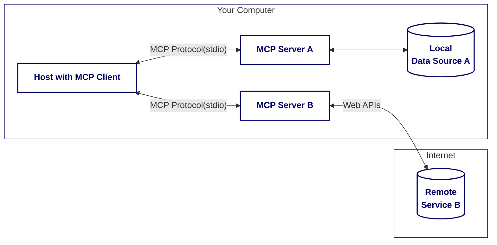

### 3.2 浏览器端部署的 MCP

浏览器端部署模式将 MCP 的能力引入到 Web 应用中。Host 应用（通常是运行在浏览器标签页中的 JavaScript 应用，作为 MCP Client）与在浏览器环境内（例如通过 Web Worker 实现）运行的 MCP Server 进行通信。这种模式使得 Web 应用能够利用 MCP 访问浏览器可触及的资源（如 IndexedDB、浏览器插件 API）或由 MCP Server 透过朴素的 HTTP APIs 访问远程资源。这为构建功能丰富的、能够与用户更深度交互的 Web 应用提供了可能。

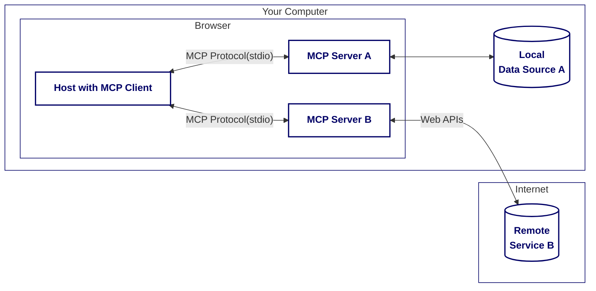

### 3.3 C/S 架构部署的 MCP

C/S 架构部署模式是一种经典的分布式部署方式。Host 应用（包含 MCP Client）运行在用户的计算机上（例如桌面应用程序），而 MCP Server 则部署在一个或多个远程服务器上，形成服务器集群。客户端通过网络（通常是 HTTP/SSE 或 Streamable HTTP）与远程服务器进行通信。这种架构适用于需要集中管理 `Resources`、`Tools` 和 `Prompts` 处理大量数据、执行复杂计算或提供多用户共享服务的场景。例如，一个企业内部的知识库可以通过部署在服务器集群上的 MCP Server 暴露，供公司内所有员工的桌面客户端查询。

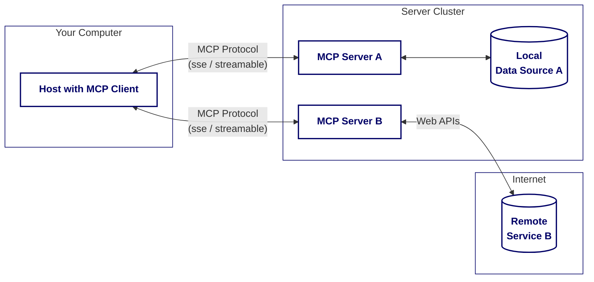

### 3.4 B/S 架构部署的 MCP

B/S (Browser/Server) 架构是 C/S 架构在 Web 环境下的延伸。Host 应用（包含 MCP Client）运行在用户的浏览器中，而 MCP Server 同样部署在远程服务器集群上。用户通过浏览器访问 Web 应用，Web 应用再通过 MCP 协议与后端的 MCP Server 进行交互。这种模式是现代 Web 应用的主流架构，适用于构建需要访问云端服务、数据库或其他企业级资源的 Web 应用。例如，一个在线项目管理工具（Host）可以通过 MCP Client 连接到云端的 MCP Server，以获取项目数据、调用任务分配工具等。

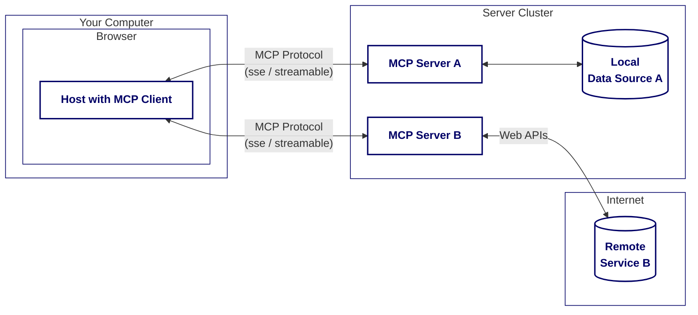

### 3.5 服务器端部署的 MCP

在服务器端部署模式中，Host 应用（包含 MCP Client）本身就运行在服务器集群上，而不是最终用户的设备上。最终用户（例如通过浏览器或桌面客户端）与这个服务器端的 Host 应用进行交互。该 Host 应用再通过 MCP 协议连接到其他（可能是本地的或远程的）MCP Server 以获取上下文或执行工具。这种架构适用于构建复杂的后端服务、API 网关或需要将多个 MCP Server 能力聚合后再向上层应用提供的场景。例如，一个 AI 助手后端服务（Host）可以集成多个分别提供天气、新闻、翻译等能力的 MCP Server，统一处理用户请求并返回结果。

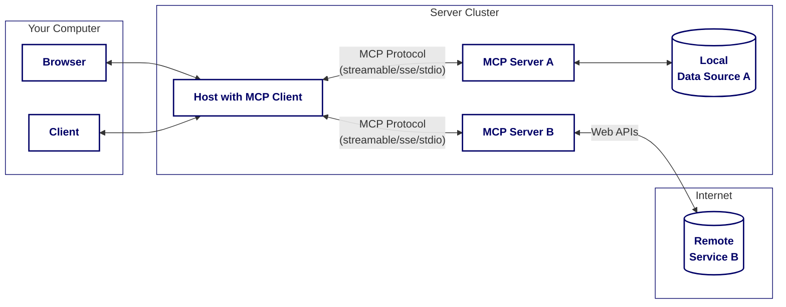

### 3.6 业务场景与架构选型考量

选择合适的 MCP 部署架构对于应用的功能实现、性能、可维护性及用户体验至关重要。本节将结合不同软件交付形态，分析各种架构模式的适用性及关键考量因素。

从产品交付的视角看，常见的软件形态包括客户端软件（如桌面应用、移动应用）和浏览器端软件（Web 应用）。
- 客户端软件：架构 3.1（本地部署）、3.3（C/S 架构）以及 3.5（服务器端 Host）通常适用于此类场景。
- 浏览器端软件：架构 3.2（浏览器内嵌部署）、3.4（B/S 架构）以及 3.5（服务器端 Host）则更适合 Web 应用。

#### **传输协议演进带来的影响：**

在新的 **Streamable HTTP** 传输方式被引入之前，对于需要远程 MCP Server 的架构（尤其是 3.3 和 3.4），依赖传统的 HTTP + SSE 传输机制带来了若干挑战：
- 连接脆弱性：SSE 连接一旦断开，通常难以自动恢复，影响服务连续性。
- 服务端资源压力：大量并发的长连接对服务器资源（如内存、连接数）构成较大压力。
- 运维复杂性：对 MCP Server 的高可用性、可靠性及弹性伸缩能力提出了更高的运维要求。

Streamable HTTP 的引入显著改善了上述局面。它具备以下优势：
- 基于标准 HTTP 请求（POST/GET），简化了客户端实现。
- 服务器可按需将会话升级为 SSE 流，仅在必要时启用流式传输，避免了长连接的持续开销。
- 支持去中心化和无状态（stateless）模式，降低了对持续连接的依赖。

#### **当前架构选型的核心考量因素：**

得益于 Streamable HTTP 的灵活性，MCP Server 的部署位置选择不再主要受限于传输方式。无论是客户端还是浏览器端软件，在选择架构 3.1、3.2、3.3 或 3.4 时，决策因素更多地转向以下层面：

1. MCP Server 的更新与管理
    - 客户端/浏览器内嵌 Server (3.1, 3.2)：Server 的更新通常需要伴随客户端软件的整体升级，迭代速度可能受限。但优势在于对本地资源的直接访问能力和潜在的离线功能。
    - 远程 Server (3.3, 3.4)：Server 的更新和维护更为集中和灵活，但需要考虑网络延迟和带宽。
2. 资源与计算的分布：
    - 分布式/本地 Server：计算和数据处理更贴近用户，可能带来更低的延迟，但管理分散。
    - 集中式 Server：便于统一管理、监控和扩展计算资源，但可能成为性能瓶颈或单点故障。
3. 数据敏感性与合规性：本地部署（3.1, 3.2）更有利于处理高度敏感或受特定法规约束的数据。

#### **对服务器端 Host 架构 (3.5) 的深入分析：**

架构 3.5 将 Host 应用（包含 MCP Client）部署于服务器集群，使其作为多个下游 MCP Server 的聚合器和编排者。这种模式非常适合构建复杂的后端服务、API 网关或需要整合多种 AI 能力的平台。

然而，此架构也引入了新的设计考量：
- Host 应用的职责加重：作为中心节点，Host 应用的稳定性、可扩展性和业务逻辑的复杂性显著增加。
- 最终用户体验的平衡：最终用户通过浏览器或桌面客户端与服务器端的 Host 应用交互。若设计不当，前端可能退化为简单的展示和输入终端，导致本地交互的智能性和灵活性降低。

因此，必须精心设计 Host 应用与最终用户客户端之间的接口和交互协议，以在集中控制的优势与丰富的终端用户体验之间取得平衡。例如，可以考虑采用更智能的前端组件，或允许部分逻辑在客户端执行，以优化响应速度和交互流畅度。


综上所述，MCP 部署架构的选择是一个涉及多方面权衡的战略决策，需要综合考虑业务需求、技术栈、运维能力、成本预算以及用户体验目标。Streamable HTTP 为这些决策提供了更大的灵活性，使得开发者可以更专注于业务逻辑本身，而非底层传输的限制。
