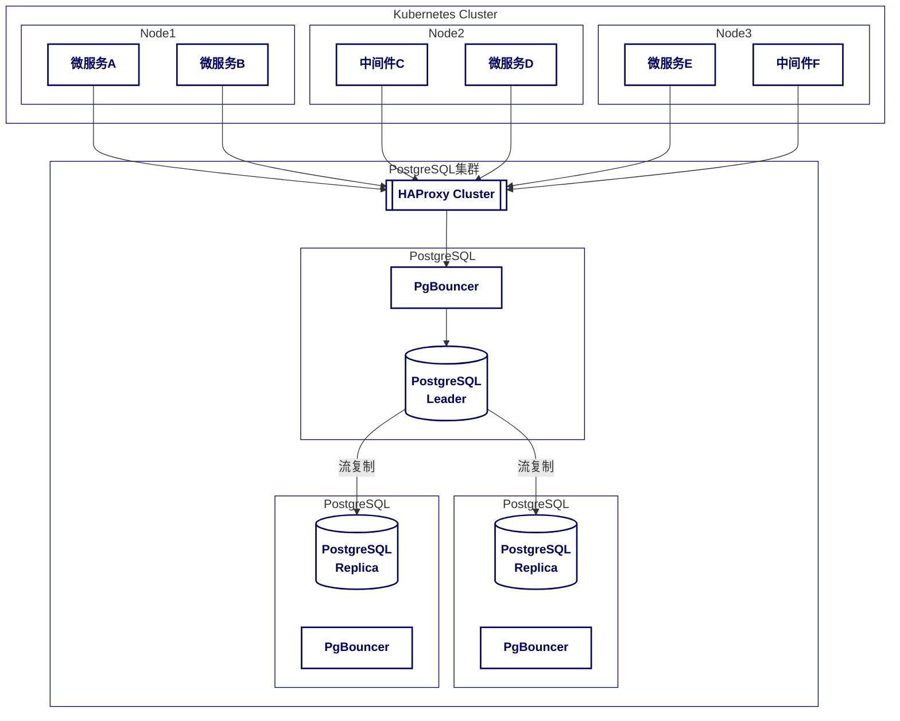

安全在整个业务开发与系统运维体系中，虽然扮演着重要的角色，但却一直被忽视。最近生产系统发生了几起事关数据库的安全事件，基于此，我们才草草地开始重视数据库的安全问题。

鉴于前期运维团体提出的方案过于潦草。在这篇文章中，我将概要性地探讨 PostgreSQL 的安全机制，以及如何在实际项目中应用这些机制。

## 1 系统部署架构

在开始讨论 PostgreSQL 的安全机制之前，我们首先需要了解系统的部署架构。下面是一个简化的部署架构：

- 各种业务服务与中间件部署在 Kubernetes 集群
- PostgreSQL 及其池化组件、高可用组件一起独立构成集群



## 2 数据库安全机制

在 PostgreSQL 中，数据库安全机制主要包括以下几个方面：

### 2.1 基于主机的认证 (Host-Based Authentication, hba)

PostgreSQL 基于主机的认证提供了很多的参数允许用户进行相关配置，包括：

```conf
local      database  user  auth-method  [auth-options]
host       database  user  address  auth-method  [auth-options]
hostssl    database  user  address  auth-method  [auth-options]
hostnossl  database  user  address  auth-method  [auth-options]
host       database  user  IP-address  IP-mask  auth-method  [auth-options]
hostssl    database  user  IP-address  IP-mask  auth-method  [auth-options]
hostnossl  database  user  IP-address  IP-mask  auth-method  [auth-options]
```

- 连接类型：UNIX 套接字、TCP/IP 连接（包括 SSL 和非 SSL 连接）
- 来源地址：主机名、IP 地址、IP 地址范围
- 认证方法：
  - `trust`：不进行认证，直接允许连接
  - `reject`：拒绝连接
  - `md5`：使用 MD5 哈希进行认证
  - `password`：使用密码进行认证
  - `scram-sha-256`：使用 SCRAM-SHA-256 哈希进行认证
  - `krb5`：使用 Kerberos 进行认证
  - `ldap`：使用 LDAP 进行认证
  - `cert`：使用证书进行认证
  - etc. 


### 2.2 访问控制

访问控制是确保只有授权用户才能访问数据库中的特定对象的机制。PostgreSQL 支持多种访问控制方法，包括：

- 基于角色的访问控制 (RBAC) ：允许数据库管理员定义和管理角色/用户访问和权限
- 细粒度权限管理：允许数据库管理员定义和管理数据库、模式、表、列等的访问和权限
- 行级安全 (RLS) ：允许数据库管理员定义和管理行级别的访问和权限

### 2.3 审计

为了提供可用于安全监控、合规性、故障排除和性能分析的事件时间顺序记录，审计日志记录需要包括以下关键组件

- 事件捕获：审计日志捕获特定事件，例如用户登录、注销、SQL 查询、数据更改以及对数据库模式的修改。
- 时间戳：每个记录的事件都与一个精确的时间戳相关联，指示事件发生的时间。
- 用户标识：日志包括有关执行操作的用户的的信息，提供责任追究和可追溯性。
- 操作详细信息：日志详细说明操作的性质。这包括操作类型（例如，SELECT、INSERT、UPDATE、DELETE）、受影响的数据或对象以及操作的结果。
- 上下文信息：可以记录其他上下文（例如源 IP 地址、应用程序名称和会话 ID）以提供对事件的全面了解。

可以考虑通过引入 PgAudit 扩展来实现 PostgreSQL 的审计功能。

## 3 数据库安全实践

要落实数据库安全机制，需要考虑以下几个方面：

1. 数据库自身的安全控制：包括启用数据库的认证机制、按照最小权限原则对每个用户分配合理可控的权限、配置数据库的审计机制。
2. 数据库通信安全：可以考虑使用加密协议（如 SSL）保护数据库通信。但考虑到纯内网环境，也可暂时忽略通信安全问题。
3. 应用程序认证凭证的妥善管理：应该确保认证凭证仅能在必要的情况下被访问，避免被未经授权的人员获取。

## 4 可行的落地方案

结合公司实际，可行的落地方案包括：

### 4.1 方案一

1. 引入 PgAudit 扩展，实现数据库审计。并定期进行安全审计，检查数据库的安全配置和用户权限，及时发现和修复安全隐患。
2. 梳理数据库用户的权限，按照最小权限原则进行再分配。微服务用户必要时可拥有 DDL 相关操作权限，开发/测试人员用户仅拥有 DML 相关操作权限，实施人员用户也不应直接使用 postgres 用户进行相关操作。
3. 认证机制中启用来源 IP 限制，仅允许特定 IP 地址的用户进行连接。（开发/测试/运维人员用户除外）
4. HAProxy 及 PgBouncer 需要调整 Proxy 配置，使来源 IP 对 PostgreSQL 可见；或调整由 PgBouncer 代为进行认证。
5. 认证机制引入 mTLS 代替用户账密认证
    - PostgreSQL 配置需调整
    - 微服务用户需要配置证书（由 Kubernetes 进行分发，JDBC url 需要调整）
    - 各中间件用户也需配置证书并调整 JDBC URL 配置
