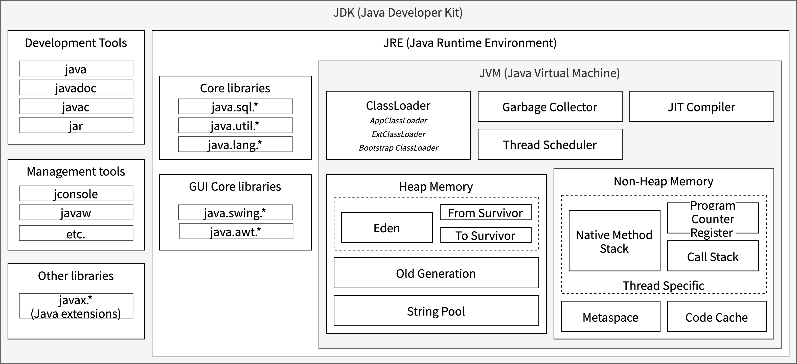

Java 语言凭借其强大的生态系统、卓越的稳定性和“一次编写，到处运行”的跨平台特性，在传统企业级应用开发中占据着举足轻重的地位。然而，随着云原生技术的蓬勃发展和边缘计算的兴起，Java 在这些新兴场景下也面临着前所未有的挑战。传统 Java 虚拟机（JVM）的设计哲学，虽然在服务器端应用中表现出色，但在追求极致效率和资源优化的新环境中，其固有的局限性日益凸显，成为制约业务发展的痛点：

- **启动性能瓶颈：** 云原生环境强调服务的快速弹性伸缩，而 Java 应用的启动往往伴随着漫长的 JVM 预热过程。这导致新实例上线缓慢，难以响应突发流量，严重影响了微服务架构的敏捷性和故障恢复速度。
- **高昂的资源消耗：** Java 应用的内存占用一直为人诟病。在容器化部署中，JVM 复杂的内存管理机制（堆、元空间、线程栈等）与容器的资源限制叠加，导致内存冗余和膨胀，每个实例都需要分配远超实际需求的资源，这在资源宝贵的云环境和边缘节点上造成了巨大的成本压力。
- **臃肿的部署包：** 包含完整 JDK/JRE 的 Java 容器镜像体积庞大，不仅增加了存储和分发成本，更延长了镜像拉取和部署时间，尤其在网络带宽受限的边缘场景中，这一问题尤为突出。

这些痛点在资源受限、网络不稳定的边缘计算场景中被进一步放大。随着业务逻辑向边缘下沉，对服务器内存、CPU 和启动速度的精细化管理变得至关重要。Java 应用的高资源消耗和低启动效率，已成为阻碍其在边缘计算领域广泛应用的关键难题。

面对上述挑战，业界不乏“放弃 JVM”的呼声，转而采用 Go、Rust 等原生编译语言。然而，放弃 Java 庞大而成熟的生态系统，以及随之而来的团队技术栈转型和历史代码迁移的巨大成本，同样令人望而却步。正是在这种两难的困境中，GraalVM 提出了一种兼顾性能与生态的创新解决方案。GraalVM 通过其创新的提前编译技术 (AOT, Ahead-of-Time)，能够将 Java 应用直接编译成独立的原生可执行文件，从而显著改善启动时间、降低内存占用，并缩小部署体积。

## GraalVM 是什么？


<center><small>图 1：JDK Components</small></center>

图 1 展示了 JDK 的核心组成部分，主要包括 Java 编译器、Java 运行时环境（JRE）以及 Java 虚拟机（JVM）。这些组件共同构成了 Java 应用开发与运行的基础。我们常说的 Oracle JDK、OpenJDK、Temurin、Dragonwell 等 JDK 分发版都遵循这一基本结构，其主要差异体现在发布渠道、支持的 Java 版本以及各自提供的附加工具和组件上。

GraalVM 同样是一种 JDK 分发版，它在标准 JDK 组件的基础上，进一步集成了特定的工具和技术，尤其在支持 AOT 编译和构建原生应用方面表现突出。

GraalVM 引入的 `native-image` 工具能够将 Java 应用直接编译成一个独立的、原生可执行文件，使得这些应用在运行时不再需要传统的 JVM 环境，而是直接在操作系统层面运行，从而显著提升启动速度、运行性能并降低资源消耗。

虽然从图 1 的 JDK 组件来看，`native-image` 是一种离经叛道的工具，它直接挑战了经典 JDK 组件架构。但软件技术本就是不断演进的，它的边界也是不停变化的，一些新组件的兴起，伴随着另一些组件的落幕。

## GraalVM 的双重运行模式

GraalVM 提供了灵活的运行模式，以适应不同的应用场景和性能需求：

### 传统 JVM 模式运行

在这种模式下，应用程序直接在 GraalVM 内置的 HotSpot 虚拟机上运行，其运行方式与我们熟悉的 Oracle JDK 或 OpenJDK 并无二致。

然而，即便在看似传统的运行模式下，GraalVM 依然带来了显著的优化。它默认采用 Graal Compiler 作为即时（JIT）编译器，取代了传统 HotSpot JVM 中常用的 C2 编译器。Graal Compiler 具备更深层次的分析和优化能力，这使得应用程序在运行时能够实现更加卓越的性能。

这种模式特别适用于那些对启动时间要求不高，但对应用程序长期运行时的峰值性能和吞吐量有较高要求的传统 Java 企业级应用。Graal Compiler 的引入，让这些应用在不改变现有架构的前提下，也能享受到显著的性能提升。


### 原生可执行文件模式运行

GraalVM 的原生镜像模式彻底改变了 Java 应用程序的部署和运行方式。它利用 GraalVM 提供的 `native-image` 工具，将整个 Java 应用程序及其所有依赖项都提前编译成一个独立的、与平台相关的原生可执行文件。

这种编译方式的核心优势在于，生成的主体不再需要外部 JVM 的支持。相反，它能直接作为操作系统的本地进程执行。这带来了两大显著优势：极快的启动速度和显著降低的内存占用。

因此，原生镜像模式特别适合对启动速度和内存效率有严苛要求的场景。例如，它能让 Java 在云原生微服务、Serverless 函数（如 AWS Lambda、Google Cloud Functions）、边缘计算以及命令行工具等新兴领域中展现出强大的竞争力，从而大幅提升 Java 应用的整体效能和部署灵活性。

## GraalVM Native Image 的核心原理与挑战

`native-image` 工具之所以能够实现 Java 应用的“原生化”，其背后依赖于一系列精巧的技术和严格的假设。理解这些原理，对于我们有效地使用 GraalVM 至关重要。

### 提前编译与静态分析

`native-image` 主要由两部分构成：提前编译和静态分析。

- **提前编译 (AOT, Ahead-of-Time Compilation)**：与传统 Java 应用在运行时通过即时编译器动态编译热点代码不同，`native-image` 工具在构建时就将 Java 字节码（包括应用程序代码及其所有依赖库）直接编译成本地机器码。这意味着最终生成的可执行文件包含了所有必要的代码，可以直接在目标操作系统上运行，无需 JVM 的参与。这种提前编译的方式是实现快速启动和降低运行时开销的关键。

- **静态分析 (Static Analysis)**：为了尽可能地优化最终的可执行文件，`native-image` 会进行一次全程序的静态分析。它会仔细周密地扫描整个应用程序的代码和依赖，只将那些在编译时能够确定会被实际用到的类、方法、字段以及资源文件打包进最终的可执行文件中。这种分析基于“封闭世界”假设 (Closed-World Assumption)，即认为在编译时可见的所有代码就是运行时可能执行的全部代码。这种分析可以极大地裁剪可执行文件的大小，但也会导致 Java 语言中的动态特性（如反射、动态代理、JNI 调用、资源加载和序列化）难以适从。

### 动态特性与可达性元数据

Java 是静态语言，但它包含大量的动态特性，包括反射、动态代理、JNI、资源加载、序列化等。这些动态特性本质上违反了“封闭世界”假设，致使静态分析器无法完全理解和优化所有可能的执行路径，从而在编译过程中被移除，最终导致原生应用在运行时出现 `ClassNotFoundException`、`MethodNotFoundException` 等错误。

为了解决静态分析无法完全覆盖动态特性的问题，GraalVM 引入了可达性元数据 (Reachiability Metadata) 的概念。这些元数据以 JSON 文件的形式（例如 `reflect-config.json`, `jni-config.json`, `resource-config.json`, `proxy-config.json`, `serialization-config.json` 等）存在，它们的作用是显式地告知 `native-image` 工具，哪些在编译时看起来“不可达”的动态元素实际上在运行时是需要的，必须被保留和正确处理。

- `reflect-config.json`：列出需要通过反射访问的类、构造函数、方法和字段。
- `jni-config.json`：声明 JNI 调用中涉及的 Java 类和本地库。
- `resource-config.json`：指定需要包含在原生镜像中的资源文件及其路径模式。
- `proxy-config.json`：列出需要为其生成动态代理的接口列表。
- `serialization-config.json`：声明需要参与序列化和反序列化的类列表。

至于如何获取这些文件，主流的有三种方法：
1. **手动配置**：开发者可以根据对代码的理解，手动编写这些 JSON 配置文件。这通常适用于小型项目或者对动态特性使用有清晰认知的情况。然而，对于大型复杂应用，手动维护这些配置既繁琐又容易出错。
2. **构建工具插件**：主流的构建工具如 Maven (`graalvm-reachability-metadata` 依赖和相关插件) 和 Gradle (GraalVM Native Image 插件) 通常提供了简化的配置选项或者自动检测某些常见模式的能力，减轻了手动配置的负担。
3. **Tracing Agent (动态分析辅助)**：这是最常用且官方推荐的方式。GraalVM 提供了一个 Java Agent (`javaagent`)，可以在 JVM 模式下运行应用程序。当应用在 JVM 上正常执行时，这个 Agent 会**追踪并记录**所有实际发生的动态调用（如反射操作、资源加载等），并在程序结束时自动生成相应的元数据 JSON 文件。开发者随后可以将这些生成的配置文件加入到项目中，供 `native-image` 工具在构建原生镜像时使用。这种方式能够较为准确地捕捉到大部分动态行为，大大提高了配置的准确性和效率。

### 编译时初始化与运行时初始化

为了进一步提升原生可执行文件的启动效率，`native-image` 工具允许开发者在构建时进行更细粒度的控制，可以选择在**编译时 (Build-Time)** 或**运行时 (Run-Time)** 进行类的初始化。

通过将那些一旦创建便不再改变，且不依赖于特定运行时环境的类和对象（不可变对象、应用配置、常量与枚举等），在构建原生镜像时提前初始化。可以有效地将它们的创建开销前置，从而极大缩短应用程序的启动时间。

但是，另有一些对象是绝对不可以在编译时初始化的，诸如随机数、时间戳、文件句柄、网络套接字等包含运行时状态、依赖于运行时环境或需要在应用程序每次启动时都重新创建的对象，都必须在运行时进行初始化。

GraalVM 提供了一套灵活的机制来精确控制每个类的初始化时机。默认情况下，`native-image` 工具会采用一种启发式策略进行自动分析，但对于复杂的应用，显式配置是保证正确性和性能的关键。

主要的配置方式有三种：

1. 命令行参数
  
    - `--initialize-at-build-time=<package.ClassName>` 将指定的类或整个包下的所有类配置为在编译时初始化。
    - `--initialize-at-run-time=<package.ClassName>` 将指定的类或包配置为在运行时初始化。

2. 配置文件 (native-image.properties)
  
    对于大型项目，将初始化配置集中管理更为高效。可以在 META-INF/native-image/ 目录下创建一个 native-image.properties 文件，并在其中定义初始化策略。

    ```properties
    Args = --initialize-at-build-time=com.example.MyConfig \
          --initialize-at-run-time=com.example.DatabaseConnector
    ```

    这种方式将配置与代码一同置于版本控制之下，便于团队协作和维护。

3. 对于框架和库的开发者而言，Feature API 提供了最强大和灵活的配置能力。通过实现 `org.graalvm.nativeimage.hosted.Feature` 接口，可以在构建过程中通过编程逻辑动态地决定哪些类应该在何时初始化。

    然后，通过 native-image 的 --features 参数或Java的服务加载器机制来启用这个 Feature。


## 原生应用的调试与诊断

在传统的 Java 世界中，我们享有由 JVM 提供的极为丰富和成熟的诊断工具生态。无论是 IDE 中功能强大的图形化调试器，还是 JProfiler、VisualVM 等性能分析工具，它们都依赖于一个共同的基础：Java 虚拟机调试接口（JVMTI）和 Java 管理扩展（JMX）。这个强大的生态系统是 Java 平台的核心优势之一，为开发者提供了深入洞察应用内部状态的能力。

然而，当我们采用 GraalVM 的 `native-image` 工具时，我们做出了一个根本性的架构选择：将应用编译为脱离 JVM 运行的原生可执行文件。这一选择在带来性能飞跃的同时，也意味着我们告别了整个基于 JVM 的诊断体系。原生应用直接在操作系统层面运行，传统的调试和监控工具因失去了与之通信的 JVM 接口而完全失效。

这并非 GraalVM 的缺陷，而是其核心价值所带来的必然结果。正如 `native-image` 工具挑战了 JVM 在运行时的中心地位一样，它也要求我们在调试与诊断的思路上进行相应的演进。开发者必须从依赖 JVM 提供的“全能管家”模式，转向拥抱原生工具链和构建自包含的可观测性（Observability）体系。

### 调试（Debugging）

由于不再有 JVM，基于 JVMTI 的调试器无法连接。调试的焦点从 Java 对象、方法和堆栈，下沉到了更底层的机器码、寄存器和内存地址。此时，就不得不回归操作系统提供的原生调试器。最常用的包括 Linux 和 macOS 上的 GDB (GNU Debugger) 或 LLDB，以及 Windows 上的 WinDbg。

### 可观测性（Observability）

由于交互式调试的复杂性增加，在原生应用开发中，建立完善的可观测性体系不再是“锦上添花”，而是保障系统稳定运行的“必要基石”。它主要由三大支柱构成：

- 日志 (Logging)：这是最基础的诊断手段。确保 Logback、Log4j2 等日志框架及其配置文件（如 logback.xml）和自定义组件被正确地包含在可达性元数据中，是保证日志在原生环境中正常工作的前提。
- 指标 (Metrics)：通过集成 Micrometer 等库，原生应用可以像任何云原生服务一样，向 Prometheus 等监控系统暴露关键性能指标。这使得我们能够通过 Grafana 等工具进行可视化监控和告警，实时掌握应用的健康状况。
- 分布式追踪 (Distributed Tracing)：在微服务架构下，使用 OpenTelemetry 等标准，可以追踪一个请求在多个原生服务间的完整调用链路，这对于定位分布式系统中的性能瓶颈和故障点至关重要。

总而言之，转向 GraalVM Native Image 不仅仅是改变了应用的打包和运行方式，更是一次开发与运维范式的深刻转变。我们用启动速度和资源效率，换取了对 JVM 诊断生态的告别。作为回报，我们必须拥抱原生调试工具，并从一开始就将强大的可观测性能力构建到应用之中，从而确保原生 Java 应用在云原生时代依然保持高效、稳定与可靠。

## 原生应用的运行与资源管理

通过 `native-image` 工具，Java 应用被彻底重塑为一个独立的、平台原生的可执行文件。这一转变不仅改变了应用的构建和分发方式，更从根本上革新了其运行模式与资源管理机制。理解这些变化，对于在生产环境中有效部署和运维原生应用至关重要。

### 独立运行
原生可执行文件的最显著特征是其完全的独立性。与需要 `java -jar myapp.jar` 命令和预装 JRE/JDK 环境才能运行的传统 Java 应用不同，GraalVM 生成的原生应用是一个自包含的二进制文件。

无需外部 JVM：它可以直接在目标操作系统上执行（例如，在 Linux 上通过 ./myapp），完全不依赖任何外部的 Java 虚拟机。这极大地简化了部署流程，消除了因目标环境 JRE 版本不匹配或缺失而导致的常见问题。
精简的容器镜像：在容器化部署中，这意味着基础镜像不再需要包含一个完整的 JDK 或 JRE。开发者可以选用像 distroless 或 scratch 这样极度精简的基础镜像，从而将容器镜像的体积从数百兆字节锐减到几十兆字节，显著加快了镜像的拉取和分发速度。

### 轻量级运行时系统

尽管原生应用摆脱了传统的 JVM，但这并不意味着它在没有任何支持的情况下运行。实际上，每个原生可执行文件内部都包含了一个名为 Substrate VM 的极度精简的运行时系统。

Substrate VM 简介：Substrate VM 并非一个完整的、动态的虚拟机，而是 native-image 在编译时，将运行应用所必需的核心服务一并打包进最终可执行文件中的结果。它只包含维持程序运行所必需的最小功能集。
核心职责：这个轻量级运行时主要负责：
内存管理：包括对象的分配和一个高效的垃圾回收器（GC），用于自动回收不再使用的内存。
线程调度：管理应用线程的生命周期和执行。
与操作系统交互：处理底层的系统调用等。
Substrate VM 提供了传统 JVM 的核心保障，但剔除了所有在运行时非必需的重量级组件，如类加载器、JIT 编译器和字节码解释器，这正是原生应用能够实现闪电般启动和低资源占用的根本原因。

### 内存管理
精简的运行时架构直接带来了原生应用在内存管理上的巨大优势，尤其体现在内存占用和配置灵活性上。

- 低内存占用：由于没有了 JVM 本身的复杂结构（如元空间、代码缓存等）所带来的固定开销，原生应用的静态内存占用（RSS）显著降低。这使得在资源受限的设备或高密度的容器化环境中，可以部署更多的应用实例。

- 智能的堆内存约束：Substrate VM 具备“容器感知”能力。当原生应用在容器（如 Docker）中运行时，它会自动检测由 cgroup 设置的内存限制，并默认将自己的最大堆内存（Max Heap Size）设置为容器可用内存的一个安全百分比（通常是 80% 左右）。这一特性极大地避免了因 Java 堆内存超出容器限制而导致的进程被强制终止（OOMKilled）的问题。

- 灵活的手动约束：为了实现对资源的精细化控制，开发者依然可以使用与传统 JVM 类似的参数来手动设置堆内存大小。这在微服务和 Serverless 场景中尤为重要，可以确保每个函数或服务实例精确地使用其被分配的资源。

总而言之，GraalVM 原生应用通过一种全新的运行与资源管理模式，成功地将 Java 从一个“资源大户”转变为云原生环境中的“轻量级选手”，在保持核心功能稳定性的同时，提供了前所未有的运行效率和资源亲和力。

## 总结

综上所述，面对云原生时代对快速启动、低资源消耗和轻量化部署的严苛要求，传统 Java 应用一度显得力不从心。GraalVM Native Image 技术，以其颠覆性的提前编译（AOT）理念，为 Java 的未来发展开辟了一条全新的道路。它通过将 Java 应用及其依赖直接编译为平台原生可执行文件，彻底摆脱了对传统 JVM 的运行时依赖。这不仅带来了毫秒级的启动速度和显著降低的内存占用，还极大地简化了容器化部署，使得 Java 在微服务、Serverless 和边缘计算等场景中重获强大的竞争力。

然而，这种转变并非没有代价。我们必须接受“封闭世界”假设，并投入精力管理可达性元数据以应对 Java 的动态特性。更重要的是，开发者需要进行一次深刻的思维范式转变：告别熟悉的 JVM 诊断工具生态，转而拥抱原生调试器，并从项目伊始就将日志、指标和分布式追踪等可观测性实践深度融入应用架构之中。

总而言之，GraalVM Native Image 并非旨在完全取代 JIT 模式，而是为 Java 生态系统提供了至关重要的“第二选择”。它让开发者能够根据具体业务场景，在经典的峰值吞吐量与极致的启动效率之间做出明智权衡。