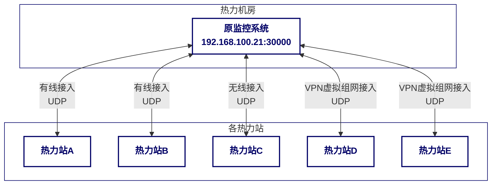
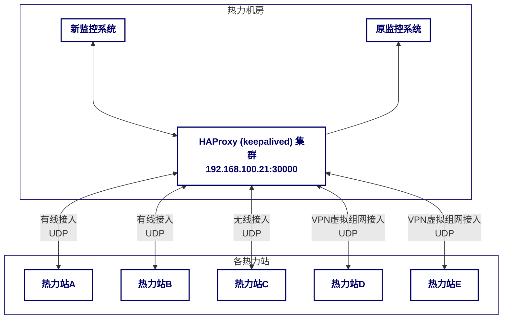
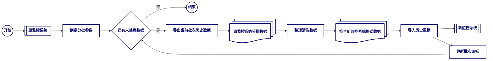
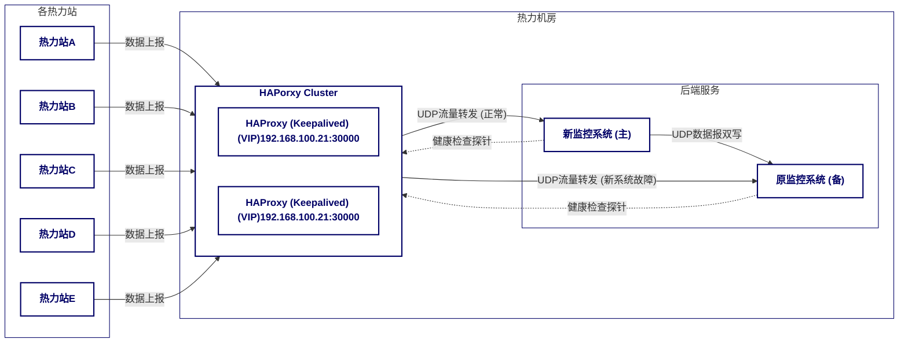
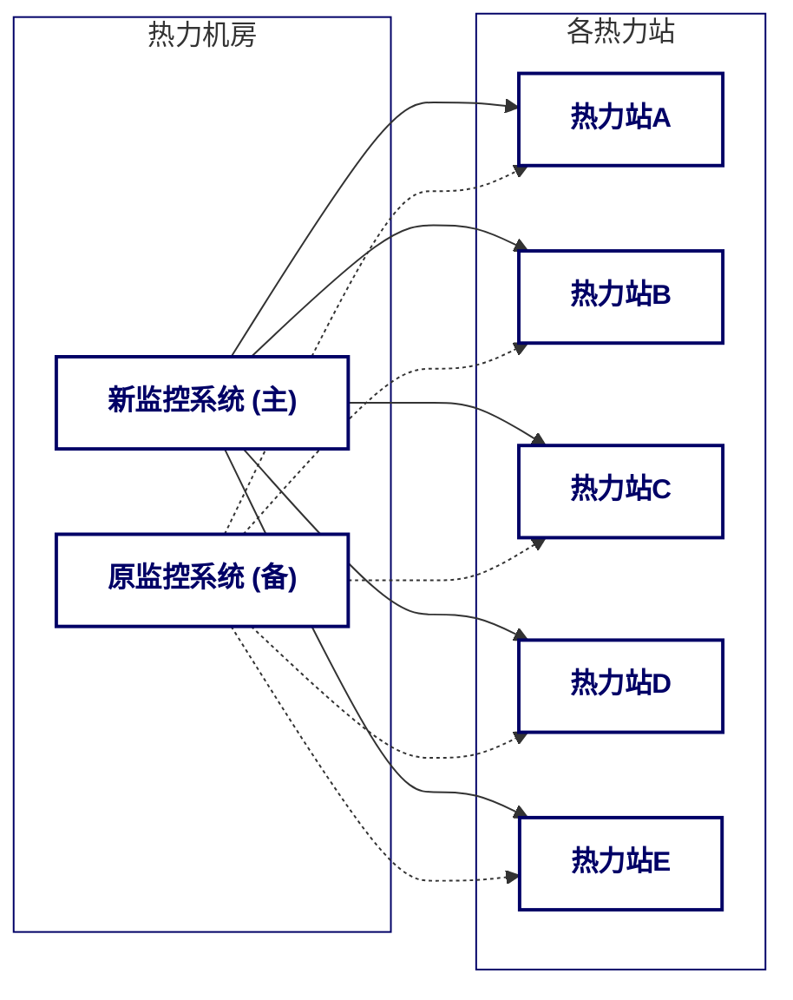

# 1. 现有监控系统通信协议的兼容与沿用

## 1.1 技术要求

本方案旨在确保新系统在不改变现有热力站及监测点设备数量、不新增硬件的前提下，严格兼容并沿用原有监控系统的地址、端口及通信协议，实现与各监测点的无缝连接，全面适配招标方现行通信方式与协议。在此基础上，新系统需实现对现有全部监测点的数据采集与控制功能，并支持有线、无线、VPN 虚拟组网等多种通信方式，以确保数据传输的稳定性、灵活性与兼容性，满足不同场景下的通信需求，保障系统平稳过渡与高效运行。

## 1.2 技术方案

### 1.2.1 原系统架构



<center><small>图 1：原系统架构</small></center>

原系统架构中，原监控系统与各热力站之间通过基于 UDP 协议的双向通信链路进行数据交互。其核心通信机制如下：

- **原监控系统端**：
    - 部署于 `192.168.100.21` 的原监控系统，监听 UDP 端口 `30000`，负责接收来自各热力站的数据报文。主要接收内容包括：
        - **实时数据定时上报**：如温度、压力、流量等运行状态参数。
        - **配置参数同步**：热力站本地参数变更后的通知。
        - **心跳报文**：用于维持连接状态及发现异常热力站。
- **热力站端**：
    - 各热力站的本地控制器或数据采集单元监听 UDP 端口 `5900`，用于接收原监控系统下发的指令或数据请求。主要接收指令包括：
        - **实时数据与运行参数读取**：查询当前运行数据及配置参数。
        - **运行参数与设备控制**：下发配置调整指令（如设定温度、阀门开度）及远程控制设备启停（如启停泵、重启控制器）。

所有 UDP 通信均采用请求-响应模式，确保了基于 UDP 协议的通信可靠性与稳定性。

### 1.2.2 新系统架构

为严格遵循沿用原监控系统网络地址、端口及通信协议的要求，本项目不对各换热站进行任何改动。新监控系统将部署于热力机房内部，并通过调整网络配置实现平滑上线。


<center><small>图 2：新系统架构</small></center>

核心改造策略在于热力机房内部署一套高可用的流量分发与故障切换机制，具体实施如下：

1. 引入 HAProxy (配合 Keepalived) 高可用集群：
    - 在热力机房内部署至少两台服务器作为 HAProxy 节点，通过 Keepalived 管理虚拟 IP (VIP) `192.168.100.21`（即原监控系统 IP）。
    - Keepalived 确保 VIP 在主 HAProxy 节点故障时自动漂移至备用节点，保障服务入口持续可用。
    - HAProxy 集群将接管原监控系统监听职责，在 VIP (`192.168.100.21`) 的 UDP 端口 `30000` 接收所有热力站的 UDP 数据报文，确保热力站端无需任何配置更改。

2. 后端服务配置与健康检查 (参考图3)：

    ```mermaid
    %%{init: { "themeVariables": { "clusterBkg": "#ffffff", "clusterBorder": "#000066" }}}%%
    flowchart LR
        subgraph 热力机房
            direction LR
            HAProxy["HAProxy (Keepalived) 集群<br>VIP(192.168.100.21:30000)"]
            subgraph Backends["后端服务"]
                direction TB
                viSCADA["新监控系统 (主)"]
                monitor["原监控系统 (备)"]
            end
        end

        HAProxy -- UDP流量转发 (正常) --> viSCADA
        HAProxy -- UDP流量转发 (新系统故障) --> monitor
        viSCADA -.->|健康检查探针| HAProxy
        monitor -.->|健康检查探针| HAProxy
        viSCADA -- UDP数据报双写 --> monitor

    classDef darkStyle fill:#ffffff,stroke:#000066,color:#000066,stroke-width:2px,font-weight:bold
    class HAProxy,monitor,viSCADA darkStyle;
    ```
    <center><small>图 3：HAProxy 配置及数据双写</small></center>

    - HAProxy 将新部署的“新监控系统”和仍在运行的“原监控系统”配置为其后端服务 (backends)。
    - **主备模式**：新监控系统设置为主服务器 (primary server)，原监控系统设置为备份服务器 (backup server)。正常情况下，所有来自热力站的 UDP 流量都将被 HAProxy 转发给新监控系统。
    - **健康检查**：HAProxy 会定期对新监控系统进行健康检查。健康检查的形式预期通过复用 UDP 端口，在原协议的基础上新增一个功能码实现监控系统心跳机制。
    - **自动故障切换 (Failover)**：
        - 当 HAProxy 的健康检查机制检测到新监控系统出现故障（例如，无响应、服务端口不可达或心跳超时）时，它会自动将流量切换到配置为备份服务器的原监控系统。这样可以最大限度地减少服务中断时间，保障监控业务的连续性。
        - 一旦新监控系统恢复正常并通过健康检查，HAProxy 会自动将流量切回新监控系统，恢复其主服务角色。

3. 数据双写与备份：
    - 为确保数据完整性与一致性，新监控系统在处理来自 HAProxy 的 UDP 数据报文后，会实时将报文**转发一份给原监控系统**。
    - 这种“数据双写”策略使原监控系统保持与新系统同步，为故障切换提供数据基础，并便于过渡期的数据比对与验证，极端情况下亦可从双系统恢复数据。

4. 控制指令的兼容与冗余策略：
    - 控制权平滑过渡：新监控系统将完全兼容并替代原系统的控制能力。上线后，日常控制操作均通过新系统发起。原系统控制功能仅作为应急备用，并通过操作规程限制其日常使用，确保控制指令来源的唯一性。
    - 应急控制保障：新系统向原系统的数据双写机制确保原系统实时同步热力站状态。当新系统故障时，管理人员可切换至原系统执行必要控制指令，保障主系统故障时控制能力不中断，提供关键冗余。
    - 设计考量与优势：
        - 降低切换风险：保留原系统控制能力作为备份，为新系统上线初期提供可靠退路，降低整体切换风险。
        - 保障业务连续性：主监控系统故障时，可迅速切换至备用控制路径，最大限度保障核心业务连续性。
        - 操作习惯平滑迁移：保留旧系统应急控制能力，有助于缓解运维人员对新系统操作的陌生感，促进操作习惯平滑过渡及应急响应效率。

综上所述，本方案在不改动热力站端配置的前提下，通过 HAProxy 与 Keepalived 实现流量平滑引入、高可用及故障自动切换，并借助数据双写确保原系统备份与数据一致性，显著提升了整体系统的稳定性和可靠性。

### 1.2.3 UDP 协议适配

为确保新监控系统与热力站（下位控制器）间的顺畅通信，需对现有 UDP 协议进行详细适配。所有 UDP 数据包均采用小端序。

**通用报文结构**

UDP 报文由 `Head`、`Addr`、`Func`、`ByteCount`、`Data` 及 `CRC` 校验码组成。`Head` 字段用于区分发送方：

*   **下位控制器发送至上位服务器**：`Head` 为 `0xA5A5`
*   **上位服务器发送至下位控制器**：`Head` 为 `0x5A5A`

| 字段 | 字节数 | 说明 | 数据类型 | 备注 |
|---|---|---|---|---|
| Head | 2 | 包头，区分发送方 |  | 0xA5A5 或 0x5A5A |
| Addr | 2 | 设备地址 |  |  |
| Func | 2 | 功能码，指示报文类型 |  |  |
| ByteCount | 2 | 数据域 (Data) 的字节数 |  |  |
| Data | ByteCount | 数据域，具体内容由功能码决定 |  |  |
| CRC-H | 1 | CRC 校验高字节 | B |  |
| CRC-L | 1 | CRC 校验低字节 | B |  |

**功能码定义**

不同功能码 (`Func`) 对应不同通信目的及 `Data` 结构。主要功能码及其通信场景如下：

- **下位控制器发起**：
    - `0x01`: 定时发送采集数据
    - `0x02`: 控制器参数本地变更后上传
    - `0x30`: 心跳报文

- **上位服务器发起**：
    - `0x11`: 请求发送当前数据
    - `0x12`: 读取运行参数
    - `0x14`: 发送更改运行参数
    - `0x15`: 启停泵
    - `0x16`: 更改补水表底数
    - `0x17`: 更改热表底数
    - `0x20`: 重启控制器

### 1.2.4 UDP 数据点位

功能码 `0x01` 对应定时上报数据，总计 438 字节，结构如下：

- **一次侧数据**：44 字节。
- **二次侧数据**：288 字节，分为 6 个机组，每机组 48 字节。不足 6 个机组时，空余部分填充 0。
- **二次侧机组专属一次分支数据**：96 字节，分为 6 个一次分支，与二次侧 6 个机组对应。

**一次侧数据点位定义**

| 数据点位说明 | 数据类型 |
|---|---|
| 站外一次供压 | WORD |
| 站外一次回压 | WORD |
| 一次供压 | WORD |
| 一次回压 | WORD |
| 一次供温传感器 | WORD |
| 一次回温传感器 | WORD |
| 一次定值开度 | WORD |
| 一次实际开度 | WORD |
| 一次供温热表 | WORD |
| 一次回温热表 | WORD |
| 一次瞬时流量 | WORD |
| 一次瞬时热量 | WORD |
| DI | WORD |
| 水箱液位 | WORD |
| 总电度 | WORD |
| 保留点位 | WORD |
| 总补水吨数 | WORD |
| 保留点位 | WORD |
| 一次累计流量 | UINT |
| 一次累计热量 | UINT |

**二次侧数据点位定义**

| 数据点位说明 | 数据类型 |
|---|---|
| 二次供压 | WORD |
| 二次回压 | WORD |
| 二次供温 | WORD |
| 二次回温 | WORD |
| 一次分支阀门定值开度 | WORD |
| 一次分支阀门实际开度 | WORD |
| 循环变频状态 | WORD |
| 循环给定频率 | WORD |
| 循环实际频率 | WORD |
| 循环变频实际值 | WORD |
| 补水变频状态 | WORD |
| 补水给定频率 | WORD |
| 补水实际频率 | WORD |
| 补水变频实际值 | WORD |
| 二次静压 | WORD |
| 一次分支回温 | WORD |
| 一次分支供压 | WORD |
| 一次分支回压 | WORD |
| DI | WORD |
| 保留点位 | WORD |
| 保留点位 | WORD |
| 二次瞬时补水量 | WORD |
| 二次累计补水量 | UINT |

**一次分支数据点位定义**

| 数据点位说明 | 数据类型 |
|---|---|
| 一次分支供温热表 | WORD |
| 一次分支回温热表 | WORD |
| 一次分支瞬时流量 | WORD |
| 一次分支瞬时热量 | WORD |
| 一次分支累计流量 | UINT |
| 一次分支累计热量 | UINT |

具体站点的数据点位可能存在差异，可通过原监控系统查看其数据点位及偏移量。

// TODO: 图片

# 2. 系统数据迁移方案

## 2.1 技术要求

本方案旨在确保原监控系统数据完整、精准地迁移至新监控系统，并能稳定高效地进行使用。

## 2.2 技术方案

为了实现新旧监控系统的数据平滑过渡，确保历史数据的完整性和可用性，我们将采用以下数据迁移方案：

### 2.2.1 热力站信息迁移方案

热力站信息是监控系统的基础配置，包括热力站名称、地址、联系方式、设备列表、通信参数（IP地址、端口、设备ID等）以及与热力站关联的测点信息等。这些信息是系统正常运行和数据采集、控制指令下发的前提。

**数据来源与内容**

- **原监控系统**：主要的热力站基础信息、设备配置、通信参数等将从原监控系统中提取。
- **现场勘查与文档**：部分未在数据库中体现或需要核对的物理位置、网络拓扑、设备型号等信息，将通过现场勘查和现有文档进行补充和校对。
- **测点信息**：包括测点名称、数据类型、单位、报警阈值、历史数据存储策略等，这些是数据采集和展示的核心。

**迁移方式**

考虑到热力站信息的结构化特性和数量相对有限，我们将采用以下组合方式进行迁移：

- **监控系统直导/脚本转换**：对于原监控系统中结构化且完整的热力站及设备配置数据，优先通过监控系统导出（如SQL脚本、CSV文件）并结合定制化脚本进行清洗、转换，直接导入新监控系统数据库。
- **人工录入与核对**：对于非结构化数据、需要人工判断或核对的信息（如现场备注、特殊配置），以及少量新增或调整的测点信息，将通过人工在新系统中进行录入和配置。此过程将严格遵循预设的配置模板和命名规范。
- **配置文件导入**：如果新系统支持特定格式的配置文件导入（如XML、JSON），可将整理好的热力站信息批量生成为配置文件进行导入，提高效率。

**数据验证与校准**

- **完整性核对**：迁移完成后，将核对新系统中热力站及设备的总数量、关键参数配置项，确保与原系统一致。
- **准确性验证**：随机抽取部分热力站，登录新系统检查其详细配置信息是否准确无误，包括IP地址、端口、设备ID、测点名称、单位、报警阈值等。
- **功能性测试**：针对已迁移的热力站，进行小范围的联调测试，验证数据采集、控制指令下发等核心功能是否正常，确保通信链路畅通，数据解析正确。

通过上述步骤，我们将确保热力站信息在新系统中的准确、完整和可用性，为后续的历史数据迁移和系统上线奠定坚实基础。

### 2.2.2 历史数据迁移策略


<center><small>图 4：迁移流程示意图</small></center>

本方案主要依赖原监控系统的导出功能和新监控系统的导入能力，通过“导出-整理-导入”的流程完成数据对接。具体步骤如下：

1. 历史数据导出：
    - 利用原监控系统提供的导出功能，将所有历史数据导出为 EXCEL 文件。根据实际系统负载，我们将按时间段或数据类型分批导出，以避免单文件过大导致处理困难。
    - 确保导出数据的完整性，包括所有必要的测量点数据、报警记录、操作日志等。

2. 数据格式整理与清洗：
    - 导出的 EXCEL 文件与新监控系统的目标格式存在差异，同时原始数据可能存在数据冗余、缺失或错误等问题。
    - 需要进行线下人工或脚本处理，对 EXCEL 文件中的数据进行清洗、转换和标准化，使其符合新监控系统的数据导入规范。
    - 我们将重点关注时间戳格式、数值单位、设备标识符等关键字段的一致性。

3. 新系统数据导入：
    - 将整理后的 EXCEL 数据导入到新监控系统中。
    - 导入前进行小批量测试，验证导入流程和数据准确性，确保无误后再进行大规模导入。
    - 导入过程中有详细的日志记录，可以方便地提供追踪和排查可能出现的问题。

# 3. 双机热备方案

## 3.1 技术要求

原有系统及设备需完整保留并作为双机热备，在新系统故障时能迅速接管工作，持续提供服务。

## 3.2 采集技术方案

为了保证系统的连续性和稳定性，我们将采用双机热备方案。具体实施步骤如下：



<center><small>图 5：双机热备采集方案示意图</small></center>

为了保证系统的连续性和稳定性，我们将采用双机热备方案，并结合 HAProxy 和 Keepalived 实现高可用和流量管理。具体实施步骤如下：

### 3.2.1 HAProxy + Keepalived 集群实现原 IP 替换与高可用

如图 4 所示，我们将在热力机房内部署至少两台服务器作为 HAProxy 节点，并通过 Keepalived 管理虚拟 IP (VIP) `192.168.100.21`（即原监控系统 IP）。

- VIP 接管：Keepalived 确保 VIP 在主 HAProxy 节点故障时自动漂移至备用节点，保障服务入口持续可用。这意味着热力站端无需进行任何配置更改，所有数据报文仍发送至原监控系统 IP。
- 高可用性：HAProxy 集群将接管原监控系统监听职责，在 VIP (`192.168.100.21`) 的 UDP 端口 `30000` 接收所有热力站的 UDP 数据报文，从而实现整个通信链路的高可用。

### 3.2.2 HAProxy 的 L4 反向代理实现主备模式

HAProxy 将作为 L4（传输层）反向代理，实现新监控系统为主、原监控系统为备的流量分发模式。此配置确保了在正常运行情况下，所有流量都优先导向新系统，同时在必要时能够无缝切换至原系统。

- 主备配置：新监控系统被配置为 HAProxy 的主服务器 (primary server)，而原监控系统则作为备份服务器 (backup server)。正常情况下，所有来自热力站的 UDP 流量都将被 HAProxy 转发给新监控系统。
- 健康检查与自动故障切换：HAProxy 会定期对新监控系统进行健康检查。当检测到新监控系统故障时（例如，无响应或心跳超时），HAProxy 会自动将流量切换到配置为备份服务器的原监控系统，最大限度地减少服务中断时间。一旦新监控系统恢复正常，HAProxy 会自动将流量切回新监控系统。

## 3.3 控制技术方案



<center><small>图 6：双机热备控制方案示意图</small></center>

- 下行控制指令：下行控制指令无需通过 HAProxy。原监控系统维护着各下位系统（热力站）的 IP 地址和端口信息，新监控系统也需具备直接向各热力站下发控制指令的能力。这意味着新旧系统都将直接与热力站建立 UDP 连接以发送控制指令。
- 主备控制权协同：在正常运行模式下，所有控制指令均由新监控系统发出。新系统在下发指令时，应同时将指令内容（或关键操作日志）同步至原监控系统，确保原系统在接管时能获取最新的控制状态。当新系统故障，原监控系统接管后，其将直接向热力站下发控制指令。这种设计避免了 HAProxy 在 L4 层面处理复杂控制逻辑的负担，同时保证了控制指令的实时性和可靠性。