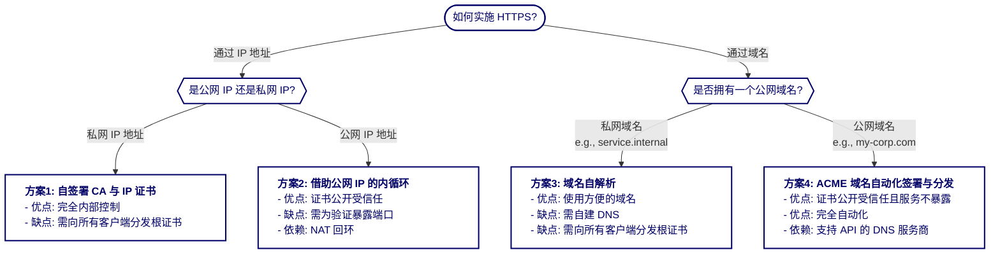
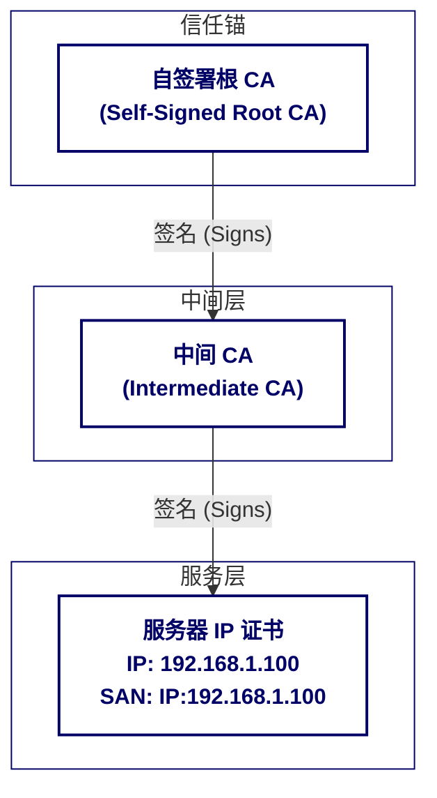
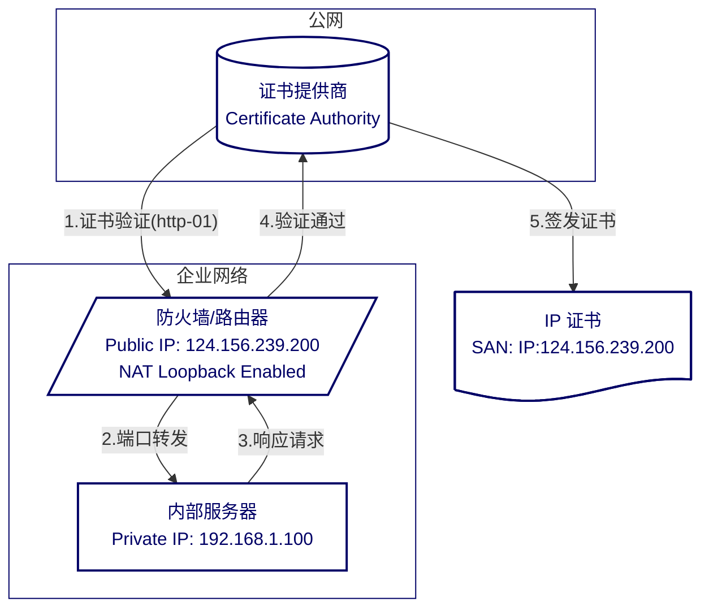
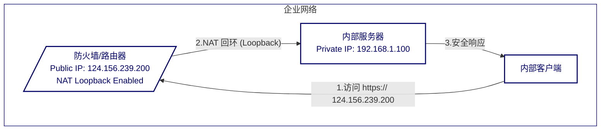
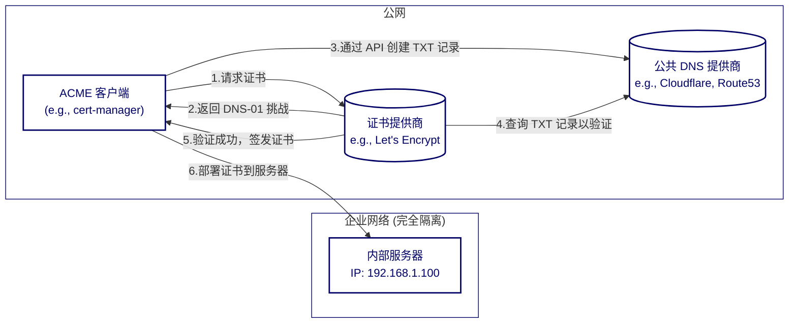
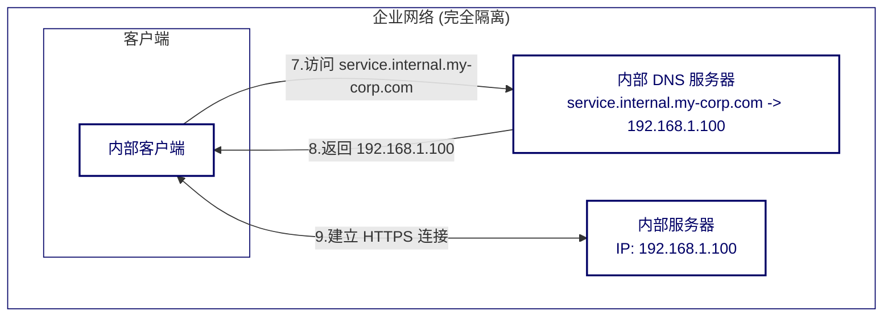

在现代 IT 架构中，使用 HTTPS (HTTP over TLS) 对网络通信进行加密已成为事实标准。浏览器侧对新一代协议的实现也强化了这一趋势：HTTP/2 在浏览器中仅实现 TLS 形态（明文 h2c 未实现[1]），而 HTTP/3 基于 QUIC 且强制使用 TLS 1.3[2],[3]，它们都在实操上等同于“必须 HTTPS”。

然而，当我们将目光从公网转向企业内网或边缘计算场景时，HTTPS 的实施往往会遇到独特的挑战。由于内部服务通常使用私有 IP 地址、不具备公开注册的域名，甚至部署在与公网隔离的网络中，传统的通过公共证书颁发机构 (Public CA) 获取证书的路径变得不再可行。

本指南从工程视角给出四类可选方案，并给出选型建议与落地要点。

[1]: https://http2.github.io/faq/#does-http2-require-encryption "Does HTTP/2 require encryption?"
[2]: https://datatracker.ietf.org/doc/html/rfc9000 "QUIC: A UDP-Based Multiplexed and Secure Transport"
[3]: https://datatracker.ietf.org/doc/html/rfc9001 "Using TLS to Secure QUIC"

## 前置要求

本文档假设读者具备以下基础知识：

- 理解 TLS/SSL 的基本工作原理。
- 了解数字证书、证书链和证书颁发机构 (CA) 的概念。
- 熟悉基本的网络概念，如 DNS、IP 地址和端口。
- 具备基本自动化与配置管理经验（便于证书分发与续期）

## TL;DR

| 方案 | 核心机制 | 证书信任 | 运维复杂度 | 安全性 | 适用场景 |
| --- | --- | --- | --- | --- | --- |
| 方案一 | 自建 CA，为内网 IP 签发证书 | **私有信任** (需分发根 CA) | 中 | 中 (依赖根 CA 安全) | 纯内网、无域名、无法访问公网的设备 |
| 方案二 | 公共 CA，为公网 IP 签发证书 | **公开信任** (默认信任) | 中 (需自动化续期) | 低 (需暴露端口) | 拥有公网 IP 但无域名的边缘设备 (如 NAS) |
| 方案三 | 内部 DNS + 自建 CA | **私有信任** (需分发根 CA) | 高 (维护 DNS + CA) | 高 (完全隔离) | 需要使用域名且安全要求高的纯内网环境 |
| 方案四 | 公共域名 + ACME + 内部 DNS | **公开信任** (默认信任) | 高 (初始配置复杂) | **最高** (服务不暴露) | **最佳实践**：云原生、大规模、自动化运维环境 |

## 方案一：自签署 CA 根证书与 IP 证书

此方案通过建立一个私有的证书颁发体系，为无法从公共 CA 获取证书的内网服务（如使用私有 IP）提供 TLS 加密，是内网 HTTPS 实施中最为直接和常见的解决方案。

### 核心思路

通过自建 CA，我们扮演“证书颁发机构”的角色。首先创建作为信任起点的根证书 (Root CA)，然后用它为内部服务器签发 IP 证书。只要所有客户端都信任该根证书，由其签发的所有服务器证书就会被自动信任，从而建立安全的 HTTPS 连接。

### 实现流程

1. 创建根 CA：生成自签名的根证书及私钥。根证书是信任链的顶点，其私钥必须被安全保管。
2. 生成服务器证书请求 (CSR)：为内网服务器生成 CSR，并在 `Subject Alternative Name (SAN)` 字段中指定其 IP 地址。
3. 签发服务器证书：使用根 CA 的私钥签署服务器的 CSR，生成最终的 IP 证书。
4. 分发与部署：
    - 客户端：将根证书（仅公钥）分发并安装到所有客户端的信任存储区中。
    - 服务端：将签发的 IP 证书及其私钥部署到目标服务器。

### 证书链结构图

### 优缺点分析

**优点:**

- 完全控制：可为任何内网 IP 或域名签发证书，不受外部限制。
- 零成本：无需向公共 CA 支付费用。
- 高灵活性：可自定义证书有效期、加密算法等参数。
- 内部安全：为内部流量提供加密保障，防止网络嗅探。

**缺点:**

- 信任管理复杂：根证书的分发和信任是主要挑战。需要确保所有客户端都安装了根证书，设备越多运维成本越高。
- 无外部信任：证书仅在内网受信任，未安装根证书的设备访问时会触发安全警告。
- 吊销机制复杂：需要自行建立和维护证书吊销列表 (CRL) 或 OCSP 服务，增加了运维的复杂性。

综上所述，自签署 CA 方案是解决内网环境 HTTPS 需求的强大工具，但它的成功实施高度依赖于企业强大的 IT 运维和设备管理能力。

## 方案二：借助公网 IP 的内循环

此方案利用一个可公开访问的 IP 地址，从公共证书颁发机构（如 Let's Encrypt）获取受信任的证书，从而为内部服务提供 HTTPS 加密。这避免了自签名方案中复杂的客户端信任管理问题。

### 背景

传统上，公共 CA 主要为域名签发证书。但 IP 地址有史以来就是技术标准[4]规定的合法主题备用名称(Subject Alternative Name, SAN)。诸如 ZeroSSL、TrustAsia 等证书提供商都支持为公共 IP 地址签发证书。广受欢迎的免费自动化证书提供商 Let's Encrypt 也在二五年七月一日宣布对公共 IP 地址的支持[5]。

[4]: https://datatracker.ietf.org/doc/html/rfc5280#section-4.2.1.6 "RFC 5280 - Internet X.509 Public Key Infrastructure Certificate and Certificate Revocation List (CRL) Profile"
[5]: https://letsencrypt.org/2025/07/01/issuing-our-first-ip-address-certificate "We've Issued Our First IP Address Certificate"

### 核心思路

核心在于，即使服务主要对内，但只要它拥有一个公网 IP 地址并能被 CA 访问以完成验证，就可以获得一个公开受信任的证书。内部客户端随后通过访问该公网 IP 来连接服务。如果网络设备支持 **NAT 回环** (NAT Loopback/Hairpinning)，内部客户端的请求会被智能地在内网中直接路由到服务器，而无需绕行公共互联网，实现了高效的“内循环”。

### 实现流程

1. 前置条件
    - 为内部服务器分配一个静态公网 IP 地址。
    - 配置防火墙和网络，确保服务器在进行证书申请/续期时，能从公网通过端口 `80` (用于 `http-01` 验证) 或 `443` (用于 `tls-alpn-01` 验证) 被访问。

2. 申请证书
    - 通过证书提供商的网站申请公网 IP 证书
    - 或通过证书提供商的 API 申请公网 IP 证书

3. 部署与访问
    - 将获取到的证书和私钥部署到服务器的 Web 服务（如 Nginx）上。
    - 内部客户端直接通过 `https://<公网IP地址>` 访问服务。

4. 续期
    - 需要尽可能构建一套自动化流程，定时检查证书过期时间，提前续期

### 流程图

**证书签发过程**

**证书应用过程**

### 优缺点分析

**优点:**

- 公共信任：证书由公共 CA 签发，被所有主流浏览器和操作系统默认信任，无需在客户端进行任何额外配置。
- 简化客户端管理：彻底解决了自签名方案中分发和管理根证书的运维难题。
- 适用性广：对于没有域名但有公网 IP 的设备（如家庭 NAS、物联网设备、云主机）是一种理想的加密方案。

**缺点:**

- 需要公网 IP：服务必须拥有一个静态公网 IP，这可能带来额外成本或不适用于纯内网隔离环境。
- 暴露攻击面：为了完成证书验证，服务器必须在特定端口上对公网开放，这增加了安全风险，需要精细的防火墙策略。
- 强制性自动续期：IP 证书的有效期通常非常短，必须建立一个高可用的自动化续期机制，否则服务可靠性会受到严重影响。
- 依赖网络设备：高效的内部访问依赖于路由器或防火墙对 NAT 回环的支持。若不支持，内部流量可能会低效地绕行外网。

## 方案三：内部 DNS 与自签署域名证书

此方案通过在内网中部署私有 DNS 服务，并结合自签署 CA，为使用内部私有域名（如 `service.internal`）的服务提供 HTTPS 加持。它非常适合需要使用易记域名但又希望网络完全隔离的场景。

### 核心思路

本方案是方案一 (自签署 CA)和内部 DNS的组合应用。首先，通过内部 DNS 服务器将一个私有域名（如 `grafana.service.internal`）解析到其内网 IP 地址。然后，使用自建的私有 CA 为该域名签发证书。最终，客户端在信任该私有 CA 的前提下，通过域名安全地访问内部服务。

### 实现流程

1. 搭建内部 DNS 服务：在内网中部署 DNS 服务器（如 CoreDNS, Dnsmasq, BIND），并将其配置为解析私有域（如 `.service.internal`）。
2. 配置域名解析：在 DNS 服务器上为内部服务添加 A/AAAA 记录，例如，将 `grafana.service.internal` 指向 `192.168.1.100`。
3. 配置客户端 DNS：将所有内网客户端的 DNS 设置指向该内部 DNS 服务器。
4. 签发域名证书：遵循方案一的流程，使用自建的根 CA 为 `grafana.service.internal` 签发服务器证书（SAN 字段应包含该域名）。也可以签发泛域名证书（如 `*.service.internal`）以简化管理。
5. 部署与分发：
    - 服务端：将签发的域名证书和私钥部署到 `192.168.1.100` 服务器上。
    - 客户端：将自建的根 CA 证书分发并安装到所有客户端的信任存储区。

### 优缺点分析

**优点:**

- 使用便捷：相比记忆 IP 地址，使用 `https://grafana.service.internal` 这样的域名更方便、更专业。
- 完全隔离：服务和域名解析均在内网进行，无需任何公网暴露。
- 高度灵活：可以自由定义内部域名结构，并为任何域名签发证书。

**缺点:**

- 运维成本高：需要同时维护内部 DNS 服务和私有 CA 体系。
- 信任管理复杂：与方案一相同，核心挑战在于将根 CA 证书分发并部署到所有客户端。

## 方案四：ACME 域名自动化签署与分发

此方案是解决内网 HTTPS 问题的“集大成者”，它旨在获得公开受信任的证书，同时确保内部服务完全无需对公网暴露。它完美地结合了公共 CA 的便利性与内网环境的安全性要求。

### 核心思路

我们利用 ACME (Automated Certificate Management Environment) 协议的 `dns-01` 挑战类型，通过操作公共 DNS 记录来向 Let's Encrypt 等公共 CA 证明我们对某个域名的所有权。

整个过程的关键在于“验证”与“使用”相分离：验证域名所有权的操作（修改公网 DNS 记录）与实际使用证书的服务（部署在内网）是解耦的。CA 只需与你的公网 DNS 提供商（如 Cloudflare, AWS Route 53）通信，完全无需访问你部署在内网的服务器。

一旦证书签发下来，我们再将其部署到内网服务器上，并结合方案三方案，让内部客户端通过内部 DNS 解析并访问该服务。

### 实现流程

1. 前置条件
    - 拥有一个可以在公网注册的域名（例如 `my-corp.com`）。
    - 使用支持 API 操作的 DNS 服务商。
    - 在内网中部署一个 ACME 客户端（如 `cert-manager` for Kubernetes, `acme.sh` 等），并为其配置访问 DNS 服务商 API 的凭证。

2. 证书申请
    - ACME 客户端为内网服务域名（如 `service.internal.my-corp.com`）向 CA 发起证书申请。
    - CA 要求进行 `dns-01` 挑战，并提供一个特定的令牌 (Token)。
    - ACME 客户端通过 API 在 `my-corp.com` 的公网 DNS 区域中，为 `_acme-challenge.service.internal` 创建一个 TXT 记录，其值为 CA 提供的令牌。

3. 证书验证与签发
    - CA 从公网查询该 TXT 记录，验证成功后，即确认你对该域名的所有权。
    - CA 签发 `service.internal.my-corp.com` 的证书。
    - ACME 客户端下载证书，并自动清理掉临时创建的 TXT 记录。

4. 部署与访问
    - ACME 客户端将获取到的证书和私钥部署到内网服务器。
    - 在内部 DNS 服务器上，配置一条 A 记录，将 `service.internal.my-corp.com` 指向其内网 IP（如 `192.168.1.100`）。
    - 内部客户端通过 `https://service.internal.my-corp.com` 访问服务，由于证书是公开受信任的，连接会无缝建立，没有任何安全警告。

### 流程图

**证书签署流程**

**证书应用流程**

### 优缺点分析

**优点:**

- 最佳安全性：内部服务无需暴露任何端口到公网，攻击面最小化。
- 公共信任：证书由公共 CA 签发，解决了所有客户端的信任问题，无需分发和安装根证书。
- 高度自动化：整个证书的申请、续期和部署流程可以完全自动化，极大地降低了运维成本，特别适合动态和大规模的环境。
- 标准实践：这是云原生生态（尤其是 Kubernetes）中使用 HTTPS 的事实标准和最佳实践。

**缺点:**

- 需要公网域名：必须拥有一个公网域名，并为其支付费用。
- 依赖 DNS 提供商 API：你的 DNS 服务商必须支持通过 API 进行记录管理。
- 初始配置复杂：相比其他方案，需要配置 ACME 客户端、API 凭证和内部 DNS，初次设置门槛稍高。

## 总结

域名系统（DNS）和证书信任链是互联网安全的基石，它们让我们能够便捷地接入和使用互联网。然而，在内网或边缘计算场景下，这些便利往往转化为实施难题。

本文系统梳理了四种主流的内网 HTTPS 实施方案。各有优势、限制与适用条件，并无“一劳永逸”的最佳选择。实际落地时，需结合业务需求、安全策略、运维能力与成本因素，做出平衡与取舍。

希望本指南能为您在复杂的内网环境中构建安全、可靠的通信体系提供有价值的参考。