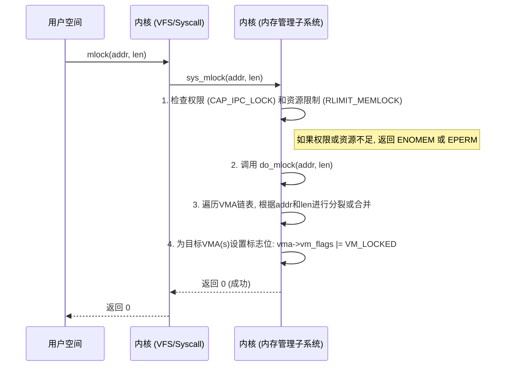

# Linux `memlock` 权威指南：从内核实现到云原生实践

## 目录
- [1. 引言：在动态内存世界中追求确定性](#1-引言在动态内存世界中追求确定性)
- [2. `memlock` API 详解：用户空间的控制契约](#2-memlock-api-详解用户空间的控制契约)
  - [2.1. 核心系统调用：`mlock(2)` 与 `munlock(2)`](#21-核心系统调用mlock2-与-munlock2)
  - [2.2. 进程级锁定：`mlockall(2)` 与 `munlockall(2)`](#22-进程级锁定mlockall2-与-munlockall2)
  - [2.3. 权限与限制：`RLIMIT_MEMLOCK` 与 `CAP_IPC_LOCK`](#23-权限与限制rlimit_memlock-与-cap_ipc_lock)
  - [2.4. `mmap(2)` 中的 `MAP_LOCKED` 标志](#24-mmap2-中的-map_locked-标志)
- [3. 内核实现探秘：`VM_LOCKED` 的生命周期](#3-内核实现探秘vm_locked-的生命周期)
  - [3.1. 关键数据结构：`struct vm_area_struct`](#31-关键数据结构struct-vm_area_struct)
  - [3.2. `mlock` 的旅程：从系统调用到 VMA](#32-mlock-的旅程从系统调用到-vma)
  - [3.3. 与缺页中断（Page Fault）的交互](#33-与缺页中断page-fault的交互)
  - [3.4. 与写时复制（Copy-on-Write）的纠葛](#34-与写时复制copy-on-write的纠葛)
- [4. 跨架构实现：x86, ARM, RISC-V 对比](#4-跨架构实现x86-arm-risc-v-对比)
  - [4.1. 通用层与特定层：`memlock` 的实现分工](#41-通用层与特定层memlock-的实现分工)
  - [4.2. x86-64：成熟的性能霸主](#42-x86-64成熟的性能霸主)
  - [4.3. AArch64：从移动端到服务器的崛起](#43-aarch64从移动端到服务器的崛起)
  - [4.4. RISC-V：新兴架构的追赶](#44-risc-v新兴架构的追赶)
  - [4.5. 横向对比：一张表格看懂架构差异](#45-横向对比一张表格看懂架构差异)
- [5. 实践出真知：`memlock` 的四大核心应用场景](#5-实践出真知memlock-的四大核心应用场景)
  - [5.1. 场景一：实时系统——满足严苛的延迟最后期限](#51-场景一实时系统满足严苛的延迟最后期限)
  - [5.2. 场景二：高性能计算与网络——保障硬件 DMA 缓冲区的稳定性](#52-场景二高性能计算与网络保障硬件-dma-缓冲区的稳定性)
  - [5.3. 场景三：数据库与内存存储——确保核心工作集（Hot Data）常驻内存](#53-场景三数据库与内存存储确保核心工作集hot-data常驻内存)
  - [5.4. 场景四：安全应用——防止敏感数据被写入交换文件](#54-场景四安全应用防止敏感数据被写入交换文件)
- [6. 性能影响分析：原理与预期效果](#6-性能影响分析原理与预期效果)
  - [6.1. 延迟优化：消除页面交换引入的 P99 抖动](#61-延迟优化消除页面交换引入的-p99-抖动)
  - [6.2. 吞吐提升：降低零拷贝场景中的内核开销](#62-吞吐提升降低零拷贝场景中的内核开销)
  - [6.3. 不可忽视的开销](#63-不可忽视的开销)
  - [6.4. 性能分析工具箱](#64-性能分析工具箱)
- [7. 近期演进：Linux v5.x-v6.x 核心变更回顾](#7-近期演进linux-v5x-v6x-核心变更回顾)
  - [7.1. `MCL_ONFAULT` 的诞生：从 `mlock2()` 提议到最终合并](#71-mcl_onfault-的诞生从-mlock2-提议到最终合并)
  - [7.2. `secretmem` 的崛起：安全思想的范式转移](#72-secretmem-的崛起安全思想的范式转移)
  - [7.3. 与 `io_uring` 的协同进化](#73-与-io_uring-的协同进化)
  - [7.4. 为容器化而生的持续优化](#74-为容器化而生的持续优化)
  - [7.5. “引擎盖”下的健康性与性能调优](#75-引擎盖下的健康性与性能调优)
- [8. 生态系统：`memlock` 与现代云原生技术的互动](#8-生态系统memlock-与现代云原生技术的互动)
  - [8.1. 容器中的 `mlock`：Docker 与 Kubernetes](#81-容器中的-mlockdocker-与-kubernetes)
  - [8.2. 虚拟化中的 `mlock`：KVM/QEMU](#82-虚拟化中的-mlockkvmqemu)
  - [8.3. 编程语言中的应用](#83-编程语言中的应用)
- [9. 未来展望：CXL 与分层内存带来的挑战与机遇](#9-未来展望cxl-与分层内存带来的挑战与机遇)
  - [9.1. 当前 `memlock` 模型的局限性](#91-当前-memlock-模型的局限性)
  - [9.2. CXL (Compute Express Link) 带来的新范式](#92-cxl-compute-express-link-带来的新范式)
  - [9.3. 与用户态内存管理框架的进一步集成](#93-与用户态内存管理框架的进一步集成)
  - [9.4. 开放性问题与研究展望](#94-开放性问题与研究展望)
- [10. 结论与建议](#10-结论与建议)
  - [10.1. 核心发现回顾](#101-核心发现回顾)
  - [10.2. 对系统设计师和应用开发者的最终建议](#102-对系统设计师和应用开发者的最终建议)
- [11. 免责声明](#11-免责声明)
- [12. 参考文献](#12-参考文献)

## 1. 引言：在动态内存世界中追求确定性

在现代计算体系结构中，Linux 操作系统的虚拟内存（Virtual Memory）机制是其最精巧的设计之一。它通过按需分页（Demand Paging）和交换（Swapping）技术，为进程提供了独立的、巨大的地址空间，极大地提高了硬件资源的利用率。然而，这套优雅机制的灵活性背后，隐藏着一个对某些应用而言致命的弱点：**不确定性（Non-determinism）**。

缺页中断（Page Fault）和页面交换的代价是高昂的，其延迟通常在微秒到毫秒级别，远超纳秒级的内存访问速度。对于实时系统、高性能计算（HPC）、高速网络和内存数据库而言，这种不可预测的延迟是不可容忍的；而对于安全敏感应用，除了延迟，页面交换到磁盘更带来了敏感信息泄漏的致命风险。这些场景下的性能不仅意味着“快”，更意味着“稳定”和“可预测”。

为了满足这种对确定性的强烈需求，Linux 提供了一组特殊的系统调用，其统领的机制被称为 **`memlock`（内存锁定）**。`memlock` **通过将内存页锁定在物理 RAM 中，防止其被意外交换到磁盘，不仅是保障数据库、实时计算等应用获得稳定、可预测性能的关键，也是防止密码、密钥等敏感数据泄漏到存储设备的重要安全手段。**

一旦内存被锁定，访问它将永远不会触发因为页面不在 RAM 中而导致的缺页中断。这为上层应用提供了一个坚实可靠的内存基座，使其能够在动态、复杂的操作系统环境中，构建起一个属于自己的、具有确定性行为的小世界。本指南将深入探索 Linux `memlock` 功能的全貌，从 API 使用到内核实现，再到其在现代软件生态中的角色。

## 2. `memlock` API 详解：用户空间的控制契约

`memlock` 机制通过一组定义在 POSIX 标准中的系统调用，向用户空间暴露了其强大的内存锁定能力。理解这套 API 的精确语义、参数和权限模型，是正确、安全地使用 `memlock` 的第一步。

### 2.1. 核心系统调用：`mlock(2)` 与 `munlock(2)`

这是 `memlock` 机制中最基本的接口，用于对进程地址空间中一个指定的、连续的区域进行操作。

- **`mlock(const void *addr, size_t len)`**: 请求内核将从 `addr` 开始，长度为 `len` 字节的内存区域锁定在物理 RAM 中。`addr` 必须对齐到系统页大小的边界。调用成功后，该范围内的所有页面都会被标记为“不可换出”。
- **`munlock(const void *addr, size_t len)`**: 用于解除之前施加的内存锁定，使页面回归到内核的正常回收和交换管理之下。

```c
#include <sys/mman.h>
#include <unistd.h>
#include <stdio.h>
#include <stdlib.h>
#include <string.h>

void lock_specific_memory() {
    long page_size = sysconf(_SC_PAGESIZE);
    if (page_size == -1) {
        perror("sysconf");
        return;
    }

    // Allocate one page of memory
    char *buffer = aligned_alloc(page_size, page_size);
    if (!buffer) {
        perror("aligned_alloc");
        return;
    }

    // Lock the memory
    if (mlock(buffer, page_size) != 0) {
        perror("mlock failed");
        // Note: Check RLIMIT_MEMLOCK and CAP_IPC_LOCK if this fails
        free(buffer);
        return;
    }

    printf("Memory page at %p locked successfully.\n", buffer);
    strcpy(buffer, "This data is pinned in RAM.");

    // ... do critical work with the buffer ...

    // Unlock the memory
    if (munlock(buffer, page_size) != 0) {
        perror("munlock failed");
    }
    free(buffer);
}
```

### 2.2. 进程级锁定：`mlockall(2)` 与 `munlockall(2)`

`mlockall()` 提供了一种更方便的方式，可以一次性锁定进程当前和/或未来的整个地址空间。

**函数签名:**
```c
#include <sys/mman.h>
int mlockall(int flags);
```

- **`flags` 参数**:
  - **`MCL_CURRENT`**: 锁定当前所有已映射的页面（代码、数据、堆、栈、mmap 区域）。这是一个重操作，可能导致显著的启动延迟。
  - **`MCL_FUTURE`**: 锁定未来所有将要映射的页面。任何新创建的内存映射都会被自动锁定。
  - **`MCL_ONFAULT` (Linux 5.10+)**: 与 `MCL_CURRENT` 结合使用，将页面锁定操作延迟到页面首次被访问时才进行。这几乎完全消除了 `mlockall` 带来的启动延迟，是现代高性能应用的最佳实践。

`munlockall()` 则用于一次性解除进程地址空间上的所有内存锁定。

### 2.3. 权限与限制：`RLIMIT_MEMLOCK` 与 `CAP_IPC_LOCK`

锁定内存是一项特权操作。内核通过两种机制进行控制：
- **`RLIMIT_MEMLOCK`**: 一个资源限制（可通过 `ulimit -l` 查看/设置），规定了非 root 进程能够锁定的最大内存字节数。
- **`CAP_IPC_LOCK`**: Linux 能力（Capabilities）之一。拥有此能力的进程可以锁定内存，其上限为 `RLIMIT_MEMLOCK` 的硬限制。这是在遵循“最小权限原则”下，授予服务锁定内存权限的标准做法。

### 2.4. `mmap(2)` 中的 `MAP_LOCKED` 标志

`mmap(2)` 系统调用自身也提供了一个 `MAP_LOCKED` 标志，其效果等同于 `mmap()` 成功后立即对同一区域执行 `mlock()`。这对于在创建时就需要锁定的动态内存区域（如 DPDK 的缓冲区）非常方便。

## 3. 内核实现探秘：`VM_LOCKED` 的生命周期

`memlock` 的用户空间 API 背后，是内核内存管理子系统中一系列精密的交互。

### 3.1. 关键数据结构：`struct vm_area_struct`

Linux 内核使用 `struct vm_area_struct` (VMA) 来描述进程地址空间中一个属性相同的连续区间。该结构体中的 `vm_flags` 字段是一个位掩码，`memlock` 机制的核心就是其中的 `VM_LOCKED` 标志位。当一个 VMA 的 `vm_flags` 中设置了 `VM_LOCKED`，内核就承诺属于此 VMA 的物理页面都不能被交换或回收。

### 3.2. `mlock` 的旅程：从系统调用到 VMA

当用户调用 `mlock(addr, len)` 时，内核会执行 `sys_mlock()`：
1.  **权限检查**: 验证进程是否拥有 `CAP_IPC_LOCK` 或 `RLIMIT_MEMLOCK` 足够。
2.  **定位与操作 VMA**: 遍历进程的 VMA 链表，找到与 `[addr, addr+len)` 相交的 VMA。内核可能会对 VMA 进行分裂或合并，以精确匹配锁定范围。
3.  **设置标志**: 为目标 VMA 设置 `vma->vm_flags |= VM_LOCKED`。



### 3.3. 与缺页中断（Page Fault）的交互

`VM_LOCKED` 标志的承诺在缺页中断处理时兑现。当进程访问一个位于 `VM_LOCKED` VMA 内但尚未分配物理页面的地址时，内核会分配一个物理页面并建立映射。在完成映射后，它会检查 `VM_LOCKED` 标志。如果已设置，内核会将该物理页面标记为 **“不可换出”（unevictable）**，页面回收守护进程 `kswapd` 会自动跳过这些页面。

### 3.4. 与写时复制（Copy-on-Write）的纠葛

`fork()` 时，子进程会继承父进程 VMA 上的 `VM_LOCKED` 标志。当发生写时复制（COW）时，内核为写入方创建新的页面副本，并检查 VMA。由于 `VM_LOCKED` 标志已被继承，这个新的副本页面也会被标记为“不可换出”。这样，`memlock` 的锁定保证与 COW 机制得以巧妙地共存。

## 4. 跨架构实现：x86, ARM, RISC-V 对比

`memlock` 的核心逻辑是架构无关的，但其效能会受到 CPU 架构特定特性的影响，如页表结构和对大页（Huge Pages）的支持。

### 4.1. 通用层与特定层：`memlock` 的实现分工

`sys_mlock()` 的入口逻辑、VMA 操作、权限检查等都位于通用的内存管理代码中（`mm/mlock.c`），保证了 API 在所有架构上行为一致。架构差异主要体现在内存管理子系统与硬件 MMU 交互的层面。

### 4.2. x86-64：成熟的性能霸主

x86-64 对 `memlock` 的支持最为成熟。其强大的大页（2MB, 1GB）支持与 `mlock` 结合，能大幅降低 TLB miss 概率，显著提升内存密集型应用（如数据库）的性能。

### 4.3. AArch64：从移动端到服务器的崛起

AArch64（ARM64）同样拥有出色的大页能力。来自 Arm、AWS 等厂商的工程师在内核社区非常活跃，持续推动内存管理子系统的发展，例如积极参与了 `MCL_ONFAULT` 特性的开发与测试。

### 4.4. RISC-V：新兴架构的追赶

对于支持 MMU 的 RISC-V 配置文件（如 Sv39, Sv48），`mlock` 的支持是存在的。随着高性能 RISC-V 服务器处理器的出现，针对 `mlock` 与高级特性结合的性能优化将逐步成为社区焦点。

### 4.5. 横向对比：一张表格看懂架构差异

| 特性/方面                | x86-64                                                              | AArch64 (ARMv8+)                                                    | RISC-V                                                              |
|--------------------------|---------------------------------------------------------------------|---------------------------------------------------------------------|---------------------------------------------------------------------|
| **基本支持**             | 完善                                                                | 完善                                                                | 完善 (在支持MMU的配置中)                                            |
| **大页 (Huge Pages) 支持** | 非常成熟 (2MB, 1GB)。`mlock` 可直接作用于大页，性能优势明显。       | 非常成熟 (2MB, 1GB, etc.)。同样支持 `mlock`，社区对大页性能优化活跃。 | 支持 (Sv39/48/57支持不同级别大页)。`mlock` 支持依赖于具体的内核实现。 |
| **`MCL_ONFAULT` 支持**   | 完全支持。                                                          | 完全支持。ARM 工程师参与了该功能的测试和补丁提交。                  | 理论上支持，因为其主要逻辑在通用MM层。具体实现和优化需看内核版本。    |
| **社区/厂商焦点**        | 性能、虚拟化 (Intel/AMD)。                                          | 移动端、服务器、HPC (Arm/Ampere/AWS)。对 `MCL_ONFAULT` 等新特性贡献活跃。 | 基础支持和生态系统建设。随着硬件普及，性能优化会成为焦点。          |

## 5. 实践出真知：`memlock` 的四大核心应用场景

### 5.1. 场景一：实时系统——满足严苛的延迟最后期限

- **为何使用**：消除由页面交换引发的随机停顿，保证满足严格的时间期限（deadline）。
- **如何使用**：在初始化阶段调用 `mlockall(MCL_CURRENT | MCL_FUTURE)`。
- **案例**：`PREEMPT_RT` 内核环境下的应用、`cyclictest` 基准测试。

### 5.2. 场景二：高性能计算与网络——保障硬件 DMA 缓冲区的稳定性

- **为何使用**：保证用于硬件直接内存访问（DMA）的缓冲区常驻内存，防止因页面被换出导致 DMA 操作失败或数据损坏。
- **如何使用**：预分配大块内存作为缓冲区，并通过 `mlock()` 或 `mmap(MAP_LOCKED)` 进行锁定。
- **案例**：DPDK 的内存池、`io_uring` 的注册缓冲区（`IORING_REGISTER_BUFFERS`）。

### 5.3. 场景三：数据库与内存存储——确保核心工作集（Hot Data）常驻内存

- **为何使用**：防止在系统内存压力下，数据库的核心工作集（热点数据和索引）被换出，保证查询性能的稳定。
- **如何使用**：在启动时分配共享内存作为缓冲池，并调用 `mlock()` 或 `mlockall()`。
- **案例**：PostgreSQL, Oracle (`LOCK_SGA`), MySQL (`innodb_lock_memory`)。

### 5.4. 场景四：安全应用——防止敏感数据被写入交换文件

- **为何使用**：防止包含私钥、密码等敏感数据的内存页被换出到磁盘交换区，从而降低离线攻击的风险。
- **如何使用**：在加载敏感数据后立即 `mlock()` 相应内存，销毁前 `munlock()` 并覆写。
- **案例**：WireGuard 工具、以及 `memlock` 安全思想的终极演进——`secretmem` (`memfd_secret`) 机制。

## 6. 性能影响分析：原理与预期效果

### 6.1. 延迟优化：消除页面交换引入的 P99 抖动

`mlock` 的核心价值在于消除因页面交换而引入的尾部延迟。通过确保关键内存不被换出，它避免了代价高昂的缺页中断，从而有望将应用的 P99 延迟从不可预测的毫秒级，稳定在可控的微秒级范围内。

### 6.2. 吞吐提升：降低零拷贝场景中的内核开销

在 `io_uring` 等零拷贝场景中，通过预先注册并锁定 I/O 缓冲区，可以避免每次 I/O 路径上动态映射/解锁页面的开销，因此在高负载下通常会观察到显著的吞吐量提升。

### 6.3. 不可忽视的开销

- **内存压力**: 被锁定的内存无法被系统回收，可能影响其他应用和页面缓存的性能。
- **启动时间**: 传统的 `mlockall(MCL_CURRENT)` 会导致显著的启动延迟，但 `MCL_ONFAULT` 已基本解决此问题。
- **CPU 开销**: `mlock` 系统调用本身有开销，不适用于频繁锁定/解锁小块内存的场景。

### 6.4. 性能分析工具箱

- **`/proc/[pid]/smaps`**: 通过 `grep VmFlags /proc/[pid]/smaps` 检查 `lo` 标志，确认 VMA 是否被锁定。
- **`perf`**: 使用 `perf stat -e dTLB-load-misses,page-faults -p <PID>` 监控 `mlock` 前后的页面错误和 TLB 未命中率。
- **`bpftrace`**: 使用 `bpftrace -e 'tracepoint:syscalls:sys_enter_mlock { printf("%s (%d)\n", comm, pid); }'` 监控系统上的 `mlock` 调用。

## 7. 近期演进：Linux v4.x-v6.x 核心变更回顾

- **`MCL_ONFAULT` 的诞生 (v4.4)**: 作为 `mlockall()` 的新标志，它将页面锁定操作延迟到首次访问时，完美解决了大内存应用的启动延迟问题，是近年来最重要的可用性改进。
- **`secretmem` 的崛起 (v5.14)**: `memfd_secret()` 机制创建的内存不仅不可交换，甚至在内核中都没有直接映射，提供了远超 `mlock` 的安全保证，代表了内存保密性思想的范式转移。
- **与 `io_uring` 的协同进化**: `mlock` 成为 `io_uring` 注册缓冲区等高性能内核特性的底层使能技术。
- **为容器化而生的持续优化**: 持续改进 cgroups 内存控制器与 `mlock` 的交互，以简化云原生环境下的资源配置。

## 8. 生态系统：`memlock` 与现代云原生技术的互动

### 8.1. 容器中的 `mlock`：Docker 与 Kubernetes

- **Docker**: 通过 `--cap-add=IPC_LOCK` 授予能力，并通过 `--ulimit memlock=-1:-1` 放开限制。
- **Kubernetes**: 在 Pod 的 `securityContext` 中添加 `IPC_LOCK` 能力。
```yaml
apiVersion: v1
kind: Pod
metadata:
  name: my-rt-app
spec:
  containers:
  - name: main-app
    image: my-image
    securityContext:
      capabilities:
        add: ["IPC_LOCK"]
```

### 8.2. 虚拟化中的 `mlock`：KVM/QEMU

宿主机上的 QEMU 进程使用 `mlock` 来锁定分配给虚拟机的内存，防止其被宿主机交换，从而为虚拟机提供稳定的“物理内存”。这通常由 `libvirt` 等管理工具通过 `<memoryBacking><locked/></memoryBacking>` 配置自动完成。

### 8.3. 编程语言中的应用

- **C/C++**: 直接包含 `<sys/mman.h>` 调用。
- **Go**: 通过 `syscall` 包调用。
- **Java**: 通过 JNI 或 JNA 库调用本地 C 函数。
- **Python**: 通过 `ctypes` 库调用 C 库函数。

## 9. 未来展望：CXL 与分层内存带来的挑战与机遇

### 9.1. 当前 `memlock` 模型的局限性

当前 `mlock` 模型是“二元”且“位置盲目”的，它基于物理内存是均质资源池的过时假设。

### 9.2. CXL (Compute Express Link) 带来的新范式

CXL 催生了分层内存（Tiered Memory）系统，包含不同速度和特性的内存层级（如 DRAM, SCM）。`mlock` 的“盲目性”在此场景下是致命的。未来的 `mlock` 必须演进为“拓扑感知”和“层级感知”，允许应用表达更精细的锁定意图，例如“将此内存锁定在最快的 Tier 0 DRAM 上”。

### 9.3. 与用户态内存管理框架的进一步集成

未来可能会看到 `jemalloc` 等分配器与 `mlock` 的更深度集成，例如提供从预先锁定的内存池中进行分配的 API。

### 9.4. 开放性问题与研究展望

`mlock` 的未来面临诸多开放性问题：如何与持久化内存（PMEM）交互？在 CXL 内存共享模型中意味着什么？eBPF 能否用于实现动态锁定策略？这些问题的解答将是未来内核内存管理发展的重要组成部分。

## 10. 结论与建议

### 10.1. 核心发现回顾

`mlock` 是性能确定性的基石，其实现简洁有效，演进由真实世界驱动，价值在与生态整合时被放大，而其未来正被 CXL 等新硬件重新定义。它的不朽价值在于，它允许开发者在一个充满不确定性的复杂系统中，构建一块属于自己的、确定性的“飞地”。同时，它也是一道重要的安全防线，阻止敏感数据因内存交换而落入磁盘，保护信息不被泄露。

### 10.2. 对系统设计师和应用开发者的最终建议

**对于应用开发者：**
- **DO**: 优先使用 `mlockall(MCL_CURRENT | MCL_FUTURE | MCL_ONFAULT)`。
- **DO**: 对于必须在内存中处理的敏感数据（如密钥），在数据创建后立即 `mlock()`，在销毁前 `munlock()` 并擦除，确保其生命周期内不触碰磁盘。
- **DON'T**: 避免过早优化，先通过剖析确认缺页是性能瓶颈。
- **CONSIDER**: 对新安全应用，优先考虑 `secretmem`。
- **ALWAYS**: 部署前，务必确认环境已正确配置 `CAP_IPC_LOCK` 和 `ulimit`。

**对于系统设计师/SRE：**
- **MONITOR**: 将 `RLIMIT_MEMLOCK` 使用情况纳入监控。
- **USE**: 积极尝试将 `mlock` 与大页（Huge Pages）结合使用。
- **BE WARY**: `mlock` 是双刃剑，容量规划时必须将其占用的内存视作固定开销。

## 11. 免责声明

本文基于截至 2025 年的 Linux 内核版本和公开文献进行分析。Linux 内核和相关技术在持续快速演进，部分实现细节和 API 行为可能在未来版本中发生变化。本文内容力求准确，但难免存在疏漏或过时之处，仅供参考。在关键生产环境中使用 `mlock` 前，请务必查阅最新的官方文档并进行充分测试。

## 12. 参考文献

| 序号 | 标题/来源 | URL/DOI |
|---|---|---|
| 1 | `mlock(2)` man page | https://man7.org/linux/man-pages/man2/mlock.2.html |
| 2 | Linux Kernel Source: `mm/mlock.c` | https://git.kernel.org/pub/scm/linux/kernel/git/torvalds/linux.git/tree/mm/mlock.c |
| 3 | LWN.net: `RLIMIT_MEMLOCK` | https://lwn.net/Articles/876288/ |
| 3 | LWN.net: `MCL_ONFAULT` | https://lwn.net/Articles/656849/ |
| 4 | LWN.net: `secretmem` | https://lwn.net/Articles/836724/ |
| 5 | Docker container run (`--ulimit`) | https://docs.docker.com/reference/cli/docker/container/run/#ulimit |
| 6 | Kubernetes `securityContext` | https://kubernetes.io/docs/tasks/configure-pod-container/security-context/ |
| 7 | `libvirt` Domain XML format | https://libvirt.org/formatdomain.html#memory-backing |
| 8 | `io_uring` documentation | https://kernel.dk/io_uring.pdf |
| 9 | LWN.net: Memory tiering | https://lwn.net/Articles/931421/ |
| 10 | `cyclictest` documentation | https://wiki.linuxfoundation.org/realtime/documentation/howto/tools/cyclictest/start |
